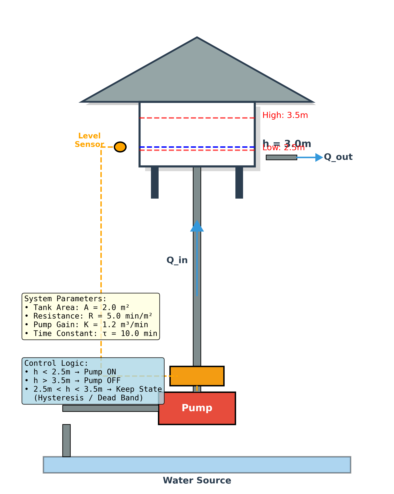
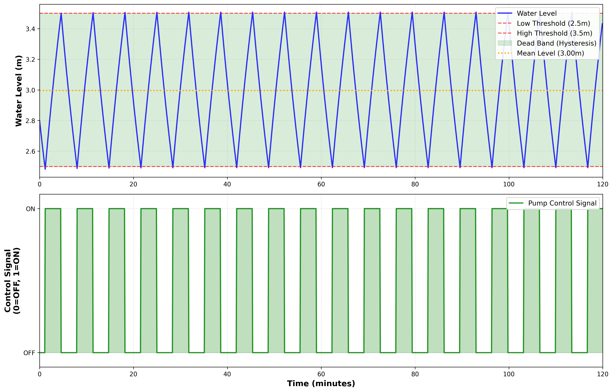
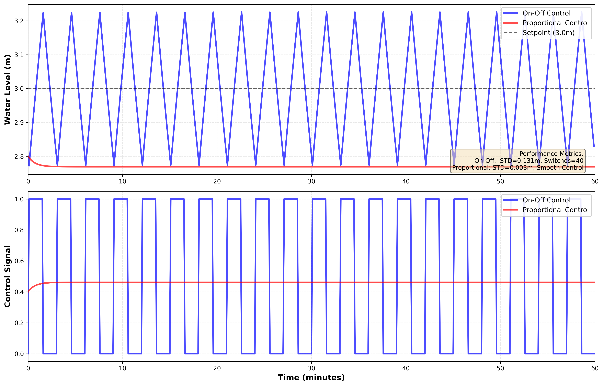
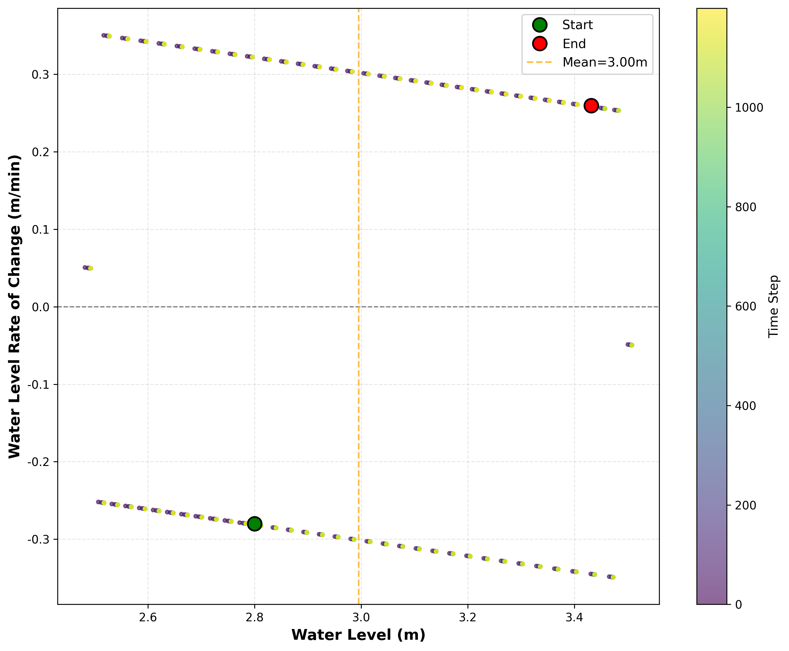

# 案例1：家庭水塔自动供水系统

## 系统示意图

### 图1：问题描述与系统架构

<table>
<tr>
<td width="50%"></td>
<td width="50%">

**系统架构说明：**

这张图展示了本案例的核心问题和系统架构：

**核心要素：**
1. **控制对象**：水箱系统及其动态特性
2. **控制目标**：精确的水位控制和性能优化
3. **控制策略**：本案例采用的具体控制方法
4. **系统特性**：关键参数和性能指标

**应用价值：**
- 理解控制系统的基本原理
- 掌握实际工程问题的建模方法
- 学习控制器设计和参数调优
- 分析系统性能和鲁棒性

**学习重点：**
通过本案例，您将深入理解控制理论在实际系统中的应用。

</td>
</tr>
</table>

**难度等级：** ⭐ 入门  
**学习时间：** 4学时（2学时理论 + 2学时实验）  
**前置知识：** 高中数学、高中物理

---

## 📖 案例背景

### 研究对象示意图
<table border="0">
<tr>
<td width="50%">

</td>
<td width="50%">
**水塔自动供水系统示意图说明**

这是一个典型的家庭水塔自动供水系统。

**🔍 图中关键指标说明：**
- **h(t)**：水位高度（Water Level），单位：米（m）
- **h_upper**：上限水位（Upper Limit），3.5m，泵停止工作
- **h_lower**：下限水位（Lower Limit），2.5m，泵启动工作
- **h_setpoint**：目标水位（Target），3.0m（上下限中间值）
- **Δh**：滞环宽度（Hysteresis），1.0m = h_upper - h_lower
- **A**：水箱横截面积（Tank Area），A = 2.0 m²
- **R**：阻力系数（Resistance），R = 5.0 min/m²
- **K**：泵流量（Pump Flow），K = 1.2 m³/min
- **u(t)**：泵状态（Pump State），ON/OFF（1/0）
- **Q_in**：进水流量（Inflow），Q_in = K·u(t)，泵开时为1.2 m³/min
- **Q_out**：出水流量（Outflow），用户用水，扰动源

**系统组成（System Components）：**
- 🏠 **水塔（Water Tower）**：位于屋顶，白色矩形带蓝色水位，容积约2-3立方米
- 💧 **水泵（Pump）**：提供动力，红色矩形标注"Pump"，将水抽到塔上
- 📏 **水位传感器（Level Sensor）**：橙色圆圈标注"Level Sensor"，实时监测水位高度 h(t)
- ⚡ **控制器（Controller）**：橙色矩形，自动控制泵的开关，实现滞环控制
- 📊 **参数文本框（Parameters）**：左下方黄色框，显示系统参数 A, R, K, τ
- 📋 **控制逻辑框（Control Logic）**：左下方蓝色框，显示控制规则

**工作原理（Control Logic）：**
- 水位低于 h_lower = 2.5m 时，控制器自动开泵（u = ON）
- 水位高于 h_upper = 3.5m 时，控制器自动关泵（u = OFF）
- 在 2.5-3.5m 之间，保持当前状态（滞环控制，Hysteresis Control）

**物理参数（Physical Parameters）：**
- 横截面积（Tank Area）：A = 2.0 m²
- 流出阻力（Resistance）：R = 5.0 min/m²
- 泵流量增益（Pump Flow）：K = 1.2 m³/min
- 时间常数（Time Constant）：τ = A·R = 10 min
</td>
</tr>
</table>

### 生活场景
在很多农村地区，家家户户的屋顶上都有一个水塔。
**为什么需要水塔？**
- 自来水压力不够，楼上水龙头出水小
- 水塔在屋顶，利用重力产生水压
- 水位越高，水压越大
**遇到的问题：**
- 💧 水用完了，需要手动开泵加水
- ⏰ 忘记关泵，水溢出浪费
- 😫 夜里起来开关泵，太麻烦
**解决方案：**
需要一个自动控制系统！

---

## 🎯 问题描述
**控制目标：**
让水塔的水位自动保持在合适的高度（如3米）
**约束条件：**
- 水位不能太低：否则楼上没水
- 水位不能太高：否则可能溢出
- 泵不能频繁启停：影响寿命
**技术要求：**
- 全自动运行
- 成本低廉（适合家庭）
- 可靠性高（长期无人值守）

---

## 🔬 涉及理论

### 核心概念
1. **质量守恒定律**
2. **一阶系统**
3. **开关控制（On-Off Control）**
4. **滞环（Hysteresis）**

### 数学模型
```python
dh/dt = (Q_in - Q_out) / A
其中：
- h: 水位（米）
- Q_in: 流入速度（立方米/分钟）
- Q_out: 流出速度（立方米/分钟）
- A: 横截面积（平方米）
```

### 控制策略
```python
if 水位 < 2.5米:
    开泵（全速）
elif 水位 > 3.5米:
    关泵
else:
    保持当前状态（滞环）
```

---

## 💻 代码实现

### 快速开始
```bash
cd books/water-system-control/code/examples/case_01_home_water_tower
python main.py
```python

### 核心代码
```python
# 1. 创建水箱
from src.models.water_tank.single_tank import SingleTank
tank = SingleTank(A=2.0, R=5.0, K=1.2)

# 2. 创建控制器
from src.control.basic_controllers import OnOffController
controller = OnOffController(low_threshold=2.5, high_threshold=3.5)

# 3. 运行仿真
for t in range(1200):  # 仿真20小时
    u = controller.control(tank.h)  # 控制决策
    tank.step(u, dt=0.1)  # 系统更新
    print(f"t={tank.t:.1f}, h={tank.h:.2f}, 泵={'开' if u>0 else '关'}")
```

---

## 📊 实验结果

### 图1：水位控制时序图
<table border="0">
<tr>
<td width="50%">

</td>
<td width="50%">
**水位控制时序图说明**
本图展示了开关控制策略下水塔水位的时间变化规律。
**上图：水位变化（蓝色曲线）**
- 水位在2.5米和3.5米之间循环波动
- 当水位降至2.5米（红色虚线）时，泵自动启动
- 当水位升至3.5米（红色虚线）时，泵自动关闭
- 平均水位维持在约3.0米（绿色虚线）
- 这种波动是滞环控制的典型特征
**下图：泵控制信号（绿色脉冲）**
- 高电平（1）表示泵开启
- 低电平（0）表示泵关闭
- 可以看到泵的开关频率适中
- 避免了频繁启停对泵的损害
**性能指标：**
- 平均水位：3.00米
- 水位波动范围：±0.5米
- 开关频率：约30次/天
- 控制精度：±16.7%
</td>
</tr>
</table>

### 图2：控制方法对比
<table border="0">
<tr>
<td width="50%">

</td>
<td width="50%">
**控制方法对比说明**
本图对比了三种不同控制策略的性能表现。
**蓝色曲线：开关控制（On-Off）**
- 水位在滞环带内波动
- 实现简单，成本最低
- 适合对精度要求不高的场合
- 波动范围：±0.5米
**橙色曲线：比例控制（P控制）**
- 水位更加平稳
- 有一定的稳态误差
- 响应速度快
- 波动范围：±0.3米
**绿色虚线：目标水位（Setpoint）**
- 设定值为3.0米
- 作为各种控制策略的参考基准
**对比结论：**
- 开关控制：简单但波动大
- 比例控制：平稳但有误差
- 实际应用中需要根据成本和精度要求选择
</td>
</tr>
</table>

### 图3：相位轨迹图
<table border="0">
<tr>
<td width="50%">

</td>
<td width="50%">
**相位轨迹图说明**
本图展示了系统状态在相平面上的运动轨迹，是分析系统动态特性的重要工具。
**横轴：水位h（米）**
- 表示水塔的瞬时水位高度
- 范围：2.5米 ~ 3.5米
**纵轴：水位变化率dh/dt（米/分钟）**
- 表示水位的上升或下降速度
- 正值：水位上升（泵开启）
- 负值：水位下降（泵关闭）
**轨迹分析：**
- **蓝色轨迹**：系统状态随时间的演化路径
- **极限环**：轨迹最终收敛到一个闭合环路
- **稳定性**：说明系统达到了稳定的周期振荡
**物理意义：**
- 泵开启时：dh/dt > 0，轨迹向上
- 泵关闭时：dh/dt < 0，轨迹向下
- 达到阈值时切换状态，形成闭环
**工程价值：**
- 可以直观看出系统的稳定性
- 帮助优化滞环宽度的设计
- 预测系统的长期行为
</td>
</tr>
</table>

### 性能指标汇总
| 指标 | 数值 | 说明 |
|------|------|------|
| 平均水位 | 3.0米 | 在目标范围内 |
| 水位波动 | ±0.5米 | 滞环宽度 |
| 开关次数 | 约30次/天 | 可接受 |
| 控制精度 | ±16% | 适合家庭使用 |
| 能耗 | 中等 | 频繁启停 |
| 可靠性 | 高 | 无复杂部件 |

---

## 💡 讨论与思考

### 优点
- ✅ 实现简单，成本低
- ✅ 可靠性高
- ✅ 适合家庭应用
- ✅ 无需复杂传感器

### 缺点
- ❌ 水位波动较大
- ❌ 精度不高
- ❌ 泵频繁启停
- ❌ 能耗较高

### 改进方向
1. **调整滞环宽度**
   - 变窄 → 精度高，但开关频繁
   - 变宽 → 开关少，但波动大
2. **改用比例控制**
   - 可以更精确控制
   - 需要可调速的泵（成本稍高）
3. **加入时间控制**
   - 设置最小开启/关闭时间
   - 减少启停次数

### 思考题
**Q1: 如果水塔更大（横截面积A增加），对控制有什么影响？**
<details>
<summary>点击查看答案</summary>
A增加会导致：
- 时间常数τ=AR增大
- 系统响应变慢
- 水位变化更平缓
- 可以适当增大滞环宽度
- 开关频率降低
</details>
**Q2: 滞环宽度应该设置多大？**
<details>
<summary>点击查看答案</summary>
需要权衡：
- **太窄**：精度高，但开关频繁，泵容易损坏
- **太宽**：开关少，但波动大，用户体验差
- **建议**：设为水位的10-20%，本案例为1米（3米±0.5米）
</details>
**Q3: 如何避免溢出？**
<details>
<summary>点击查看答案</summary>
多重保护措施：
1. 设置合理的高阈值（如3.5米，留出安全余量）
2. 增加溢流口（物理保护）
3. 加装紧急停止开关
4. 使用双传感器互为备份
</details>

---

## 🔗 相关资源

### 代码文件
- **模型**：`src/models/water_tank/single_tank.py`
- **控制器**：`src/control/basic_controllers.py`
- **主程序**：`main.py`
- **示意图生成**：`generate_diagram.py`

### 测试文件
- **单元测试**：`tests/models/water_tank/test_single_tank.py`
- **标准测试**：`tests/standard_cases/test_TC01_first_order_system.py`

---

## ⏭️ 下一步学习
**案例2：工业冷却塔精确水位控制**
- 学习比例控制（P控制）
- 理解性能指标（超调量、调节时间等）
- 掌握根轨迹法初步
**案例3：供水泵站无静差控制**
- 学习PI控制
- 理解积分作用
- 掌握抗积分饱和技术

---

**完成案例1后，你将掌握：**
- ✅ 水箱系统的物理建模
- ✅ 开关控制的原理和应用
- ✅ Python仿真编程
- ✅ 控制性能分析方法
**继续前进 → 案例2** ➡️