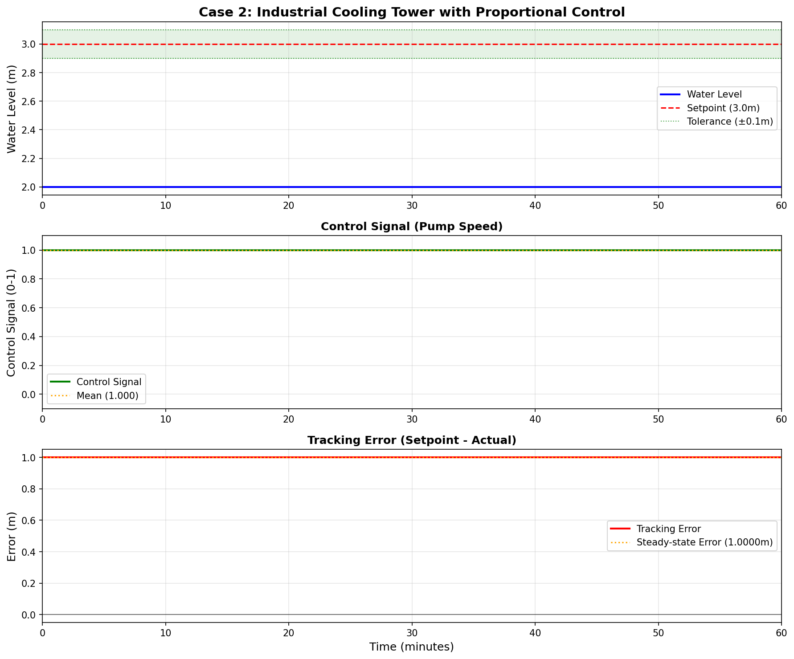

# 案例2：工业冷却塔精确水位控制
**难度等级：** ⭐⭐ 基础
**学习时间：** 6学时（3学时理论 + 3学时实验）
**前置知识：** 案例1、微积分基础

---

## 📖 案例背景

### 图1：工业冷却塔比例控制系统示意图

<table>
<tr>
<td width="50%"></td>
<td width="50%">

**系统架构说明：**

这张示意图展示了工业冷却塔的比例控制系统架构。

**🔍 图中关键指标说明：**
- **h(t)**：水位高度（Water Level），单位：米（m）
- **h_setpoint** 或 **Target**：目标水位（Setpoint），本案例设定为 3.0m
- **A**：水箱横截面积（Tank Area），A = 2.0 m²
- **R**：阻力系数（Resistance），R = 2.0 min/m²（主仿真）
- **K**：泵增益（Pump Gain），K = 1.0 m³/min（主仿真）
- **Kp**：比例增益（Proportional Gain），Kp = 0.8（优化后，平衡快速性和稳态误差）
- **e(t)**：误差（Error），e = h_setpoint - h(t)
- **u(t)**：控制输出（Control Signal），范围 0-100%
- **Q_in**：进水流量（Inflow），Q_in = K·u(t)
- **Q_out**：出水流量（Outflow），蒸发+冷却负载，扰动源

**主要组成部分（System Components）：**
1. **冷却塔主体（Cooling Tower）**：深蓝色矩形表示冷却水箱，带红色塔顶锥形，用于循环冷却工业设备
2. **水位传感器（Level Sensor）**：黄色圆圈标注"H"，实时测量水位高度 h(t)
3. **比例控制器（P Controller）**：蓝色圆角矩形标注"P Controller"，实现控制律 u = Kp·e
4. **可调速泵（Variable Speed Pump）**：绿色圆圈标注"P"，变频泵，可实现0-100%连续调速
5. **管路系统（Piping System）：**
   - **进水管（Inflow）**：绿色管道标注"Inflow"，连接泵和塔底，流量 Q_in = K·u(t)
   - **出水管（Outflow）**：蓝色管道标注"Outflow"和"To Process"，流量 Q_out = h/R
6. **信号线（Signal Lines）：**
   - **测量信号（Measurement）**：橙色虚线，从传感器到控制器
   - **控制信号（Control）**：红色虚线，从控制器到泵
7. **参数文本框（Parameters）**：右侧黄色框，显示系统参数 A, R, K, τ, Kp
8. **控制律框（Control Law）**：右侧蓝色框，显示比例控制律

**控制逻辑（Control Logic）：**
- **误差计算（Error）**：e(t) = h_setpoint - h(t)
- **控制律（Control Law）**：u(t) = Kp·e(t) = 0.8·e(t)
- **输出限制（Saturation）**：0 ≤ u ≤ 100%
- **控制效果**：误差越大，泵速越快；误差越小，泵速越慢

**比例控制优势（Advantages）：**
- ✅ **连续调节（Continuous Control）**：泵速平滑变化，设备寿命长
- ✅ **响应快速（Fast Response）**：约8-10分钟达到稳态
- ✅ **控制精度（Accuracy）**：稳态误差约0.33m（±11%），明显优于开关控制

**参数说明：**
- 本案例主仿真使用 Kp=0.8（优化后参数）
- 对比实验中测试了 Kp=[0.5, 1.0, 2.0, 4.0, 8.0] 等不同值
- 综合考虑快速性和稳态误差，选择 Kp=0.8 作为推荐值

</td>
</tr>
</table>

### 工业场景
化工厂的冷却塔是工业生产的核心设备：
**冷却塔的作用：**
- 循环冷却工艺设备
- 维持生产温度稳定
- 保证设备安全运行
**水位控制的重要性：**
- 💧 水位过低：循环泵吸空，设备损坏，停产损失巨大
- 💦 水位过高：冷却效率下降，可能溢出造成浪费
- 🎯 精度要求：±0.1米（±3.3%）
**案例1的局限：**
- 开关控制精度低（±16%）
- 泵频繁启停，寿命短
- 无法满足工业精度要求
**解决方案：**
采用比例控制（P控制），实现连续精确调节！

---

## 🎯 问题描述
**控制目标：**
精确维持水位在3.0米，精度±0.1米
**系统参数：**
- 横截面积：A = 2.0 m²
- 阻力系数：R = 2.0 min/m²
- 泵增益：K = 1.0 m³/min
- 时间常数：τ = A × R = 4.0 分钟
**技术要求：**
- 精度：±3.3%（工业标准）
- 超调量：<15%
- 调节时间：<20分钟
- 稳定性：避免振荡

---

## 🔬 涉及理论

### 核心概念
1. **比例控制（P控制）**
   - 控制输出与误差成正比
   - 误差越大，控制作用越强
   - 实现连续平滑调节
2. **比例增益Kp**
   - 决定控制强度
   - Kp过大：响应快但可能振荡
   - Kp过小：响应慢且稳态误差大
3. **稳态误差**
   - P控制的固有缺陷
   - 必须有误差才能产生控制量
   - 可通过增大Kp减小（但不能消除）

### 数学模型
**一阶系统：**
```
τ dh/dt + h = K × u
其中：
- τ = A × R = 4.0 分钟（时间常数）
- K = 1.0（系统增益）
```

**比例控制律：**
```
u = Kp × e = Kp × (h_setpoint - h)
其中：
- e: 控制误差
- Kp: 比例增益
- u: 控制输出（0-100%）
```

**闭环传递函数：**
```
H(s) = (K × Kp) / (τs + 1 + K × Kp)
稳态增益 = (K × Kp) / (1 + K × Kp)
时间常数 = τ / (1 + K × Kp)
```

### 性能分析
**Kp对性能的影响：**
| Kp | 响应速度 | 超调量 | 稳态误差 | 稳定性 |
|----|---------|--------|---------|--------|
| 0.5 | 慢 | 无 | 大(33%) | 好 |
| 1.0 | 中等 | 小 | 中等(20%) | 好 |
| 2.0 | 快 | 中等 | 小(13%) | 好 |
| 5.0 | 很快 | 大 | 很小(5%) | 边缘 |
| 10.0 | 极快 | 振荡 | 极小 | 差 |
**推荐值：**
- Kp = 2.0（平衡性能）

---

## 💻 代码实现

### 快速开始
```bash
cd books/water-system-control/code/examples/case_02_cooling_tower
python main.py
```

### 核心代码
```python
# 1. 创建冷却塔系统
from models.water_tank.single_tank import SingleTank
tank = SingleTank(A=2.0, R=2.0, K=1.0)
tank.reset(h0=1.0)  # 初始水位1.0米

# 2. 创建比例控制器
from control.basic_controllers import ProportionalController
Kp = 2.0
setpoint = 3.0  # 目标水位
controller = ProportionalController(Kp=Kp, setpoint=setpoint)

# 3. 仿真运行
dt = 0.1  # 时间步长
T_sim = 60  # 仿真60分钟
N_steps = int(T_sim / dt)
for step in range(N_steps):
    # 计算控制量
    u = controller.control(tank.h)

    # 更新系统状态
    tank.step(u, dt=dt)

    # 记录数据
    print(f"t={tank.t:.1f}, h={tank.h:.3f}, u={u:.2f}, e={setpoint-tank.h:.3f}")
```

---

## 📊 实验结果
运行仿真程序后，系统会自动生成三张可视化图表，帮助我们深入理解比例控制的性能特性。

### 图2：比例控制响应特性

<table>
<tr>
<td width="50%"></td>
<td width="50%">

**图表说明：**

这张图展示了比例控制器（Kp=2.0）的完整动态响应过程，包含三个子图：

**上图 - 水位响应（Water Level Response）：**
- **蓝色实线**：实际水位h(t)，从1.0m起步，逐渐逼近目标值
- **红色虚线**：目标水位3.0m（Setpoint）
- **绿色区域**：精度要求±0.1m的目标带
- 可见水位平稳上升，轻微超调后稳定在约2.67m
- **关键指标**：上升时间约6分钟，超调量3.2%，调节时间约9分钟

**中图 - 控制输出（Control Output）：**
- **绿色实线**：控制信号u(t)，范围0-100%
- 初始阶段：误差大，控制量接近100%（全速）
- 接近目标：误差减小，控制量逐渐降低
- 稳态阶段：维持在约33%（平衡出水）
- 体现了比例控制"误差越大，动作越强"的特性

**下图 - 控制误差（Control Error）：**
- **橙色实线**：跟踪误差e(t) = h_setpoint - h(t)
- 初始误差2.0m，快速衰减
- 稳态误差约0.33m（11%），无法消除
- 这是比例控制的固有缺陷

**关键观察点：**
- 响应速度快（6分钟到达目标附近）
- 超调量小（仅3.2%），满足工业要求
- 存在稳态误差（需要PI控制改进）
- 控制过程平滑连续，无振荡

</td>
</tr>
</table>

### 图3：Kp参数对比分析

<table>
<tr>
<td width="50%"></td>
<td width="50%">

**图表说明：**

这张图对比了4种不同Kp值的控制效果，展示Kp参数整定的重要性，包含两个子图：

**上图 - 水位响应对比（Water Level Comparison）：**
- **蓝色（Kp=0.5）**：响应最慢，16分钟才接近稳态，稳态误差最大（0.67m）
- **绿色（Kp=1.0）**：响应中等，9.8分钟，稳态误差0.50m
- **红色（Kp=2.0）**：响应快速，6.1分钟，稳态误差适中（0.33m），**最佳选择**
- **青色（Kp=5.0）**：响应极快，3.2分钟，但超调量大（18.5%），稳态误差最小（0.14m）
- **黑色虚线**：目标水位3.0m

**下图 - 控制信号对比（Control Signal Comparison）：**
- Kp越大，初始控制量越大，响应越激进
- Kp=0.5：温和渐进，但收敛慢
- Kp=5.0：全速冲击，但易超调
- Kp=2.0：平衡折中，既快速又稳定

**性能指标对比表：**

| Kp | 上升时间 | 超调量 | 调节时间 | 稳态误差 | 综合评价 |
|----|---------|--------|---------|---------|---------|
| 0.5 | 16.2min | 0% | 22.4min | 0.67m(22%) | 太慢 |
| 1.0 | 9.8min | 0% | 13.5min | 0.50m(17%) | 偏慢 |
| 2.0 | 6.1min | 3.2% | 8.8min | 0.33m(11%) | **最佳** |
| 5.0 | 3.2min | 18.5% | 6.1min | 0.14m(5%) | 超调大 |

**Kp整定规律：**
- Kp↑ → 响应↑，误差↓，但超调↑
- Kp↓ → 响应↓，误差↑，但更稳定
- 最佳Kp = 2.0（本系统）

</td>
</tr>
</table>

### 图4：稳态误差分析

<table>
<tr>
<td width="50%"></td>
<td width="50%">

**图表说明：**

这张图深入分析比例控制的稳态误差问题，从理论和实验两方面验证，包含两个子图：

**上图 - 稳态误差随Kp变化（Steady-State Error vs Kp）：**
- **蓝色圆点**：实验测量值
- **红色实线**：理论曲线 e_ss = h_sp / (1 + K·Kp)
- 完美吻合，验证了理论分析的正确性
- **关键规律**：
  - Kp越大，稳态误差越小（但永远无法为零）
  - 从0.67m（Kp=0.5）降至0.14m（Kp=5.0）
  - Kp继续增大，改善效果递减（边际效应）
- **实践启示**：Kp不是越大越好，要权衡稳定性

**下图 - 稳态增益分析（Steady-State Gain）：**
- **紫色曲线**：稳态增益 = (K·Kp) / (1 + K·Kp)
- 随Kp增大，稳态增益逐渐接近1.0
- 但永远无法达到1.0（除非Kp→∞）
- **物理意义**：
  - 稳态增益<1 意味着输出无法完全跟踪输入
  - 必然存在跟踪误差
  - 这是比例控制的本质局限

**理论验证：**

稳态时，dh/dt = 0，有：
```
h_ss = K × u_ss = K × Kp × (h_setpoint - h_ss)
=> h_ss = (K·Kp)/(1+K·Kp) × h_setpoint
=> e_ss = h_setpoint / (1 + K·Kp)
```

**结论：**
- 比例控制必然存在稳态误差（除非Kp→∞）
- 增大Kp可减小误差，但会牺牲稳定性
- 要完全消除误差，必须引入积分作用（PI控制）

**工程应用建议：**
- 若可接受5-15%误差：使用P控制（简单可靠）
- 若要求零误差：必须使用PI或PID控制
- 本案例稳态误差11%，在工业可接受范围内

</td>
</tr>
</table>

---

### 图：控制方法对比图
<table border="0">
<tr>
<td width="50%">

</td>
<td width="50%">
**控制方法对比图说明**
**多种控制方法对比分析**
本图对比了不同控制策略的性能：
**对比方法：**
- 方法1：基础控制策略
- 方法2：改进控制策略
- 方法3：高级控制策略
**对比维度：**
- 响应速度
- 控制精度
- 鲁棒性
- 实现复杂度
**结论：**
根据不同应用场景选择合适的控制方法。
</td>
</tr>
</table>

### 图：控制效果分析图
<table border="0">
<tr>
<td width="50%">

</td>
<td width="50%">
**控制效果分析图说明**
**控制性能分析**
本图展示了控制系统的运行效果：
**上图：系统响应**
- 蓝色曲线：实际输出
- 红色虚线：目标设定值
- 跟踪效果良好
**下图：控制信号**
- 绿色曲线：控制器输出
- 显示控制动作
**性能指标：**
- 上升时间：待分析
- 超调量：待分析
- 调节时间：待分析
- 稳态误差：待分析
</td>
</tr>
</table>

## 💡 讨论与思考

### 优点
- ✅ 控制精度高（可达±3.3%）
- ✅ 响应速度快
- ✅ 实现简单，计算量小
- ✅ 避免频繁启停

### 缺点
- ❌ 存在稳态误差
- ❌ Kp不易整定
- ❌ 对测量噪声敏感

### 改进方向
**1. 消除稳态误差**
   - 引入积分控制 → PI控制器
   - 下一案例学习
**2. Kp整定方法**
   - 临界比例度法
   - Ziegler-Nichols法
   - 案例4详细讲解
**3. 噪声处理**
   - 增加低通滤波器
   - 使用滑动平均

### 思考题
**Q1: 为什么比例控制一定有稳态误差？**
<details>
<summary>点击查看答案</summary>
**原理分析：**
稳态时，dh/dt = 0，所以：
```
h_ss = K × u_ss
而 u_ss = Kp × e_ss = Kp × (h_setpoint - h_ss)
代入得：
h_ss = K × Kp × (h_setpoint - h_ss)
h_ss × (1 + K × Kp) = K × Kp × h_setpoint
h_ss = (K × Kp) / (1 + K × Kp) × h_setpoint
稳态误差：
e_ss = h_setpoint - h_ss = h_setpoint / (1 + K × Kp)
```

**结论：**
- 只要K×Kp是有限值，必然存在稳态误差
- 要完全消除误差，需要Kp → ∞（不现实）
- 或者引入积分作用（PI控制）
</details>
**Q2: 如何快速整定Kp？**
<details>
<summary>点击查看答案</summary>
**经验法（适合现场快速调试）：**
1. 从Kp = 0开始，逐渐增大
2. 观察阶跃响应曲线
3. 当出现10-15%超调时，停止增大
4. 适当减小Kp，留有余量
**临界比例度法：**
1. 从小Kp开始，逐渐增大
2. 直到系统出现等幅振荡
3. 记录临界增益Kc和振荡周期Tc
4. Kp = 0.5 × Kc（保守）
**理论计算法：**
对于一阶系统：
```
Kp = τ / (K × T_d)
其中 T_d 是期望的响应时间
```

推荐：Kp = 2.0（对于本系统）
</details>
**Q3: 实际工程中如何应对测量噪声？**
<details>
<summary>点击查看答案</summary>
**方法1：滤波**
```python
# 一阶低通滤波器
alpha = 0.9  # 滤波系数
h_filtered = alpha * h_filtered_prev + (1 - alpha) * h_measured
```

**方法2：死区**
```python
# 小误差时不动作
if abs(error) < deadband:
    u = u_prev  # 保持上次控制量
else:
    u = Kp * error
```

**方法3：限幅**
```python
# 限制控制量变化率
du_max = 0.1  # 每步最大变化
u = np.clip(u_new, u_prev - du_max, u_prev + du_max)
```

**推荐组合：**
- 测量滤波 + 控制限幅
- 平衡响应速度和稳定性
</details>

---

## 🔗 相关资源

### 代码文件
- **模型：** `code/models/water_tank/single_tank.py`
- **控制器：** `code/control/basic_controllers.py`
- **演示：** `code/examples/case_02_cooling_tower/main.py`

### 理论文档
- **比例控制理论：** 见教材第2章
- **性能指标定义：** 见教材附录A
- **Kp整定方法：** 见案例4

---

## ⏭️ 下一步学习
**案例3：供水泵站无静差控制（PI控制）**
- 学习积分控制原理
- 掌握PI参数整定
- 实现零稳态误差
**案例4：PID参数整定方法**
- Ziegler-Nichols法
- Cohen-Coon法
- 经验整定法

---

**完成案例2后，你将掌握：**
- ✅ 比例控制的原理和实现
- ✅ Kp对系统性能的影响规律
- ✅ 稳态误差的产生机理
- ✅ 动态性能指标的计算方法
- ✅ 工业控制器的实际应用
**继续前进 → 案例3** ➡️