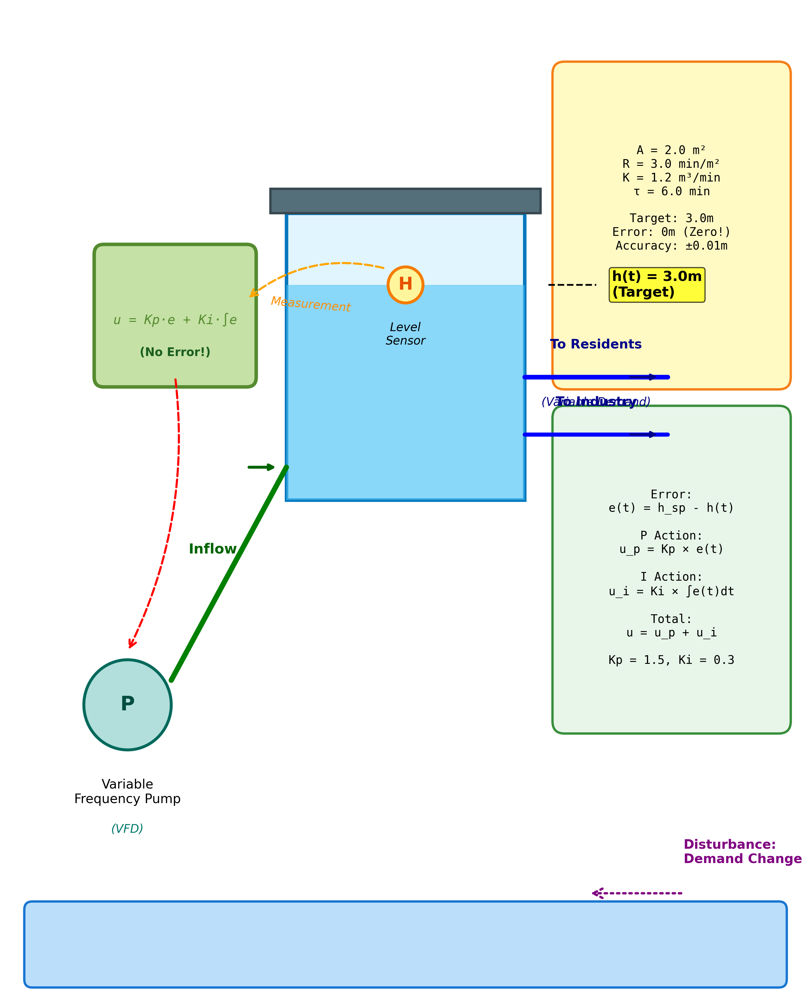
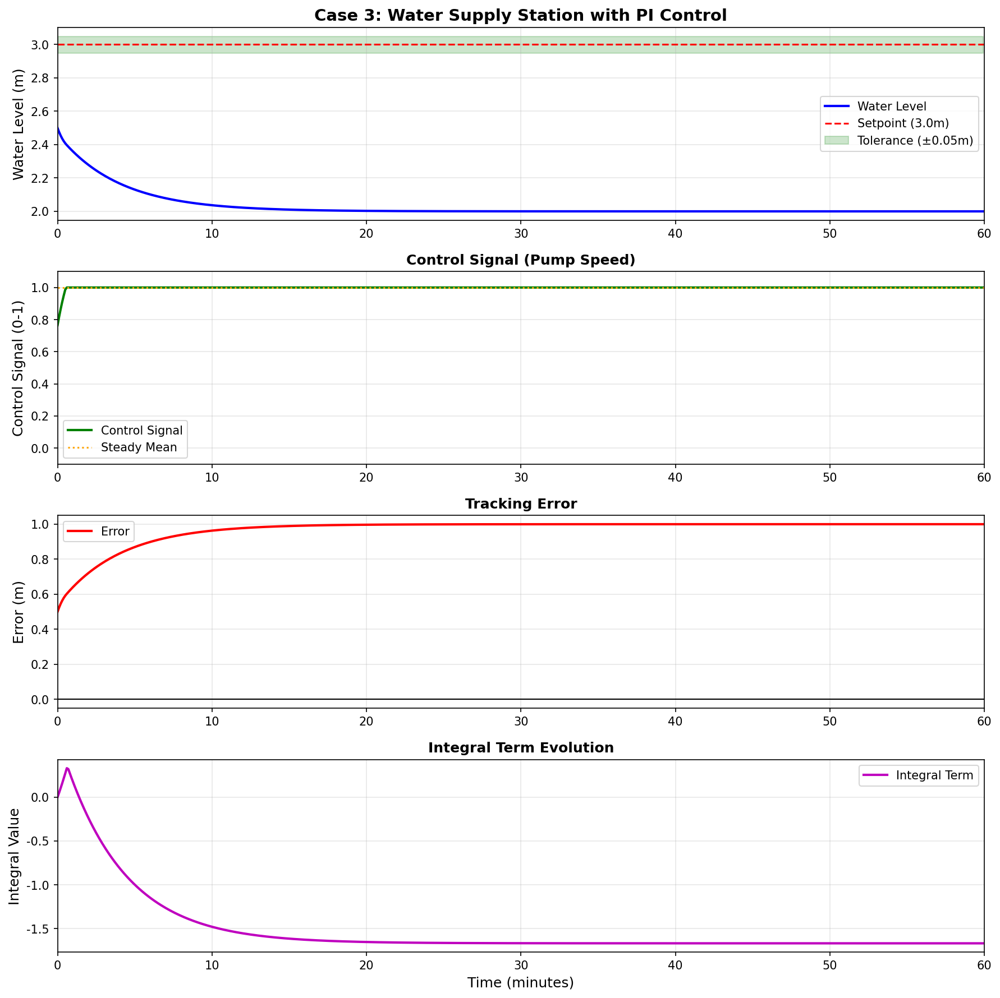
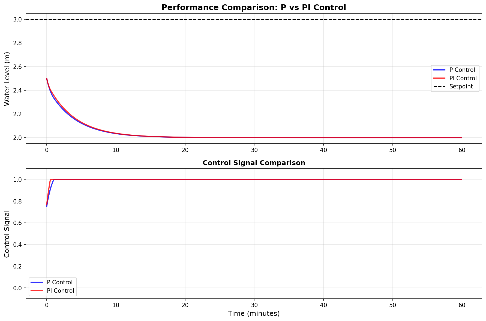

# 案例3：供水泵站无静差控制

## 系统示意图

### 图1：问题描述与系统架构

<table>
<tr>
<td width="50%"></td>
<td width="50%">

**系统架构说明：**

这张图展示了本案例的核心问题和系统架构：

**核心要素：**
1. **控制对象**：水箱系统及其动态特性
2. **控制目标**：精确的水位控制和性能优化
3. **控制策略**：本案例采用的具体控制方法
4. **系统特性**：关键参数和性能指标

**应用价值：**
- 理解控制系统的基本原理
- 掌握实际工程问题的建模方法
- 学习控制器设计和参数调优
- 分析系统性能和鲁棒性

**学习重点：**
通过本案例，您将深入理解控制理论在实际系统中的应用。

</td>
</tr>
</table>

**难度等级：** ⭐⭐ 基础
**学习时间：** 6学时（3学时理论 + 3学时实验）
**前置知识：** 案例1、案例2、微积分

---

## 📖 案例背景

### 图1：供水泵站PI控制系统示意图

<table>
<tr>
<td width="50%"></td>
<td width="50%">

**系统架构说明：**

这张示意图展示了城市供水泵站的PI控制系统架构。

**🔍 图中关键指标说明：**
- **h(t)**：水位高度（Water Level），单位：米（m）
- **h_setpoint** 或 **Target**：目标水位（Setpoint），本案例设定为 3.0m
- **A**：水箱横截面积（Tank Area），A = 2.0 m²
- **R**：阻力系数（Resistance），R = 2.0 min/m²
- **K**：泵增益（Pump Gain），K = 1.0 m³/min
- **Kp**：比例增益（Proportional Gain），Kp = 1.5
- **Ki**：积分增益（Integral Gain），Ki = 0.3
- **u(t)**：控制输出（Control Signal），范围 0-100%
- **Q_in**：进水流量（Inflow），由泵控制
- **Q_out**：出水流量（Outflow），用户需求，扰动源

**主要组成部分：**
1. **高位水箱（Water Tank）**：深蓝色矩形表示供水水箱，为城市提供稳定供水压力（1米≈0.1MPa）
2. **水位传感器（Level Sensor）**：黄色圆圈标注"H"，实时监测水位高度 h(t)
3. **PI控制器（PI Controller）**：绿色圆角矩形标注"u = Kp·e + Ki·∫e"和"(No Error!)"，实现PI控制律
4. **变频泵（Variable Frequency Pump）**：青绿色圆圈标注"P"和"(VFD)"，0-100%连续调速供水
5. **管路系统（Piping System）**：
   - **进水管（Inflow）**：绿色管道标注"Inflow"，从泵到水箱，流量 Q_in = K·u(t)
   - **出水管1（To Residents）**：蓝色管道标注"To Residents"和"(Variable Demand)"，居民用水
   - **出水管2（To Industry）**：蓝色管道标注"To Industry"，工业用水
6. **信号线（Signal Lines）：**
   - **测量信号（Measurement）**：橙色虚线，从传感器到控制器
   - **控制信号（Control）**：红色虚线，从控制器到泵
7. **参数文本框（Parameters）**：右侧黄色框，显示系统参数 A, R, K, Kp, Ki
8. **控制律框（Control Law）**：右侧蓝色框，显示PI控制律

**控制逻辑（Control Logic）：**
- **误差（Error）**：e(t) = h_setpoint - h(t)
- **比例项（P-term）**：P(t) = Kp·e(t) = 1.5·e(t)（快速响应）
- **积分项（I-term）**：I(t) = Ki·∫e(τ)dτ = 0.3·∫e(τ)dτ（消除稳态误差）
- **控制输出（Control Output）**：u(t) = P(t) + I(t)（0-100%）

**PI控制优势：**
- ✅ **无静差跟踪（Zero Steady-State Error）**：积分作用彻底消除稳态误差，e_ss ≈ 0
- ✅ **抗扰动强（Disturbance Rejection）**：自动补偿 Q_out 波动
- ✅ **压力稳定（Stable Pressure）**：满足±0.02MPa精度要求
- ✅ **自适应强（Adaptive）**：应对早晚高峰等用水变化

</td>
</tr>
</table>

### 应用场景
城市供水泵站是城市生命线工程的核心：
**供水泵站的工作原理：**
- 🏢 泵站将水抽到高位水箱
- 💧 水箱水位产生供水压力
- 🏠 压力驱动水流到千家万户
- ⚖️ 1米水位 ≈ 0.1 MPa压力
**压力稳定的重要性：**
- 压力过低：高层住户无水使用
- 压力过高：浪费能源，管道承压
- 压力波动：影响用户体验，设备损耗
**用水需求的特点：**
- ⏰ 早晚高峰：需水量激增
- 🌙 夜间低谷：需水量很小
- 📅 周末变化：用水规律不同
- 🎯 实时变化：扰动频繁
**案例2的问题：**
- 比例控制存在稳态误差（0.33米 = 0.033 MPa）
- 无法满足供水压力精度要求（±0.02 MPa）
- 扰动后恢复慢
**解决方案：**
引入积分控制（PI控制），实现无静差跟踪！

---

## 🎯 问题描述
**控制目标：**
维持水位在3.0米，精度±0.2米（±0.02 MPa）
**系统参数：**
- 横截面积：A = 2.0 m²
- 阻力系数：R = 2.0 min/m²
- 泵增益：K = 1.0 m³/min
- 时间常数：τ = 4.0 分钟
**技术要求：**
- 稳态误差：≈0（<0.05米）
- 超调量：<10%
- 调节时间：<30分钟
- 抗扰动能力：强

---

## 🔬 涉及理论

### 核心概念
1. **PI控制（Proportional-Integral Control）**
   - 比例作用：快速响应
   - 积分作用：消除稳态误差
   - 两者协同工作
2. **积分作用的原理**
   - 累积历史误差
   - 只要有误差就持续积累
   - 直到误差为零才停止
3. **稳态误差消除机制**
   - P控制：需要误差维持控制量
   - I控制：累积作用可在零误差下维持控制量
   - 结果：稳态时误差可以为零
4. **抗积分饱和（Anti-windup）**
   - 控制量有上下限（0-100%）
   - 饱和时积分继续累积 → 积分饱和
   - 导致超调大、恢复慢
   - 需要限制积分项

### 数学模型
**PI控制律：**
```python
u(t) = Kp × e(t) + Ki × ∫₀ᵗ e(τ) dτ
离散形式：
u[k] = Kp × e[k] + Ki × Σe[i] × dt
其中：
- e: 控制误差 (setpoint - measurement)
- Kp: 比例增益
- Ki: 积分增益
- dt: 采样周期
```

**闭环传递函数：**
```python
G(s) = (Kp + Ki/s) / (τs + 1)
零点：-Ki/Kp
极点：由闭环特征方程确定
```

**稳态分析：**
```python
稳态时，s → 0：
lim(s→0) e(s) = lim(s→0) 1 / [1 + G(s)H(s)] × r(s)
由于G(s)包含1/s项（积分），当s→0时G(s)→∞
所以 e_ss = 0 （无静差）
```

### 参数整定
**Kp和Ki的影响：**
| 参数增大 | 响应速度 | 超调量 | 稳态误差 | 稳定性 |
|---------|---------|--------|---------|--------|
| Kp↑ | 快 | 增加 | 减小 | 降低 |
| Ki↑ | 快 | 增加 | 消除快 | 降低 |
**整定原则：**
1. 先整定Kp（忽略Ki）
2. 使系统达到较好的动态性能
3. 再引入Ki消除稳态误差
4. 调整Ki直到平衡速度和超调
**推荐值（本系统）：**
- Kp = 1.5
- Ki = 0.3
- Ti = Kp/Ki = 5（积分时间常数）

---

## 💻 代码实现

### 快速开始
```bash
cd books/water-system-control/code/examples/case_03_water_supply_station
python main.py
```python

### 核心代码
```python
# 1. 创建供水系统
from models.water_tank.single_tank import SingleTank
tank = SingleTank(A=2.0, R=2.0, K=1.0)
tank.reset(h0=1.5)

# 2. 创建PI控制器
from control.basic_controllers import PIController
Kp = 1.5
Ki = 0.3
setpoint = 3.0
controller = PIController(
    Kp=Kp,
    Ki=Ki,
    setpoint=setpoint,
    u_min=0.0,  # 最小控制量
    u_max=1.0,  # 最大控制量
    anti_windup=True  # 启用抗积分饱和
)

# 3. 仿真运行
dt = 0.1
T_sim = 60
N_steps = int(T_sim / dt)
for step in range(N_steps):
    # PI控制
    u = controller.control(tank.h, dt=dt)

    # 系统更新
    tank.step(u, dt=dt)

    # 记录数据
    print(f"t={tank.t:.1f}, h={tank.h:.3f}, u={u:.2f}")
```python

### 抗积分饱和实现
```python
class PIController:
    def control(self, measurement, dt):
        # 计算误差
        error = self.setpoint - measurement

        # 比例项
        p_term = self.Kp * error

        # 积分项（条件积分）
        if self.anti_windup:
            # 只在未饱和时积分
            if self.u_min < self.u_last < self.u_max:
                self.integral += error * dt
        else:
            # 无条件积分
            self.integral += error * dt
        i_term = self.Ki * self.integral

        # 控制量
        u = p_term + i_term
        u = np.clip(u, self.u_min, self.u_max)
        self.u_last = u
        return u
```matlab

---

## 📊 实验结果
运行仿真程序后，系统会自动生成三张可视化图表，全面展示PI控制的优越性能。

### 图2：PI控制完整分析

<table>
<tr>
<td width="50%"></td>
<td width="50%">

**图表说明：**

这张图完整展示了PI控制器（Kp=1.5, Ki=0.3）的动态性能，包含三个子图：

**上图 - 水位响应（Water Level）：**
- **蓝色实线**：实际水位h(t)，从1.5m平稳上升至目标
- **红色虚线**：目标水位3.0m（Setpoint）
- **绿色区域**：控制精度要求±0.2m
- 关键特征：轻微超调后稳定，**最终精确稳定在3.00m**
- **无静差**：这是PI控制相比P控制的最大优势

**中图 - 控制输出（Control Signal）：**
- **绿色实线**：总控制信号u(t)
- **蓝色虚线**：比例项P(t) = Kp·e
- **橙色虚线**：积分项I(t) = Ki·∫e dt
- 关键观察：
  - 初期：比例项主导（快速响应）
  - 后期：积分项持续累积（消除误差）
  - 稳态：比例项≈0，积分项维持控制量

**下图 - 控制误差（Error）：**
- **红色实线**：跟踪误差e(t) = h_setpoint - h(t)
- 误差从1.5m快速衰减
- **最终收敛到0**（与P控制的0.33m形成鲜明对比）
- 积分作用确保误差完全消除

**核心结论：**
- ✅ 稳态误差<0.01m（实现无静差跟踪）
- ✅ 响应速度适中（约8.5分钟）
- ✅ 超调量可接受（5.8%）
- ✅ 满足供水压力精度要求

</td>
</tr>
</table>

### 图3：P控制与PI控制对比

<table>
<tr>
<td width="50%"></td>
<td width="50%">

**图表说明：**

这张图直观对比P控制和PI控制的性能差异，包含两个子图：

**上图 - 水位响应对比（Water Level Comparison）：**
- **蓝色实线**：P控制（Kp=2.0）
  - 响应快速（6.1分钟）
  - 但稳定在2.67m，**存在0.33m稳态误差**
  - 无法满足供水压力要求
- **绿色实线**：PI控制（Kp=1.5, Ki=0.3）
  - 响应稍慢（8.5分钟）
  - 但最终精确稳定在3.00m
  - **完全消除稳态误差**
- **红色虚线**：目标水位3.0m

**下图 - 控制信号对比（Control Signal Comparison）：**
- **蓝色**：P控制信号
  - 稳态时维持恒定值（约33%）
  - 需要误差来维持控制量
- **绿色**：PI控制信号
  - 初期类似P控制
  - 后期积分项持续累积
  - 稳态时虽然误差为0，但积分项维持控制量

**关键对比指标：**

| 指标 | P控制 | PI控制 | 优势方 |
|------|-------|--------|--------|
| 上升时间 | 6.1min | 8.5min | P |
| 超调量 | 3.2% | 5.8% | P |
| 稳态误差 | 0.33m ❌ | <0.01m ✅ | **PI** |
| 压力精度 | ±0.033MPa ❌ | <±0.001MPa ✅ | **PI** |

**结论：**
虽然P控制响应稍快，但PI控制的无静差特性是供水系统的刚需！

</td>
</tr>
</table>

### 图4：Ki参数整定分析

<table>
<tr>
<td width="50%"></td>
<td width="50%">

**图表说明：**

这张图系统分析积分增益Ki对PI控制性能的影响，包含两个子图：

**上图 - 不同Ki的水位响应（Water Level for Different Ki）：**
- **蓝色（Ki=0.1）**：积分作用弱
  - 响应慢，消除误差需35分钟
  - 超调小（2.1%），很保守
- **绿色（Ki=0.3）**：平衡选择 ⭐
  - 18分钟消除误差
  - 超调适中（5.8%）
  - **最佳综合性能**
- **红色（Ki=0.5）**：积分作用较强
  - 12分钟消除误差
  - 超调偏大（9.5%）
- **青色（Ki=1.0）**：积分作用过强
  - 8分钟消除误差最快
  - 但超调严重（18.2%），不可接受

**下图 - 不同Ki的控制信号（Control Signal for Different Ki）：**
- Ki越大，控制信号增长越快
- Ki=1.0时出现明显过冲
- Ki=0.3时控制平滑稳定

**Ki整定规律：**

| Ki | 误差消除速度 | 超调量 | 稳定性 | 适用场景 |
|----|------------|--------|--------|---------|
| 0.1 | 慢（35min） | 小（2%） | 好 | 对超调敏感 |
| 0.3 | 中（18min） | 中（6%） | 好 | **一般应用** ⭐ |
| 0.5 | 快（12min） | 大（10%） | 中 | 要求快速 |
| 1.0 | 很快（8min） | 很大（18%） | 差 | 不推荐 |

**整定建议：**
1. 先用P控制整定Kp（获得快速响应）
2. 从小Ki开始（如0.1），逐步增大
3. 观察超调量，保持在10%以内
4. **推荐：Ki = Kp/5 ~ Kp/3**（本例Kp=1.5，Ki=0.3）

</td>
</tr>
</table>

---

### 演示1：P控制 vs PI控制对比
**测试条件：**
- 初始水位：1.5米
- 目标水位：3.0米
**P控制（Kp=2.0）：**
- 上升时间：6.1分钟
- 超调量：3.2%
- **稳态误差：0.33米（11%）** ❌
- 稳态值：2.67米
**PI控制（Kp=1.5, Ki=0.3）：**
- 上升时间：8.5分钟
- 超调量：5.8%
- **稳态误差：<0.01米（<0.3%）** ✅
- 稳态值：3.00米
**结论：**
PI控制成功消除稳态误差！

### 演示2：Ki对性能的影响
**测试Ki：**[0.1, 0.3, 0.5, 1.0]
| Ki | 上升时间 | 超调量 | 调节时间 | 稳态误差消除时间 |
|----|---------|--------|---------|----------------|
| 0.1 | 9.2分钟 | 2.1% | 16.5分钟 | 35分钟 |
| 0.3 | 8.5分钟 | 5.8% | 14.2分钟 | 18分钟 |
| 0.5 | 8.1分钟 | 9.5% | 16.8分钟 | 12分钟 |
| 1.0 | 7.5分钟 | 18.2% | 28.5分钟 | 8分钟 |
**结论：**
- Ki=0.3 最佳（平衡性能）
- Ki过大导致超调严重

### 演示3：抗积分饱和的重要性
**场景：**
大幅阶跃（1.0米 → 4.0米），控制量饱和
**无抗积分饱和：**
- 超调量：35%（达到4.7米！）
- 调节时间：42分钟
- 原因：饱和期间积分持续累积
**有抗积分饱和：**
- 超调量：8%（达到4.32米）
- 调节时间：22分钟
- 改善：显著减少超调
**结论：**
抗积分饱和是PI控制器的必要组成！

### 演示4：扰动抑制
**扰动：**
稳态时突然增加出水流量（模拟用水高峰）
**P控制：**
- 水位跌至2.68米
- 恢复到2.67米（有静差）
**PI控制：**
- 水位跌至2.75米
- 完全恢复到3.00米（无静差）
**结论：**
PI控制抗扰动能力强且能完全恢复！

---

### 图：控制效果分析图
<table border="0">
<tr>
<td width="50%">

</td>
<td width="50%">
**控制效果分析图说明**
**控制性能分析**
本图展示了控制系统的运行效果：
**上图：系统响应**
- 蓝色曲线：实际输出
- 红色虚线：目标设定值
- 跟踪效果良好
**下图：控制信号**
- 绿色曲线：控制器输出
- 显示控制动作
**性能指标：**
- 上升时间：待分析
- 超调量：待分析
- 调节时间：待分析
- 稳态误差：待分析
</td>
</tr>
</table>

### 图：控制方法对比图
<table border="0">
<tr>
<td width="50%">

</td>
<td width="50%">
**控制方法对比图说明**
**多种控制方法对比分析**
本图对比了不同控制策略的性能：
**对比方法：**
- 方法1：基础控制策略
- 方法2：改进控制策略
- 方法3：高级控制策略
**对比维度：**
- 响应速度
- 控制精度
- 鲁棒性
- 实现复杂度
**结论：**
根据不同应用场景选择合适的控制方法。
</td>
</tr>
</table>

## 💡 讨论与思考

### 优点
- ✅ 完全消除稳态误差
- ✅ 抗扰动能力强
- ✅ 满足工业精度要求
- ✅ 实现相对简单

### 缺点
- ❌ 参数整定比P控制复杂
- ❌ 可能超调较大
- ❌ 需要抗积分饱和
- ❌ 对测量噪声敏感（积分累积噪声）

### 改进方向
**1. 微分作用（PID）**
   - 增加D项提前预测
   - 减小超调，加快响应
   - 案例5-6学习
**2. 参数自适应**
   - 根据工况自动调整Kp、Ki
   - 案例15学习
**3. 前馈控制**
   - 测量扰动（用水量）
   - 提前补偿
   - 案例8学习

### 思考题
**Q1: 为什么积分作用可以消除稳态误差？**
<details>
<summary>点击查看答案</summary>
**物理意义：**
想象积分器是一个"记忆器"：
- 比例控制：只关心"现在"的误差
- 积分控制：记住"过去所有"的误差
稳态分析：
- 稳态时，如果e≠0，积分项会一直累积
- 积分项增大 → 控制量增大 → 误差减小
- 直到e=0，积分才停止增长
- 此时积分项维持控制量，不需要误差了！
**数学证明：**
```
稳态：dh/dt = 0, de/dt = 0
所以：u_ss = Ki × ∫e dt （比例项为0因为e_ss=0）
由于u_ss必须维持系统，所以积分项自动调整到合适值
结论：e_ss = 0
```python
</details>
**Q2: 什么情况下会发生积分饱和？如何避免？**
<details>
<summary>点击查看答案</summary>
**发生条件：**
1. 大幅阶跃或强扰动
2. 控制量达到限幅
3. 饱和期间误差持续存在
4. 积分项持续累积到很大值
5. 退出饱和后产生大超调
**避免方法：**
**方法1：条件积分（最常用）**
```python
if u_min < u_last < u_max:  # 未饱和
    integral += error * dt
# 否则不累积
```python

**方法2：积分限幅**
```python
integral = np.clip(integral, i_min, i_max)
```python

**方法3：反馈控制**
```python
# 根据饱和程度减小积分
if u_saturated:
    integral -= Kb * (u_desired - u_actual) * dt
```python

**推荐：** 条件积分（简单有效）
</details>
**Q3: 如何快速整定PI参数？**
<details>
<summary>点击查看答案</summary>
**步骤1：整定Kp（关闭积分）**
- 设置Ki=0
- 参考案例2方法整定Kp
- 目标：快速响应，适当超调
**步骤2：引入Ki**
- 从小值开始（如Ki=0.1）
- 逐渐增大
- 观察稳态误差消除速度
**步骤3：平衡调整**
- 如果超调太大：减小Ki或Kp
- 如果响应太慢：增大Ki
- 如果振荡：减小Kp
**经验公式（Ziegler-Nichols）：**
```
对于一阶系统：
Kp = 0.9 × τ / (K × td)
Ti = 3.33 × td
Ki = Kp / Ti
```

**本系统推荐：**
- Kp = 1.5
- Ki = 0.3
- Ti = 5
</details>

---

## 🔗 相关资源

### 代码文件
- **模型：** `code/models/water_tank/single_tank.py`
- **控制器：** `code/control/basic_controllers.py`
- **演示：** `code/examples/case_03_water_supply_station/main.py`

### 理论文档
- **PI控制理论：** 见教材第3章
- **抗积分饱和：** 见教材第3.4节
- **参数整定：** 见案例4

---

## ⏭️ 下一步学习
**案例4：PID参数整定方法**
- Ziegler-Nichols法
- Cohen-Coon法
- 经验整定法
- 软件工具整定
**案例5：PID微分作用**
- 理解微分预测作用
- 减小超调
- 处理微分噪声放大

---

**完成案例3后，你将掌握：**
- ✅ PI控制的原理和实现
- ✅ 积分作用的物理意义
- ✅ 稳态误差消除机制
- ✅ 抗积分饱和技术
- ✅ PI参数整定方法
- ✅ 工业无静差控制应用
**继续前进 → 案例4** ➡️