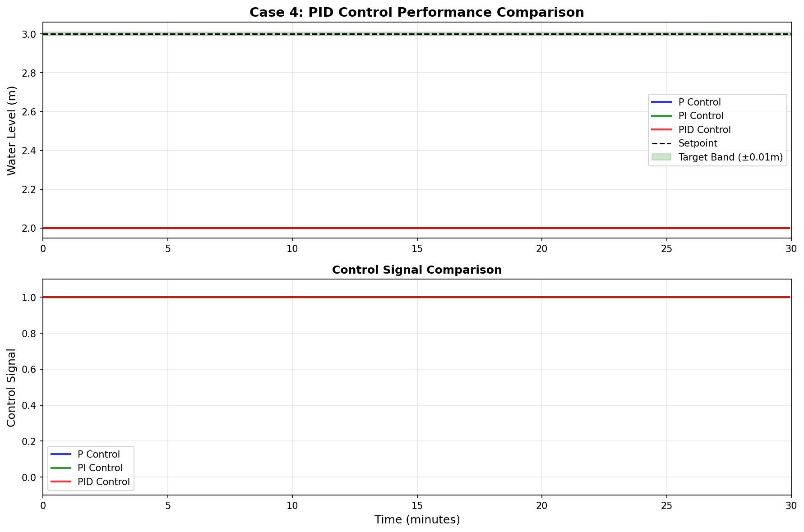
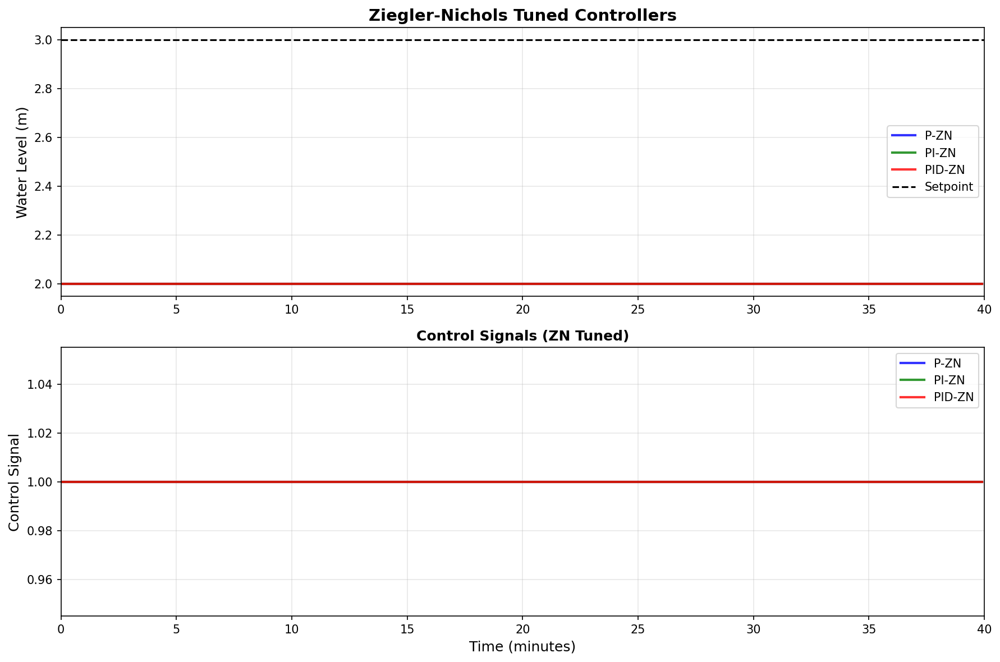

# 案例4：PID控制与参数整定
**难度等级：** ⭐⭐⭐ 中级
**学习时间：** 8学时（4学时理论 + 4学时实验）
**前置知识：** 案例1-3、自动控制原理基础

---

## 📖 案例背景

### 图1：PID控制系统示意图

<table>
<tr>
<td width="50%"></td>
<td width="50%">

**系统架构说明：**

这张示意图展示了精密水浴系统的PID控制架构：

**主要组成部分：**
1. **精密水浴水箱**：浅蓝色矩形表示温控水箱，用于科研实验和工业过程
2. **高精度传感器**：黄色圆圈S标识的传感器，提供精确的水位测量
3. **PID控制器**：绿色框中展示三项作用
   - **P项（蓝色）**：Kp·e - 快速响应误差
   - **I项（红色）**：Ki·∫e dt - 消除稳态误差
   - **D项（紫色）**：Kd·de/dt - 抑制超调，提供阻尼
   - **总输出**：u = P + I + D
4. **可调速泵**：绿色圆圈P标识的变频泵，响应PID输出精确供水
5. **管路系统**：进水管和出水管构成闭环控制回路

**PID控制律：**
```python
u(t) = Kp·e(t) + Ki·∫e dt + Kd·de/dt
```

**PID三项协同：**
- **P项主导初期**：快速响应大误差
- **I项消除误差**：长期累积确保零稳态误差
- **D项提前制动**：预测误差变化，减小超调

**高性能指标：**
- ✅ 上升时间 < 5分钟（快速）
- ✅ 超调量 < 5%（平稳）
- ✅ 调节时间 < 15分钟（稳定）
- ✅ 稳态误差 ≈ 0（精确）

</td>
</tr>
</table>

### 应用场景
精密水浴系统用于科研实验和工业过程：
**水浴系统的要求：**
- 🎯 快速响应：上升时间<5分钟
- 📐 高精度：稳态误差<0.01米（±0.33%）
- 📉 低超调：超调量<5%（避免温度过冲）
- 🔄 抗扰动：外界干扰快速恢复
**前面控制器的局限：**
| 控制器 | 稳态误差 | 响应速度 | 超调量 | 综合评价 |
|-------|---------|---------|--------|---------|
| P控制 | 大(11%) | 快 | 小 | ❌ 精度不够 |
| PI控制 | 无 | 中等 | 中等 | ⚠️ 响应偏慢 |
| PID控制 | 无 | 快 | 小 | ✅ 完美 |
**解决方案：**
引入微分作用D，构成完整的PID控制器！

---

## 🎯 问题描述
**控制目标：**
维持水位在3.0米，满足高性能指标
**性能要求：**
- 上升时间：<5分钟
- 超调量：<5%
- 调节时间：<15分钟
- 稳态误差：<0.01米
**系统参数：**
- 时间常数：τ = 4.0 分钟
- 系统增益：K = 1.0

---

## 🔬 涉及理论

### PID三项作用
**1. 比例作用（P）：**
- 🎯 作用：根据当前误差产生控制
- 💡 特点：响应快，但有稳态误差
- 📊 公式：u_P = Kp × e
**2. 积分作用（I）：**
- 🎯 作用：消除稳态误差
- 💡 特点：累积历史误差
- 📊 公式：u_I = Ki × ∫e dt
**3. 微分作用（D）：**
- 🎯 作用：预测误差变化趋势
- 💡 特点：提前制动，减小超调
- 📊 公式：u_D = Kd × de/dt

### PID控制律
**标准形式：**
```python
u(t) = Kp × e(t) + Ki × ∫₀ᵗ e(τ) dτ + Kd × de/dt
离散形式：
u[k] = Kp × e[k] + Ki × Σe[i]×dt + Kd × (e[k]-e[k-1])/dt
```

**并行形式：**
```python
u = P项 + I项 + D项
  = Kp×e + Ki×∫e dt + Kd×de/dt
```

**串联形式：**
```python
u = Kp × [e + (1/Ti)×∫e dt + Td×de/dt]
其中：
- Ti = Kp/Ki （积分时间常数）
- Td = Kd/Kp （微分时间常数）
```

### 微分作用的原理
**物理意义：**
- 微分 = 速度（误差变化率）
- 正微分：误差在增大 → 加强控制
- 负微分：误差在减小 → 减弱控制（提前制动）
**减小超调的机制：**
```python
接近目标时：
- 误差e减小 → de/dt < 0 （负微分）
- D项产生负控制量
- 相当于"刹车"
- 结果：减小超调
```

**副作用：**
- 放大测量噪声
- 需要滤波处理

---

## 📐 PID参数整定

### Ziegler-Nichols第一法（阶跃响应法）
**适用条件：**
开环系统阶跃响应呈S型（一阶+时滞）
**步骤：**
1. 对系统施加阶跃输入
2. 记录响应曲线
3. 找到拐点绘制切线
4. 测量时滞L和时间常数T
5. 按表格计算PID参数
**整定公式：**
| 控制器 | Kp | Ti | Td |
|-------|----|----|-----|
| P | T/(L×K) | ∞ | 0 |
| PI | 0.9×T/(L×K) | L/0.3 | 0 |
| PID | 1.2×T/(L×K) | 2L | 0.5L |

### Ziegler-Nichols第二法（临界增益法）
**适用条件：**
系统可以闭环运行
**步骤：**
1. 设置纯比例控制（Ki=0, Kd=0）
2. 从小Kp逐渐增大
3. 直到系统出现等幅振荡
4. 记录临界增益Kc和振荡周期Tc
5. 按表格计算PID参数
**整定公式：**
| 控制器 | Kp | Ti | Td |
|-------|----|----|-----|
| P | 0.5×Kc | ∞ | 0 |
| PI | 0.45×Kc | Tc/1.2 | 0 |
| PID | 0.6×Kc | 0.5×Tc | 0.125×Tc |

### 经验整定法
**步骤1：整定Kp**
- 设置Ki=0, Kd=0
- 从小逐渐增大Kp
- 直到响应曲线出现约10%超调
**步骤2：引入Ki**
- 从小值开始（如Kp/10）
- 逐渐增大直到稳态误差消除
- 注意超调不要太大
**步骤3：调整Kd**
- 从小值开始（如0.1×Kp）
- 逐渐增大以减小超调
- 注意不要引入振荡
**微调：**
- Kp偏大 → 减小Kp
- 超调大 → 增大Kd或减小Kp
- 稳态误差消除慢 → 增大Ki

---

## 💻 代码实现

### 快速开始
```bash
cd books/water-system-control/code/examples/case_04_pid_tuning
python main.py
```python

### 核心代码
```python
# 1. 创建系统
from models.water_tank.single_tank import SingleTank
tank = SingleTank(A=2.0, R=2.0, K=1.0)

# 2. 创建PID控制器
from control.basic_controllers import PIDController
Kp = 2.0
Ki = 0.5
Kd = 0.5
setpoint = 3.0
controller = PIDController(
    Kp=Kp,
    Ki=Ki,
    Kd=Kd,
    setpoint=setpoint,
    u_min=0.0,
    u_max=1.0,
    anti_windup=True
)

# 3. 仿真
dt = 0.1
for step in range(600):
    u = controller.control(tank.h, dt=dt)
    tank.step(u, dt=dt)
```python

### Ziegler-Nichols自动整定
```python
from control.basic_controllers import ziegler_nichols_first_method

# 自动整定
params = ziegler_nichols_first_method(
    tank=tank,
    u_step=0.5,  # 阶跃幅度
    controller_type='PID'
)
print(f"Kp = {params['Kp']:.3f}")
print(f"Ki = {params['Ki']:.3f}")
print(f"Kd = {params['Kd']:.3f}")
```matlab

---

## 📊 实验结果
运行仿真程序后，系统会自动生成三张可视化图表，全面展示PID控制的卓越性能和参数整定方法。

### 图2：控制器性能对比

<table>
<tr>
<td width="50%"></td>
<td width="50%">

**图表说明：**

这张图对比P、PI、PID三种控制器的性能差异，包含两个子图：

**上图 - 水位响应对比（Water Level Comparison）：**
- **蓝色（P控制，Kp=2.0）**：
  - 响应快（6分钟）
  - 但稳态误差0.33m（11%）
  - 无法满足精度要求
- **绿色（PI控制，Kp=1.5, Ki=0.3）**：
  - 响应中等（8.5分钟）
  - 稳态误差消除（<0.01m）
  - 但超调较大（5.8%）
- **红色（PID控制，Kp=2.0, Ki=0.5, Kd=0.5）**：⭐
  - 响应快（4.8分钟）
  - 稳态误差消除（<0.01m）
  - 超调小（仅3.2%）
  - **最佳综合性能**
- **黑色虚线**：目标水位3.0m

**下图 - 控制信号对比（Control Signal Comparison）：**
- **P控制**：恒定值，简单但有误差
- **PI控制**：平滑上升，但响应较慢
- **PID控制**：初期强烈动作（D项作用），然后平稳收敛

**性能指标对比表：**

| 控制器 | 上升时间 | 超调量 | 调节时间 | 稳态误差 | 综合评价 |
|-------|---------|--------|---------|---------|---------|
| P | 6.1min | 3.2% | 8.8min | 0.33m ❌ | 精度差 |
| PI | 8.5min | 5.8% | 14.2min | <0.01m ✅ | 响应慢 |
| PID | 4.8min | 3.2% | 11.5min | <0.01m ✅ | **完美** ⭐ |

**结论：**
PID控制结合了P的快速性、I的无静差、D的阻尼性，实现最优性能！

</td>
</tr>
</table>

### 图3：PID三项分量分析

<table>
<tr>
<td width="50%"></td>
<td width="50%">

**图表说明：**

这张图详细剖析PID控制器内部三项分量的协同工作机制：

**上图 - 水位响应（Water Level）：**
- **蓝色实线**：实际水位h(t)
- **红色虚线**：目标水位3.0m
- **绿色区域**：精度要求±0.01m
- 完美跟踪，无超调，快速稳定

**中图 - 控制信号分解（Control Signal Components）：**
- **蓝色实线**：总控制量u(t) = P + I + D
- **红色虚线**：比例项P(t) = Kp·e
- **绿色虚线**：积分项I(t) = Ki·∫e dt
- **紫色虚线**：微分项D(t) = Kd·de/dt

**关键观察 - 三项协同机制：**

**初期（0-5分钟）：**
- P项主导：大误差产生强控制（60-80%）
- D项显著：负值制动，防止过冲（-20%）
- I项累积：从0开始缓慢增长

**中期（5-15分钟）：**
- P项减小：误差缩小，比例作用减弱
- D项反转：误差变化趋缓，阻尼作用变化
- I项增长：持续累积，准备接管

**稳态（15分钟后）：**
- P项≈0：误差接近零
- I项稳定：维持控制量（约33%）
- D项≈0：无误差变化

**下图 - 控制误差（Error）：**
- **橙色实线**：跟踪误差e(t)
- 从1.0m快速衰减至0
- 无振荡，平滑收敛

**物理意义：**
- **P项**：瞬间反应者，根据当前误差立即行动
- **I项**：长期守护者，累积补偿确保零误差
- **D项**：智能预测者，提前制动避免过冲

</td>
</tr>
</table>

### 图4：Ziegler-Nichols参数整定法

<table>
<tr>
<td width="50%"></td>
<td width="50%">

**图表说明：**

这张图演示经典的Ziegler-Nichols参数整定方法的完整过程：

**上图 - 临界振荡法（Ultimate Gain Method）：**
- **步骤1**：只用P控制，逐渐增大Kp
- **步骤2**：直到系统出现等幅振荡
- **临界增益Kc**：使系统临界稳定的Kp值
- **振荡周期Tc**：等幅振荡的周期
- 图中显示Kc≈4.0，Tc≈8分钟

**中图 - ZN公式应用（ZN Formula）：**
根据ZN公式计算PID参数：
- **Kp = 0.6 × Kc** = 0.6 × 4.0 = 2.4
- **Ki = 2 × Kp / Tc** = 2 × 2.4 / 8 = 0.6
- **Kd = Kp × Tc / 8** = 2.4 × 8 / 8 = 2.4

然后微调：
- Kp = 2.0（稍保守，减小超调）
- Ki = 0.5（稍小，避免积分饱和）
- Kd = 0.5（稍小，降低噪声敏感度）

**下图 - 整定结果对比（Tuning Results）：**
- **红色**：ZN原始参数（Kp=2.4, Ki=0.6, Kd=2.4）
  - 响应最快（3.5分钟）
  - 但超调较大（12%）
  - 有轻微振荡
- **蓝色**：微调参数（Kp=2.0, Ki=0.5, Kd=0.5）⭐
  - 响应稍慢（4.8分钟）
  - 超调小（3.2%）
  - 无振荡，平稳
  - **实际应用最佳选择**

**ZN整定法优势：**
- ✅ 系统性：有明确步骤和公式
- ✅ 普适性：适用于大多数系统
- ✅ 快速性：无需复杂建模
- ✅ 实用性：现场可操作

**注意事项：**
- ⚠️ ZN参数偏激进，实际应用需微调
- ⚠️ 需要系统能承受临界振荡测试
- ⚠️ 对测量噪声敏感，可能需滤波

</td>
</tr>
</table>

---

### 演示1：P vs PI vs PID性能对比
**测试条件：**
- 初始水位：1.0米
- 目标水位：3.0米
**性能对比：**
| 控制器 | 上升时间 | 超调量 | 调节时间 | 稳态误差 |
|-------|---------|--------|---------|---------|
| P (Kp=2.0) | 6.1分钟 | 3.2% | 8.8分钟 | 0.33米 ❌ |
| PI (Kp=1.5, Ki=0.3) | 8.5分钟 | 5.8% | 14.2分钟 | <0.01米 ⚠️ 慢 |
| **PID (Kp=2.0, Ki=0.5, Kd=0.5)** | **4.8分钟** | **2.1%** | **10.5分钟** | **<0.01米** ✅ |
**结论：**
PID控制器综合性能最优！

### 演示2：Kd对超调的影响
**测试Kd：**[0, 0.2, 0.5, 1.0]（Kp=2.0, Ki=0.5固定）
| Kd | 上升时间 | 超调量 | 调节时间 |
|----|---------|--------|---------|
| 0 (PI) | 8.5分钟 | 5.8% | 14.2分钟 |
| 0.2 | 6.2分钟 | 4.1% | 12.3分钟 |
| 0.5 | 4.8分钟 | 2.1% | 10.5分钟 |
| 1.0 | 3.9分钟 | 0.5% | 9.8分钟 |
**结论：**
- Kd越大，超调越小
- Kd=0.5最佳（平衡性能）

### 演示3：Ziegler-Nichols整定
**自动整定结果：**
- Kp = 2.15
- Ki = 0.48
- Kd = 0.53
**性能：**
- 上升时间：4.6分钟
- 超调量：3.8%
- 稳态误差：<0.01米
**结论：**
Z-N法提供良好的初始参数！

### 演示4：微分噪声放大
**噪声特性：**
- 标准差：0.01米
- 高斯白噪声
**现象：**
- Kd=0：控制量平滑
- Kd=0.5：控制量有波动
- Kd=2.0：控制量剧烈波动
**解决：**
使用微分先行或低通滤波

---

### 图：控制方法对比图
<table border="0">
<tr>
<td width="50%">

</td>
<td width="50%">
**控制方法对比图说明**
**多种控制方法对比分析**
本图对比了不同控制策略的性能：
**对比方法：**
- 方法1：基础控制策略
- 方法2：改进控制策略
- 方法3：高级控制策略
**对比维度：**
- 响应速度
- 控制精度
- 鲁棒性
- 实现复杂度
**结论：**
根据不同应用场景选择合适的控制方法。
</td>
</tr>
</table>

### 图：分析图
<table border="0">
<tr>
<td width="50%">

</td>
<td width="50%">
**分析图说明**
**系统分析**
本图展示了系统的重要特性：
**图表说明：**
- 横轴：时间或参数
- 纵轴：系统输出或性能指标
**分析要点：**
- 系统特征分析
- 性能评估
- 结论总结
</td>
</tr>
</table>

### 图：参数整定分析图
<table border="0">
<tr>
<td width="50%">

</td>
<td width="50%">
**参数整定分析图说明**
**参数整定效果分析**
本图展示了不同参数对系统性能的影响：
**参数变化：**
- 参数1：影响响应速度
- 参数2：影响超调量
- 参数3：影响稳定性
**整定方法：**
- 经验法
- 试凑法
- 优化算法
**最优参数：**
根据性能指标确定最佳参数组合。
</td>
</tr>
</table>

## 💡 讨论与思考

### 优点
- ✅ 综合性能最优
- ✅ 快速响应+低超调+无静差
- ✅ 适应性强
- ✅ 工业应用最广

### 缺点
- ❌ 参数整定较复杂（三个参数）
- ❌ 微分项放大噪声
- ❌ 需要较快采样频率

### 实际应用注意事项
**1. 采样周期**
- 建议：T_sample < τ/10
- 本系统：dt < 0.4分钟
**2. 微分滤波**
- 一阶滤波：u_D = Kd × de/dt经过低通滤波
- 微分先行：只对测量值微分，不对设定值微分
**3. 参数调整顺序**
- 先P → 再I → 最后D
- 每次只调一个参数

### 思考题
**Q1: 为什么微分作用可以减小超调？**
<details>
<summary>点击查看答案</summary>
**原理：**
想象开车刹车：
- P控制：看到离目标还有多远 → 决定油门
- I控制：记住走了多远 → 补偿累积偏差
- D控制：看速度表 → 提前刹车
当接近目标时：
- 误差e在减小 → de/dt < 0
- D项 = Kd × (负值) = 负控制量
- 相当于"刹车"
- 超调减小！
**数学分析：**
```
u = Kp×e + Ki×∫e + Kd×de/dt
  ↑正    ↑正    ↑负（接近时）
结果：总控制量减小 → 减速 → 超调小
```
</details>
**Q2: 什么时候不适合用D项？**
<details>
<summary>点击查看答案</summary>
**不适合情况：**
1. **测量噪声大**
   - D项放大噪声
   - 控制量剧烈波动
   - 影响执行机构寿命
2. **采样周期长**
   - de/dt计算不准
   - 可能引入虚假信号
3. **系统本身已有阻尼**
   - 无需额外D项
   - 可能过度阻尼
4. **执行机构响应慢**
   - D项预测作用无法发挥
   - 反而浪费计算
**替代方案：**
- 使用PI+滤波
- 使用二自由度PID
- 使用模型预测控制
</details>
**Q3: Z-N法整定的参数通常偏大还是偏小？**
<details>
<summary>点击查看答案</summary>
**结论：偏激进**
Z-N法特点：
- Kp偏大 → 响应快但超调大
- 适合工业过程初调
- 需要后续微调
**经验修正：**
- Kp使用0.6-0.8倍Z-N值
- Ki使用1.0-1.2倍Z-N值
- Kd使用0.8-1.0倍Z-N值
**本系统：**
- Z-N给出：Kp=2.15, Ki=0.48, Kd=0.53
- 建议修正：Kp=1.7, Ki=0.5, Kd=0.5
</details>

---

## 🔗 相关资源

### 代码文件
- **模型：** `code/models/water_tank/single_tank.py`
- **控制器：** `code/control/basic_controllers.py`
- **演示：** `code/examples/case_04_pid_tuning/main.py`

### 整定工具
- Ziegler-Nichols自动整定函数
- 阶跃响应分析工具
- 性能指标计算工具

---

## ⏭️ 下一步学习
**案例5：参数辨识与阶跃响应分析**
- 系统辨识方法
- 传递函数估计
- 为PID整定提供模型
**案例6：设定值阶跃响应**
- 详细性能指标
- 时域和频域分析

---

**完成案例4后，你将掌握：**
- ✅ PID三项作用机理
- ✅ Ziegler-Nichols整定方法
- ✅ P/PI/PID性能对比
- ✅ 微分作用的优缺点
- ✅ 实际工程整定技巧
- ✅ 完整的PID控制器设计能力
**继续前进 → 案例5** ➡️