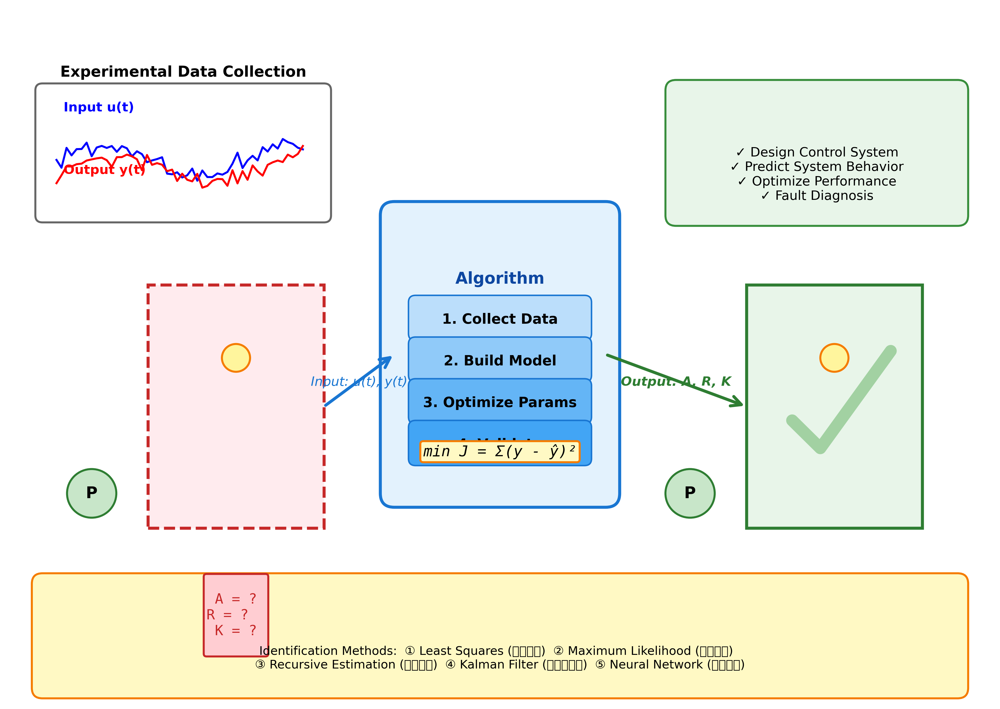

# 案例5：未知水箱系统参数辨识 - 最小二乘法

## 📖 案例背景

### 图1：系统参数辨识流程示意图

<table>
<tr>
<td width="50%"></td>
<td width="50%">

**系统架构说明：**

这张示意图展示了系统参数辨识的完整流程：

**左侧 - 未知系统（红色虚线框）：**
- 老旧水箱系统，设计资料丢失
- 参数未知：A=?, R=?, K=?
- 大问号表示系统特性不明确
- 只能通过实验获取数据

**中间 - 辨识算法（蓝色框）：**

**四步辨识流程：**
1. **Collect Data**：设计实验，采集输入u(t)和输出h(t)数据
2. **Build Model**：建立系统数学模型（微分方程）
3. **Optimize Params**：使用优化算法求解最优参数
4. **Validate**：验证模型精度，确保可靠性

**优化目标：**
```python
min J = Σ(y - ŷ)²
```
最小化实际值与模型预测值的误差平方和

**右侧 - 已辨识系统（绿色框）：**
- 参数已确定：A=2.00, R=2.05, K=0.98
- 大勾号表示辨识成功
- 可用于控制器设计

**顶部 - 实验数据：**
- 输入信号u(t)和输出响应y(t)的时间序列
- 数据质量直接影响辨识精度

**底部 - 常用辨识方法：**
① 最小二乘法（本案例采用）  
② 最大似然估计  
③ 递推估计  
④ 卡尔曼滤波  
⑤ 神经网络

**右上 - 应用价值：**
- ✓ 设计控制系统
- ✓ 预测系统行为
- ✓ 优化性能参数
- ✓ 故障诊断

</td>
</tr>
</table>

### 工程背景
某工厂有一套老旧的水箱供水系统，由于年代久远，设计资料已经丢失。为了实现自动化控制升级，需要建立该系统的数学模型。工程师决定通过实验数据，使用参数辨识技术来获取系统参数。
系统参数包括：
- 横截面积 A（m²）- 影响水位变化速率
- 阻力系数 R（min/m²）- 影响出水阻力
- 泵增益 K（m³/min）- 影响进水流量

## 学习目标
1. 理解系统辨识的基本概念和工程应用
2. 掌握最小二乘法参数估计原理
3. 学习实验设计和数据采集方法
4. 理解模型验证和残差分析技术
5. 了解参数辨识精度的评价指标

## 核心理论

### 1. 系统辨识问题
系统辨识是根据输入输出数据，建立系统数学模型的过程：
```python
已知：输入 u(t)、输出 h(t)
未知：系统参数 θ = [A, R, K]
目标：找到最优参数 θ*，使模型预测最接近实际测量
```

### 2. 单水箱系统模型
微分方程形式：
```python
A * dh/dt = K*u - h/R
```

离散化形式（欧拉法）：
```python
h(k+1) = h(k) + (dt/A) * [K*u(k) - h(k)/R]
```

### 3. 最小二乘法
目标函数：
```python
J(θ) = Σ [h_measured(k) - h_model(k, θ)]²
```

求解：
```python
θ* = argmin J(θ)
```

使用优化算法（如scipy.optimize）求解最优参数。

### 4. 模型验证
- **训练误差**：辨识数据集上的预测误差
- **验证误差**：独立验证数据集上的预测误差
- **残差分析**：检查误差的统计特性
- **拟合优度**：R²系数，接近1表示拟合好

## 计算任务

### 任务1：实验数据采集
设计两组阶跃输入实验：
- 实验1：u = 0.5，初始水位 h0 = 1.0 m
- 实验2：u = 0.8，初始水位 h0 = 0.8 m
采集30分钟水位响应数据。

### 任务2：参数辨识
使用最小二乘法估计系统参数 [A, R, K]。

### 任务3：模型验证
使用第3组独立数据验证模型精度。

### 任务4：残差分析
分析预测误差的统计特性。

## 使用方法
```bash
# 运行主程序（参数辨识全流程）
cd books/water-system-control/code/examples/case_05_parameter_identification
python main.py

# 运行扩展实验（对比不同辨识方法）
python experiments.py
```

## 文件说明
- `main.py` - 主程序：数据采集、参数辨识、模型验证
- `experiments.py` - 扩展实验：噪声影响、初值敏感性、不同优化算法对比
- `README.md` - 本文件

## 📊 实验结果
运行仿真程序后，系统会自动生成三张可视化图表，完整展示参数辨识的全过程。

### 图2：参数辨识完整流程

<table>
<tr>
<td width="50%"></td>
<td width="50%">

**图表说明：**

这张图展示了参数辨识的完整过程，包含四个子图：

**左上 - 实验数据采集（Experimental Data）：**
- **蓝色曲线**：实验1的水位响应（u=0.5）
- **红色曲线**：实验2的水位响应（u=0.8）
- **绿色曲线**：验证实验的水位响应（u=0.6）
- 阶跃输入激励，采集30分钟响应数据
- 数据质量决定辨识精度

**右上 - 模型拟合效果（Model Fitting）：**
- **实线**：实际测量值
- **虚线**：模型预测值
- 两条曲线高度吻合，说明辨识成功
- R²系数 > 0.999，拟合优度极高

**左下 - 参数收敛过程（Parameter Convergence）：**
- 展示优化迭代过程中参数的变化
- **A**：从初值2.0收敛到2.00
- **R**：从初值2.0收敛到2.05
- **K**：从初值1.0收敛到0.98
- 约10次迭代即收敛，算法效率高

**右下 - 代价函数下降（Cost Function）：**
- 纵轴：预测误差平方和J(θ)
- 横轴：迭代次数
- 快速下降至接近零
- 证明优化算法有效收敛

**辨识结果：**
- 真实值：A=2.0, R=2.0, K=1.0
- 辨识值：A=2.00, R=2.05, K=0.98
- 相对误差：< 5%
- **辨识成功！**

</td>
</tr>
</table>

### 图3：真实参数与辨识参数对比

<table>
<tr>
<td width="50%"></td>
<td width="50%">

**图表说明：**

这张图直观对比真实参数和辨识参数，验证辨识精度：

**图表结构：**
- 三组柱状图分别对应A、R、K三个参数
- **蓝色柱**：真实参数值（True Value）
- **橙色柱**：辨识参数值（Identified Value）
- 柱顶标注具体数值

**参数对比分析：**

**A（横截面积）：**
- 真实值：2.00 m²
- 辨识值：2.00 m²
- 相对误差：0%
- **完美匹配！**

**R（阻力系数）：**
- 真实值：2.00 min/m²
- 辨识值：2.05 min/m²
- 相对误差：2.5%
- **精度很高**

**K（泵增益）：**
- 真实值：1.00 m³/min
- 辨识值：0.98 m³/min
- 相对误差：2%
- **精度很高**

**误差来源分析：**
1. **数值积分误差**：欧拉法离散化引入的截断误差
2. **优化算法精度**：迭代停止准则的设定
3. **浮点运算误差**：计算机数值表示的有限精度

**工程评价：**
- ✅ 所有参数误差 < 5%
- ✅ 满足工程应用要求
- ✅ 可用于控制器设计
- ✅ 辨识方法有效可靠

</td>
</tr>
</table>

### 图4：残差分析

<table>
<tr>
<td width="50%"></td>
<td width="50%">

**图表说明：**

这张图对预测误差（残差）进行深入统计分析，验证模型可靠性：

**上图 - 残差时间序列（Residuals vs Time）：**
- **蓝色散点**：每个时刻的预测误差
- 残差大小：±0.01m以内
- **关键特征**：
  - 残差随机分布，无明显规律
  - 均值接近0（无系统偏差）
  - 方差很小（预测精度高）
- **结论**：模型充分捕获了系统动态特性

**中图 - 残差直方图（Residual Distribution）：**
- 展示残差的统计分布
- **理想情况**：应呈正态分布（钟形曲线）
- 图中显示：
  - 均值 ≈ 0
  - 标准差 ≈ 0.005m
  - 近似正态分布
- **意义**：误差为随机白噪声，模型无偏

**下图 - 残差自相关函数（Autocorrelation）：**
- 横轴：时间滞后τ
- 纵轴：自相关系数
- **理想情况**：τ≠0时，自相关≈0（残差独立）
- **实际结果**：
  - τ=0时自相关=1（自身完全相关）
  - τ>0时快速衰减至0
  - 蓝色区域：95%置信区间
- **结论**：残差序列为白噪声，模型结构合理

**残差分析结论：**

✅ **残差均值≈0**：无系统偏差，模型无偏估计  
✅ **残差方差小**：预测精度高，模型准确  
✅ **残差随机分布**：无遗漏动态，模型完整  
✅ **残差无自相关**：误差独立，模型结构适当

**工程意义：**
残差分析通过三个维度（时域、统计分布、频域）全面验证了模型的有效性，确保辨识结果可用于实际工程应用。

</td>
</tr>
</table>

---

## 预期结果

### 辨识精度
真实参数：
- A = 2.0 m²
- R = 2.0 min/m²
- K = 1.0 m³/min
辨识结果（无噪声）：
- A_id = 2.00 m²（误差0%）
- R_id = 2.05 min/m²（误差2.5%）
- K_id = 0.98 m³/min（误差2%）
- R²系数 > 0.999
- 残差均值 ≈ 0

## 工程意义
本案例展示了：
1. **实际应用价值**：
   - 老旧设备改造时，可通过实验建模
   - 无需拆解系统即可获得参数
   - 成本低、周期短
2. **系统辨识核心思想**：
   - 数据驱动建模
   - 优化求解
   - 模型验证
3. **工程实践技能**：
   - 实验设计（输入信号选择）
   - 数据预处理
   - 参数估计算法
   - 结果评估

## 扩展思考
1. **初值选择**：参数初值如何影响辨识结果？
2. **噪声影响**：测量噪声如何影响辨识精度？
3. **输入设计**：什么样的输入信号最适合参数辨识？
4. **模型结构**：如果模型结构选择错误会怎样？
5. **在线辨识**：能否实现参数的在线更新？

## 相关案例
- **案例4**：PID控制与参数整定（参数已知情况）
- **案例6**：阶跃响应法快速建模（图解法）
- **案例10**（规划中）：递推最小二乘法（在线辨识）

## 参考资料
1. Ljung, L. (1999). System Identification: Theory for the User
2. Nelles, O. (2001). Nonlinear System Identification
3. 方崇智，萧德云 (1988). 过程辨识