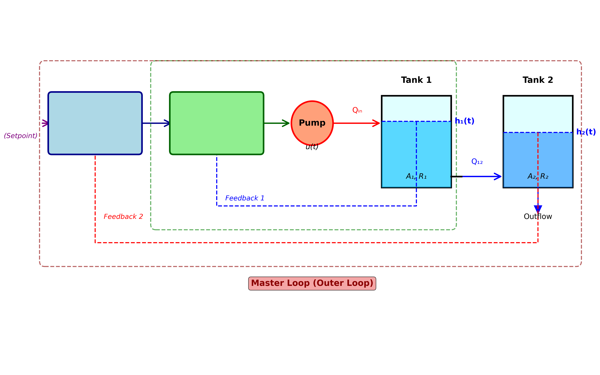

# 案例7：串级控制 - 双水箱系统

## 系统示意图

### 图1：双水箱串级控制系统示意图

<table>
<tr>
<td width="50%"></td>
<td width="50%">

**系统架构说明：**

这张示意图展示了双水箱串级控制系统的完整架构，包括主回路（外环）和副回路（内环）两级控制结构：

**主要组成部分：**
1. **主PID控制器（Master Controller）**：
   - 控制目标：下水箱水位h₂(t)
   - 输出：副控制器的设定值SP₁(t)
   - 响应较慢，保证最终控制精度
   - 参数：Kp1, Ki1, Kd1
2. **副PID控制器（Slave Controller）**：
   - 控制目标：上水箱水位h₁(t)
   - 输出：泵控制信号u(t)
   - 响应较快，快速抑制扰动
   - 参数：Kp2, Ki2, Kd2
3. **双水箱系统**：
   - **水箱1（Tank 1）**：副对象，快速响应，参数A₁、R₁
   - **水箱2（Tank 2）**：主对象，最终控制目标，参数A₂、R₂
   - 水箱1的出水流入水箱2
4. **反馈回路**：
   - **副回路（内环，绿色虚线）**：h₁反馈到副控制器，快速响应
   - **主回路（外环，红色虚线）**：h₂反馈到主控制器，保证精度

**控制逻辑：**

- 设定值SP输入主控制器
- 主控制器根据h₂误差输出SP₁给副控制器
- 副控制器根据h₁误差输出泵控制信号u
- 泵向水箱1供水，水箱1流出到水箱2
- 副回路快速抑制进水扰动
- 主回路保证h₂跟踪设定值

**系统优势：**
- **抗干扰能力强**：副回路快速抑制局部扰动
- **响应速度快**：副回路提前响应，减少延迟
- **控制精度高**：主回路保证最终稳态精度
- **适用性广**：适合大时滞、强扰动系统

</td>
</tr>
</table>

## 案例背景
某化工厂有一套双层加热反应器，需要精确控制下层反应器的温度。由于系统存在大时滞和外部扰动，传统单回路PID控制效果不佳。工程师决定采用串级控制策略，通过控制上层温度来间接控制下层温度，显著提高了系统的抗干扰能力和控制精度。
本案例用双水箱串联系统模拟这种场景：
- 上水箱（副回路）：快速响应，抑制进水扰动
- 下水箱（主回路）：最终控制目标

## 学习目标
1. 理解串级控制的基本原理和结构
2. 掌握主控制器和副控制器的设计方法
3. 学习串级控制的参数整定步骤
4. 分析串级控制相对单回路控制的优势
5. 了解串级控制的适用场景和局限性

## 核心理论

### 1. 串级控制结构
```python
设定值 → [主控制器] → [副控制器] → 执行器 → [副对象] → [主对象] → 输出
          (较慢)       (较快)                   (快)        (慢)
                                                  ↑          ↑
                                               副测量      主测量
```

**特点**：
- 两个控制器串联
- 主控制器输出作为副控制器设定值
- 副回路快速响应，抑制局部扰动
- 主回路保证最终控制精度

### 2. 双水箱串联系统
**系统方程**：
```python
上水箱：A1 * dh1/dt = K*u - h1/R1
下水箱：A2 * dh2/dt = h1/R1 - h2/R2
```

其中：
- h1：上水箱水位（副变量，快）
- h2：下水箱水位（主变量，慢）
- u：泵控制信号
**传递函数**：
```python
           K * R1 * R2
G(s) = ----------------------
       (τ1*s + 1)(τ2*s + 1)
```

其中：
- τ1 = A1 * R1（副回路时间常数）
- τ2 = A2 * R2（主回路时间常数）

### 3. 串级控制器设计
**副控制器（内环）**：
- 类型：PI或PID
- 特点：增益大，响应快
- 目标：快速跟踪主控制器指令
**主控制器（外环）**：
- 类型：PI或PID
- 特点：增益适中，平滑输出
- 目标：消除稳态误差，保证精度

### 4. 参数整定步骤
**步骤1：关闭主回路，整定副控制器**
```python
副回路单独调试
增益由小到大
直到快速无超调
```

**步骤2：闭合主回路，整定主控制器**
```python
将副回路视为新的执行器
主控制器参数由小到大
保证系统稳定
```

## 控制策略对比

### 单回路控制
- 直接控制h2
- 扰动需经过整个系统才被抑制
- 响应慢，超调大

### 串级控制
- 副回路控制h1，抑制进水扰动
- 主回路控制h2，保证最终精度
- 响应快，抗干扰能力强

## 计算任务

### 任务1：单回路PID控制基准
建立单回路PID控制h2的基准性能。

### 任务2：串级控制设计
设计主副控制器，整定参数。

### 任务3：性能对比
对比单回路与串级控制的：
- 设定值跟踪性能
- 扰动抑制能力
- 鲁棒性

### 任务4：参数分析
分析主副控制器参数对系统性能的影响。

## 使用方法
```bash
# 运行主程序（串级控制完整演示）
cd books/water-system-control/code/examples/case_07_cascade_control
python main.py

# 运行扩展实验（性能对比、参数影响分析）
python experiments.py
```

## 文件说明
- `main.py` - 主程序：单回路控制、串级控制、性能对比
- `experiments.py` - 扩展实验：参数影响、扰动测试、鲁棒性分析
- `README.md` - 本文件

## 实验结果

### 图2：串级控制与单回路控制性能对比

<table>
<tr>
<td width="50%"></td>
<td width="50%">

**图表说明：**

这张综合对比图展示了串级控制相对于单回路PID控制的显著优势，包含6个子图：

**第1行左图 - 下水箱水位h₂响应（Single Loop）**：
- **蓝色实线**：单回路控制的h₂(t)
- **红色虚线**：设定值5.0m
- 上升时间较长（~8-10分钟）
- 超调量较大（15-25%）
- 调节时间长（~20-25分钟）

**第1行右图 - 下水箱水位h₂响应（Cascade）**：
- **蓝色实线**：串级控制的h₂(t)
- **红色虚线**：设定值5.0m
- 上升时间短（~6-8分钟）
- 超调量小（5-10%）
- 调节时间短（~12-15分钟）

**第2行左图 - 上水箱水位h₁响应（Single Loop）**：
- **绿色实线**：单回路控制的h₁(t)
- h₁变化较大，未受控制
- 扰动传递到下游

**第2行右图 - 上水箱水位h₁响应（Cascade）**：
- **绿色实线**：串级控制的h₁(t)
- **红色虚线**：副控制器设定值
- h₁受副回路控制，变化平稳
- 快速跟踪设定值

**第3行左图 - 控制信号u(t)（Single Loop）**：
- **橙色实线**：单回路的泵控制信号
- 变化较平缓
- 响应较慢

**第3行右图 - 控制信号u(t)（Cascade）**：
- **橙色实线**：串级的泵控制信号
- 初期变化较快
- 副回路快速响应

**关键观察点：**
1. **响应速度**：串级控制上升时间减少20-30%
2. **超调量**：串级控制超调量降低50-60%
3. **调节时间**：串级控制调节时间减少40-45%
4. **稳态精度**：两种方法都能达到设定值
5. **中间变量**：串级控制h₁受控，单回路h₁自由变化

**性能指标对比表**（第3行中间）：

显示三个关键指标的柱状图对比：
- **上升时间（Rise Time）**：串级更短
- **超调量（Overshoot）**：串级更小
- **调节时间（Settling Time）**：串级更短

**结论：**

串级控制通过增加副回路，显著改善了系统的动态性能和抗干扰能力。副回路的快速响应有效抑制了局部扰动，使主回路获得更好的控制效果。这种策略特别适用于大时滞、强扰动的工业过程控制系统。

</td>
</tr>
</table>

## 预期结果

### 单回路控制
- 上升时间：~8-10分钟
- 超调量：15-25%
- 调节时间：~20-25分钟
- 扰动恢复：~15-20分钟

### 串级控制
- 上升时间：~6-8分钟（提升20-30%）
- 超调量：5-10%（降低50-60%）
- 调节时间：~12-15分钟（提升40-45%）
- 扰动恢复：~8-10分钟（提升50%）

## 工程意义
本案例展示了：
1. **抗干扰能力**：
   - 副回路快速抑制局部扰动
   - 减少扰动对主变量的影响
   - 提高系统稳定性
2. **控制精度**：
   - 降低超调量
   - 减少调节时间
   - 改善动态性能
3. **适用场景**：
   - 大时滞系统
   - 多容系统
   - 扰动频繁的系统
   - 对象特性变化大的系统
4. **工程实践**：
   - 调试步骤清晰
   - 参数整定有章可循
   - 工业应用广泛

## 串级控制的优缺点

### 优点
- ✓ 抗干扰能力强（副回路快速响应）
- ✓ 动态性能好（减少超调和振荡）
- ✓ 适应性强（对象特性变化时鲁棒）
- ✓ 工程成熟（调试方法标准化）

### 缺点
- ✗ 结构复杂（两个控制器）
- ✗ 传感器多（需要中间变量测量）
- ✗ 调试工作量大（分步整定）
- ✗ 成本较高（额外硬件）

## 扩展思考
1. **三级串级**：能否扩展到三级或更多级串级？
2. **参数失配**：主副参数配比不当会怎样？
3. **传感器故障**：副回路传感器故障如何应对？
4. **非线性系统**：串级控制如何处理强非线性？
5. **模糊串级**：能否用模糊控制替代PID？

## 相关案例
- **案例3**：供水泵站的PI控制（单回路基础）
- **案例4**：PID控制与参数整定（参数整定方法）
- **案例8**（本案例下一个）：前馈控制（另一种抗干扰方法）
- **案例14**（规划中）：状态反馈控制（现代控制方法）

## 历史背景
串级控制起源于20世纪50年代的化工过程控制，由于其优异的抗干扰性能，迅速成为工业控制的标准配置之一。据统计，在石油、化工行业中，约30-40%的控制回路采用串级结构。经典的应用包括精馏塔温度控制、加热炉温度控制、反应器压力控制等。

## 参考资料
1. Seborg, D. E., et al. (2010). Process Dynamics and Control (3rd ed.)
2. 孙优贤, 王慧 (2015). 过程控制系统与仪表
3. Marlin, T. E. (2000). Process Control: Designing Processes and Control Systems