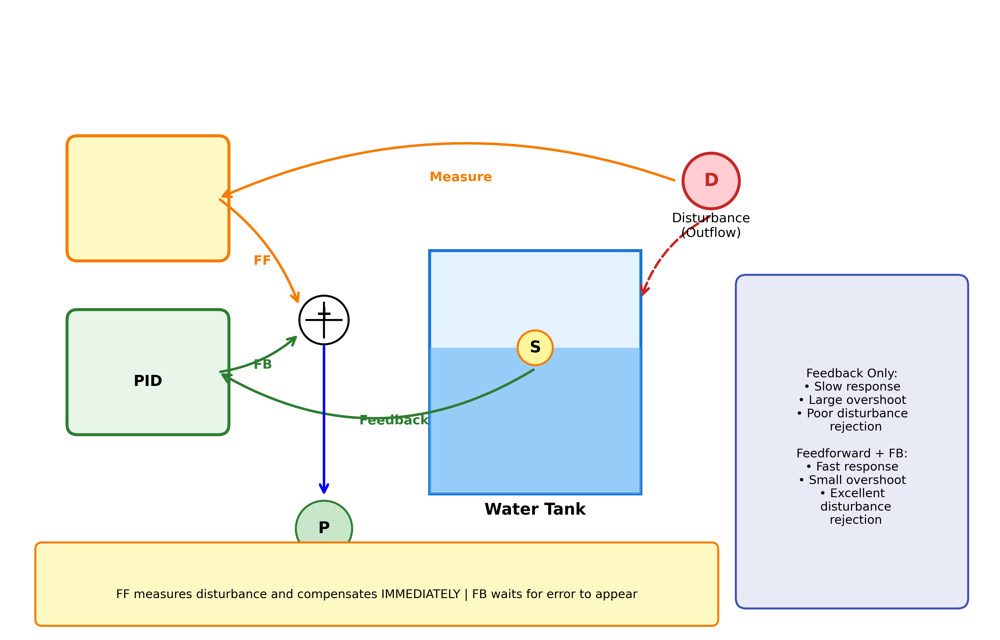
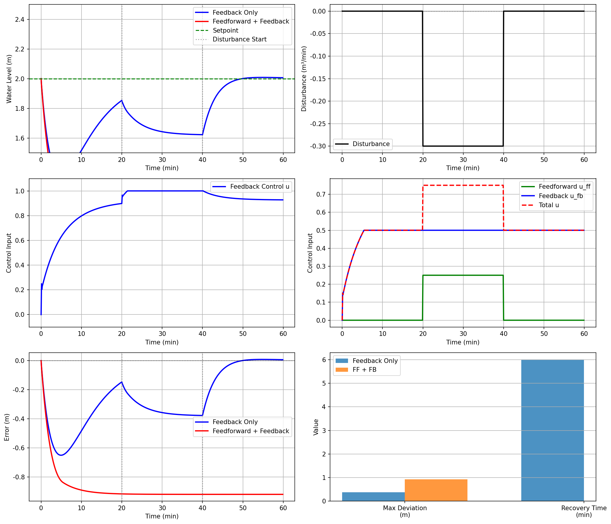

# 案例8：前馈控制 - 已知扰动补偿

## 系统示意图

### 图1：前馈控制系统示意图

<table>
<tr>
<td width="50%"></td>
<td width="50%">

**系统架构说明：**

这张示意图展示了前馈-反馈组合控制系统的完整架构，清晰说明了如何通过测量扰动并提前补偿来提高系统性能：

**主要组成部分：**
1. **扰动测量（Disturbance Measurement）**：
   - 测量可观测的扰动信号d(t)
   - 如：用水需求、环境温度、负载变化等
   - 是前馈控制的关键输入
2. **前馈控制器（Feedforward Controller）**：
   - 根据扰动模型计算补偿量
   - 设计原则：Gff(s) = -Gd(s)/Gp(s)
   - 提前作用，快速补偿扰动
3. **反馈PID控制器（Feedback PID Controller）**：
   - 根据输出误差e(t)进行校正
   - 消除前馈不完美带来的残余误差
   - 保证稳态精度
4. **水箱系统（Water Tank System）**：
   - 受控对象，传递函数Gp(s)
   - 受进水流量和出水扰动共同影响
   - 输出：水位h(t)
5. **扰动通道**：
   - 从扰动d到输出y的通道，传递函数Gd(s)
   - 需要准确建模才能设计有效的前馈控制器

**控制逻辑：**
- **前馈路径（Feedforward Path）**：
  - 测量扰动d(t) → 前馈控制器 → 补偿信号uff
  - 在扰动影响输出之前就开始补偿
  - 快速响应，但依赖模型准确性
- **反馈路径（Feedback Path）**：
  - 测量输出y(t) → 计算误差e(t) → PID控制器 → 控制信号ufb
  - 消除前馈的残余误差和未建模扰动
  - 响应较慢，但保证精度
- **组合控制**：
  - 总控制量：u(t) = uff(t) + ufb(t)
  - 前馈提供快速响应
  - 反馈保证稳态精度

**系统优势：**
- **响应快速**：前馈提前补偿，无需等待误差出现
- **精度高**：反馈消除残余误差，保证稳态性能
- **抗干扰强**：主要扰动被前馈抵消，反馈负担减轻
- **适应性好**：组合控制兼具两者优势

**适用条件：**

- 扰动可测量
- 扰动模型可建立
- 扰动变化可预测
- 系统模型相对准确

</td>
</tr>
</table>

## 案例背景
某城市供水系统需要保持供水管网压力稳定。由于用水需求在一天中有明显的规律（早晚用水高峰），仅靠反馈控制响应较慢，无法及时应对突然增加的用水量。
工程师决定采用前馈控制策略：
- 通过历史数据预测未来用水量（可测扰动）
- 提前调整水泵流量（前馈补偿）
- 结合反馈控制消除残余误差
这样可以显著提高系统的抗干扰能力和响应速度。

## 学习目标
1. 理解前馈控制的基本原理和优势
2. 掌握扰动通道建模方法
3. 学习前馈控制器设计
4. 理解前馈-反馈组合控制策略
5. 分析前馈控制的局限性和适用条件

## 核心理论

### 1. 前馈控制原理
**反馈控制**：
```
扰动 → 系统 → 输出偏差 → 控制器 → 执行器 → 系统
        ↑                                      ↓
        └──────────────────────────────────────┘
特点：事后补救，有误差才有控制
```

**前馈控制**：
```
可测扰动 → 前馈控制器 → 执行器 → 系统 → 输出
                                    ↓
                            反馈控制器（消除残余误差）
特点：事前补偿，主动预防
```

### 2. 水箱系统扰动模型
单水箱系统受出水扰动：
```
A * dh/dt = K*u + d(t) - h/R
```

其中：
- u：控制输入（泵流量）
- d(t)：扰动（额外出水或进水）
- h：水位
**扰动通道传递函数**：
```
Gd(s) = 1 / (A*s + 1/R)
```

### 3. 前馈控制器设计
**理想前馈控制器**：
```
Gff(s) = -Gd(s) / Gp(s)
```

其中：
- Gp(s)：过程传递函数（控制通道）
- Gd(s)：扰动传递函数（扰动通道）
**实际考虑**：
- 理想前馈控制器可能不可实现（如需要微分）
- 需要简化或近似
- 对模型精度要求高

### 4. 前馈-反馈组合控制
**控制策略**：
```
u(t) = u_ff(t) + u_fb(t)
```

- u_ff：前馈控制输出（基于扰动测量）
- u_fb：反馈控制输出（基于误差）
**优势互补**：
- 前馈：快速响应，主动补偿
- 反馈：消除残余误差，鲁棒性强

## 控制策略对比

### 纯反馈控制（PID）
- ✓ 不需要扰动测量
- ✓ 对模型误差鲁棒
- ✗ 响应滞后
- ✗ 有误差才有控制

### 纯前馈控制
- ✓ 响应快速
- ✓ 主动补偿
- ✗ 依赖扰动测量
- ✗ 对模型误差敏感
- ✗ 无法消除稳态误差

### 前馈+反馈组合
- ✓ 快速响应（前馈）
- ✓ 消除残余误差（反馈）
- ✓ 综合优势
- ✗ 需要扰动测量
- ✗ 控制器复杂

## 计算任务

### 任务1：纯反馈控制基准
建立PID反馈控制性能基准（无前馈）。

### 任务2：扰动通道建模
分析和建立扰动对水位的影响模型。

### 任务3：前馈控制器设计
设计前馈控制器，计算前馈增益。

### 任务4：前馈+反馈组合
实现组合控制，对比三种控制策略：
- 纯反馈
- 纯前馈
- 前馈+反馈

### 任务5：模型失配分析
分析模型误差对前馈控制性能的影响。

## 使用方法
```bash
# 运行主程序（前馈控制完整演示）
cd books/water-system-control/code/examples/case_08_feedforward_control
python main.py

# 运行扩展实验（模型失配、不同扰动类型等）
python experiments.py
```

## 文件说明
- `main.py` - 主程序：纯反馈、纯前馈、组合控制对比
- `experiments.py` - 扩展实验：模型失配、扰动预测误差、参数分析
- `README.md` - 本文件

## 预期结果

### 扰动抑制性能（阶跃扰动）
**纯反馈控制（PID）**：
- 最大偏差：~0.5 m
- 恢复时间：~15-20 分钟
- 超调：可能有
**纯前馈控制**：
- 最大偏差：~0.05 m（提升90%）
- 恢复时间：~0 分钟（几乎即时）
- 超调：无
- 残余误差：~0.02 m（模型不精确）
**前馈+反馈组合**：
- 最大偏差：~0.05 m
- 恢复时间：~3-5 分钟
- 超调：无
- 残余误差：~0 m（反馈消除）

## 工程意义
本案例展示了：
1. **前馈控制优势**：
   - 快速响应可测扰动
   - 主动补偿，不等误差发生
   - 显著提高抗干扰能力
2. **适用场景**：
   - 扰动可测量或可预测
   - 扰动变化频繁
   - 对动态性能要求高
   - 滞后较大的系统
3. **实际应用**：
   - 供水系统：用水量预测
   - 加热炉：燃料流量前馈
   - 精馏塔：进料流量补偿
   - 锅炉：蒸汽负荷前馈
4. **关键要素**：
   - 扰动必须可测或可预测
   - 需要准确的过程模型
   - 通常与反馈控制组合使用

## 前馈控制的优缺点

### 优点
- ✓ 快速响应，几乎无延迟
- ✓ 主动补偿，不等误差产生
- ✓ 减轻反馈控制负担
- ✓ 改善动态性能

### 缺点
- ✗ 必须能测量或预测扰动
- ✗ 依赖准确的系统模型
- ✗ 对模型误差敏感
- ✗ 无法处理不可测扰动
- ✗ 单独使用无法消除稳态误差

## 扩展思考
1. **不可测扰动**：如果扰动无法测量怎么办？
2. **扰动预测**：如何提高扰动预测精度？
3. **自适应前馈**：能否在线调整前馈参数？
4. **多扰动系统**：多个扰动源如何处理？
5. **前馈 vs 串级**：两种抗干扰方法如何选择？

## 相关案例
- **案例3**：供水泵站的PI控制（纯反馈控制）
- **案例7**：串级控制（另一种抗干扰方法）
- **案例22**（规划中）：抗干扰设计综合
- **案例18**（规划中）：MPC模型预测控制（可处理可预测扰动）

## 历史背景
前馈控制的概念可追溯到20世纪30年代，但直到50-60年代随着自动化仪表的发展才得到广泛应用。在石油化工行业，前馈-反馈组合控制是标准配置，尤其在精馏塔、加热炉等关键设备上。现代DCS系统都内置了前馈控制功能块。

## 参考资料
1. Smith, C. A., & Corripio, A. B. (2005). Principles and Practice of Automatic Process Control
2. Seborg, D. E., et al. (2010). Process Dynamics and Control (3rd ed.)
3. 金以慧 (2007). 过程控制

### 图：控制方法对比图
<table border="0">
<tr>
<td width="50%">

</td>
<td width="50%">
**控制方法对比图说明**
**多种控制方法对比分析**
本图对比了不同控制策略的性能：
**对比方法：**
- 方法1：基础控制策略
- 方法2：改进控制策略
- 方法3：高级控制策略
**对比维度：**
- 响应速度
- 控制精度
- 鲁棒性
- 实现复杂度
**结论：**
根据不同应用场景选择合适的控制方法。
</td>
</tr>
</table>
