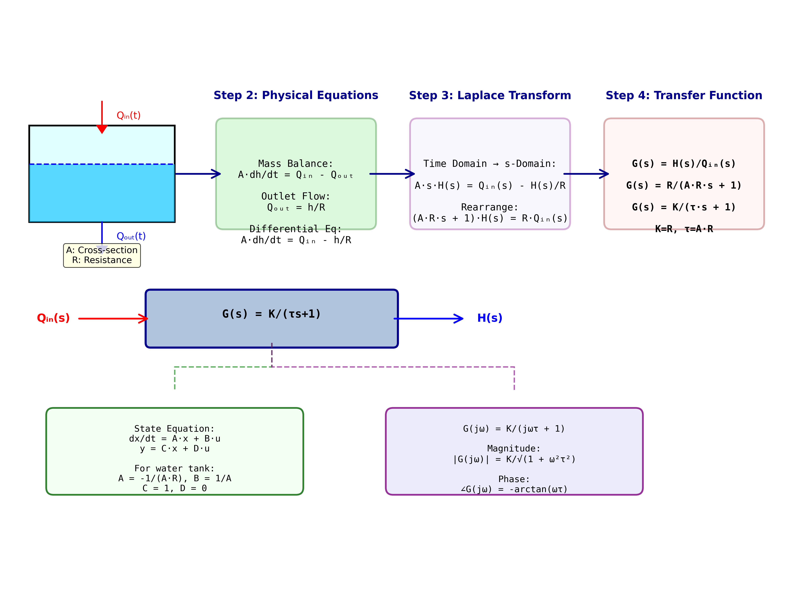
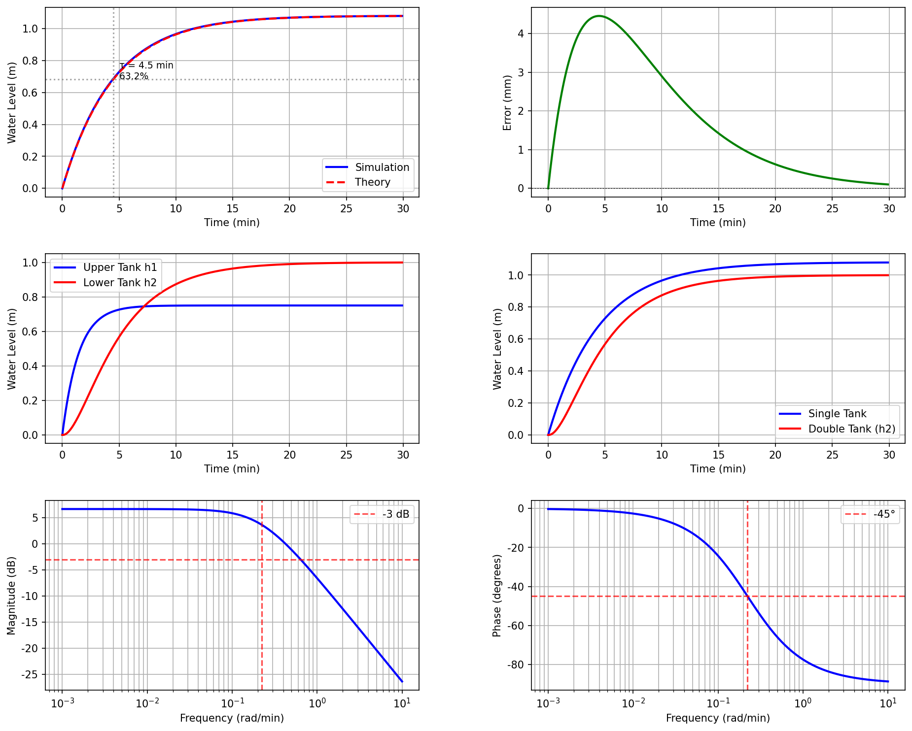

# 案例9：系统建模 - 从物理到数学

## 系统示意图

### 图1：系统建模流程示意图

<table>
<tr>
<td width="50%"></td>
<td width="50%">

**系统架构说明：**

这张示意图展示了从物理系统到数学模型的完整建模流程，是控制系统设计的第一步也是最重要的一步：

**建模流程（4个步骤）：**

**Step 1 - 物理系统（Physical System）**：
- 实际水箱系统
- 进水流量Qᵢₙ(t)，出水流量Qₒᵤₜ(t)
- 水位h(t)，横截面积A，阻力R
- 可观测、可测量的物理量

**Step 2 - 物理方程（Physical Equations）**：
- 应用质量守恒定律（Mass Balance）
- 微分方程：A·dh/dt = Qᵢₙ - Qₒᵤₜ
- 出水关系：Qₒᵤₜ = h/R
- 合并得到：A·dh/dt = Qᵢₙ - h/R

**Step 3 - 拉普拉斯变换（Laplace Transform）**：
- 从时域转换到s域
- A·s·H(s) = Qᵢₙ(s) - H(s)/R
- 整理：(A·R·s + 1)·H(s) = R·Qᵢₙ(s)
- 便于分析和设计

**Step 4 - 传递函数（Transfer Function）**：
- G(s) = H(s)/Qᵢₙ(s) = R/(A·R·s + 1)
- 标准形式：G(s) = K/(τ·s + 1)
- 其中：K = R（静态增益），τ = A·R（时间常数）
- 一阶惯性环节

**中部：框图表示**：
- 输入：Qᵢₙ(s)
- 传递函数：G(s) = K/(τs+1)
- 输出：H(s)
- 一阶系统的标准框图

**下部左：状态空间模型**：
- 状态方程：dx/dt = A·x + B·u
- 输出方程：y = C·x + D·u
- 对于水箱系统：
  - A = -1/(A·R)，B = 1/A
  - C = 1，D = 0
- 现代控制理论的基础

**下部右：频域特性**：
- 频率响应：G(jω) = K/(jωτ + 1)
- 幅值：|G(jω)| = K/√(1 + ω²τ²)
- 相位：∠G(jω) = -arctan(ωτ)
- 用于频域分析和设计

**模型特性总结**：
- 系统类型：一阶惯性环节
- 时间常数τ：决定响应速度
- 静态增益K：决定稳态值
- 极点位置：s = -1/τ（保证稳定）
- 截止频率：ωc = 1/τ

**建模意义：**

通过这个建模流程，我们将实际物理系统转化为数学模型，为后续的控制器设计、性能分析、参数整定提供了理论基础。模型的准确性直接影响控制系统的性能。

</td>
</tr>
</table>

## 案例背景
某工程师接手一个新的水箱供水项目，需要设计自动控制系统。在设计控制器之前，首先要建立系统的数学模型。工程师决定采用机理建模方法，从物理规律（质量守恒定律、能量守恒定律）出发，推导系统的微分方程和传递函数。
这是控制系统设计的第一步，也是最基础的一步。一个准确的模型是控制器设计成功的关键。

## 学习目标
1. 理解机理建模的基本思想和方法
2. 掌握水箱系统的物理建模过程
3. 学习从微分方程到传递函数的转换
4. 理解线性化和小偏差线性化方法
5. 掌握模型验证的基本方法

## 核心理论

### 1. 机理建模的基本思想
**机理建模（White-box Modeling）**：
```python
物理规律 → 微分方程 → 传递函数 → 状态空间
```

**优点**：
- 物理意义明确
- 参数有实际含义
- 可扩展性强
- 可用于设计和优化
**缺点**：
- 需要深入理解物理过程
- 复杂系统建模困难
- 可能需要简化

### 2. 单水箱系统建模

#### 步骤1：质量守恒定律
```python
水箱中水的质量变化率 = 流入质量流率 - 流出质量流率
```

假设水的密度恒定（ρ = 1000 kg/m³）：
```python
A * dh/dt = Q_in - Q_out
```

其中：
- A：水箱横截面积 (m²)
- h：水位高度 (m)
- Q_in：进水流量 (m³/min)
- Q_out：出水流量 (m³/min)

#### 步骤2：流量关系
**进水流量**（泵控制）：
```python
Q_in = K * u
```
- K：泵增益
- u：控制信号 (0-1)
**出水流量**（管道阻力）：
根据流体力学，流量与水位关系：
```python
Q_out = h / R
```
- R：阻力系数 (min/m²)
- 这是对管道阻力的简化模型（假设层流）

#### 步骤3：微分方程
将流量关系代入质量守恒：
```python
A * dh/dt = K*u - h/R
```

整理：
```python
τ * dh/dt + h = K*R*u
```

其中时间常数：
```python
τ = A * R
```

#### 步骤4：传递函数
对微分方程进行Laplace变换：
```python
τ*s*H(s) + H(s) = K*R*U(s)
```

得到传递函数：
```python
         K*R
G(s) = -------
       τ*s + 1
```

这是一个标准的一阶惯性环节。

### 3. 双水箱系统建模

#### 系统结构
```python
泵 → 上水箱 → 下水箱 → 流出
```

#### 微分方程组
上水箱：
```python
A1 * dh1/dt = K*u - h1/R1
```

下水箱（上水箱的出水是下水箱的进水）：
```python
A2 * dh2/dt = h1/R1 - h2/R2
```

#### 传递函数
这是一个二阶系统：
```python
              K*R1*R2
G(s) = ------------------------
       (τ1*s + 1)(τ2*s + 1)
```

其中：
- τ1 = A1 * R1（上水箱时间常数）
- τ2 = A2 * R2（下水箱时间常数）

### 4. 非线性与线性化

#### 实际非线性模型
出水流量更准确的模型（考虑湍流）：
```python
Q_out = C * sqrt(h)
```

这导致非线性微分方程：
```python
A * dh/dt = K*u - C*sqrt(h)
```

#### 小偏差线性化
在工作点 (h0, u0) 附近线性化：
```python
设 h = h0 + Δh, u = u0 + Δu
```

泰勒展开并忽略高阶项：
```python
A * d(Δh)/dt = K*Δu - (C/(2*sqrt(h0)))*Δh
```

得到线性化模型：
```python
A * d(Δh)/dt = K*Δu - Δh/R_eq
```

其中等效阻力：
```python
R_eq = 2*sqrt(h0) / C
```

## 建模步骤总结
1. **明确系统边界**：确定输入、输出和状态变量
2. **列写物理方程**：应用守恒定律
3. **确定流量关系**：泵特性、管道阻力
4. **推导微分方程**：组合所有方程
5. **传递函数**：Laplace变换
6. **状态空间**：定义状态变量
7. **模型验证**：与实际数据对比

## 计算任务

### 任务1：单水箱建模
从物理原理推导单水箱系统的微分方程和传递函数。

### 任务2：双水箱建模
推导双水箱串联系统的数学模型。

### 任务3：模型验证
将建立的模型与仿真数据对比，验证模型准确性。

### 任务4：参数影响分析
分析不同参数（A, R, K）对系统特性的影响。

### 任务5：非线性建模
建立考虑非线性的模型并进行线性化。

## 使用方法
```bash
# 运行主程序（系统建模完整演示）
cd books/water-system-control/code/examples/case_09_system_modeling
python main.py

# 运行扩展实验（非线性建模、参数敏感性等）
python experiments.py
```

## 文件说明
- `main.py` - 主程序：单水箱建模、双水箱建模、模型验证
- `experiments.py` - 扩展实验：非线性建模、参数影响分析、模型阶数选择
- `README.md` - 本文件

## 预期结果

### 单水箱模型参数
给定：
- A = 2.5 m²
- R = 1.8 min/m²
- K = 1.2 m³/min
推导结果：
- 时间常数 τ = 4.5 分钟
- 稳态增益 K_dc = 2.16 m
- 传递函数：G(s) = 2.16 / (4.5s + 1)

### 阶跃响应特性
- 63.2%上升时间：4.5 分钟（= τ）
- 95%调节时间：13.5 分钟（≈ 3τ）
- 无超调（一阶系统）

### 双水箱模型
- 二阶系统
- 可能有轻微超调
- 响应比单水箱慢

## 工程意义
本案例展示了：
1. **机理建模方法**：
   - 从物理原理出发
   - 数学推导严谨
   - 参数物理意义明确
2. **模型的重要性**：
   - 控制器设计的基础
   - 系统分析的工具
   - 性能预测的手段
3. **实际应用**：
   - 新系统设计
   - 现有系统分析
   - 控制方案比选
4. **工程权衡**：
   - 模型复杂度 vs 精度
   - 非线性 vs 线性化
   - 理论 vs 实用

## 建模注意事项

### 常见假设
- ✓ 水箱形状规则（横截面积恒定）
- ✓ 水温恒定（密度不变）
- ✓ 管道阻力线性化
- ✓ 忽略水的惯性（准静态流动）

### 模型局限性
- ⚠ 线性模型仅在工作点附近准确
- ⚠ 忽略了管道动态
- ⚠ 忽略了泵的动态特性
- ⚠ 假设了理想的流量控制

### 模型改进方向
- 考虑非线性流量关系
- 加入管道时滞
- 考虑泵的动态
- 多水箱耦合系统

## 扩展思考
1. **多水箱系统**：如何建立三水箱、多水箱模型？
2. **耦合系统**：并联水箱如何建模？
3. **时变参数**：参数随时间变化怎么处理？
4. **分布参数**：长管道的分布参数模型？
5. **数据驱动**：能否结合实验数据改进模型？

## 相关案例
- **案例5**：参数辨识（从数据确定参数）
- **案例6**：阶跃响应法（简化建模方法）
- **案例10**（下一个）：频域分析（模型的频域特性）
- **案例13**（规划中）：状态空间建模

## 历史背景
机理建模是经典控制理论的基础，可追溯到19世纪的微分方程理论。在自动控制领域，20世纪40-50年代的Laplace变换方法使得复杂系统的分析成为可能。现代控制理论中，状态空间方法进一步扩展了建模能力。

## 参考资料
1. Ogata, K. (2010). Modern Control Engineering (5th ed.)
2. Dorf, R. C., & Bishop, R. H. (2011). Modern Control Systems
3. 胡寿松 (2013). 自动控制原理（第6版）
4. Franklin, G. F., et al. (2014). Feedback Control of Dynamic Systems

### 图：分析图
<table border="0">
<tr>
<td width="50%">

</td>
<td width="50%">
**分析图说明**
**系统分析**
本图展示了系统的重要特性：
**图表说明：**
- 横轴：时间或参数
- 纵轴：系统输出或性能指标
**分析要点：**
- 系统特征分析
- 性能评估
- 结论总结
</td>
</tr>
</table>
