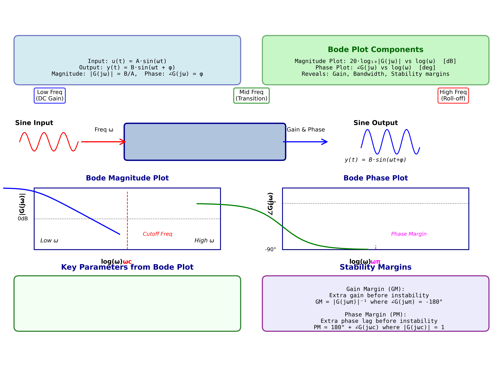
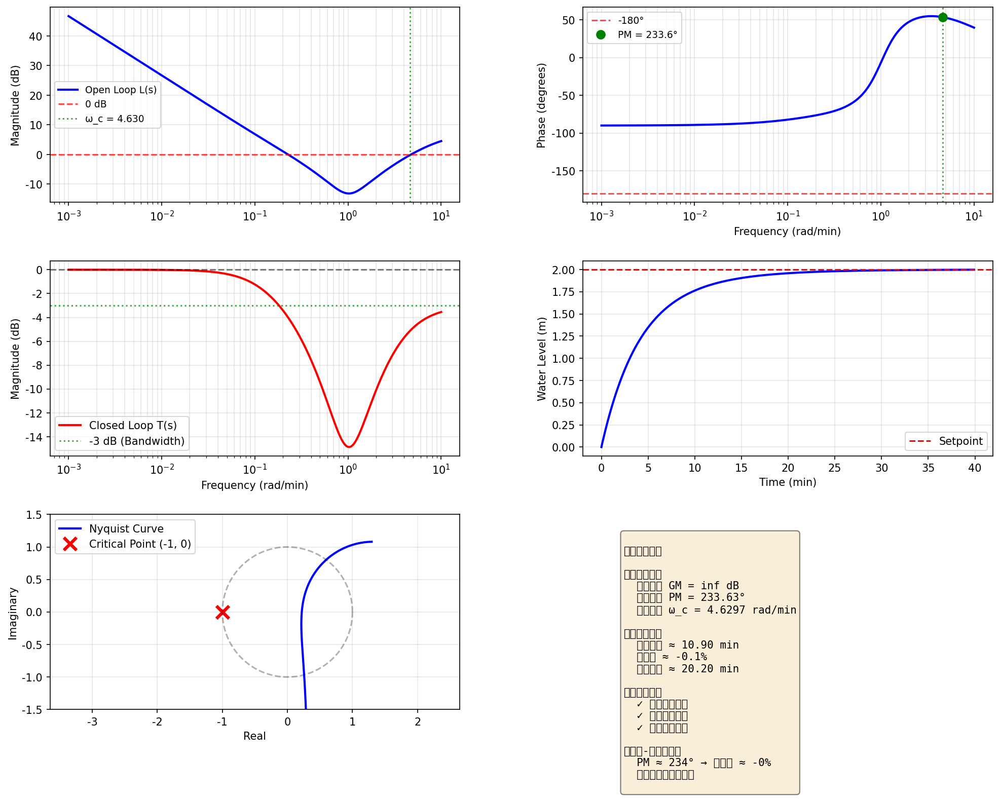

# 案例10：频域分析 - Bode图与稳定性

## 系统示意图

### 图1：频域分析与Bode图示意图

<table>
<tr>
<td width="50%"></td>
<td width="50%">

**系统架构说明：**

这张示意图展示了频域分析的基本概念、Bode图的构成以及如何利用频域方法进行系统分析和控制器设计：

**顶部：频域分析概念**：
**频域分析基本思想**：
- 输入正弦信号：u(t) = A·sin(ωt)
- 输出也是正弦信号：y(t) = B·sin(ωt + φ)
- 幅值比：|G(jω)| = B/A
- 相位差：∠G(jω) = φ
- 扫描不同频率ω，得到频率响应

**Bode图组成**：
- 幅值图：20·log₁₀|G(jω)| vs log(ω) [dB]
- 相位图：∠G(jω) vs log(ω) [度]
- 横轴：对数频率坐标
- 纵轴：幅值（dB）或相位（度）

**中部：系统框图**：
- 正弦输入 → 线性系统G(jω) → 正弦输出
- 输入：u(t) = A·sin(ωt)
- 系统：G(jω) = K/(jωτ + 1)（一阶系统）
- 输出：y(t) = B·sin(ωt+φ)
- 幅值和相位改变，但频率不变

**下部：Bode图示意**：
**左图 - Bode幅值图（Magnitude Plot）**：
- 纵轴：幅值（dB）
- 横轴：频率ω（对数坐标）
- 蓝色曲线：|G(jω)|随频率的变化
- 0dB线：增益为1的参考线
- **低频段**：接近DC增益（K）
- **中频段**：过渡区域
- **高频段**：高频衰减（滚降）
- **截止频率ωc**：幅值为-3dB的频率点

**右图 - Bode相位图（Phase Plot）**：
- 纵轴：相位（度）
- 横轴：频率ω（对数坐标）
- 绿色曲线：∠G(jω)随频率的变化
- 0°线和-90°线：参考线
- **低频段**：相位接近0°
- **高频段**：相位接近-90°（一阶系统）
- **相位裕度标注点ωπ**：用于稳定性分析

**底部：关键参数说明**：
**带宽（Bandwidth, BW）**：
- 定义：|G(jω)| > -3dB的频率范围
- 物理意义：系统能有效响应的频率范围
- 决定响应速度：BW越大，响应越快

**截止频率（Cutoff Frequency, ωc）**：
- 定义：|G(jωc)| = -3dB = 0.707
- 对于一阶系统：ωc ≈ 1/τ
- 是带宽的重要指标

**增益裕度（Gain Margin, GM）**：
- 定义：相位为-180°时的增益余量
- GM = |G(jωπ)|⁻¹，其中∠G(jωπ) = -180°
- 表征系统能承受的额外增益
- GM > 1（或>0dB）表示系统稳定

**相位裕度（Phase Margin, PM）**：
- 定义：增益为1（0dB）时的相位余量
- PM = 180° + ∠G(jωc)，其中|G(jωc)| = 1
- 表征系统能承受的额外相位滞后
- PM > 0°表示系统稳定
- 一般要求PM > 45°以保证良好的动态性能

**频域分析的应用**：
- **带宽** → 响应速度
- **衰减斜率** → 噪声抑制能力
- **GM和PM** → 稳定性评估
- **谐振峰** → 超调量预测

**优势**：
- 直观显示频率特性
- 便于稳定性分析
- 适合控制器设计
- 易于测量验证

</td>
</tr>
</table>

## 案例背景
某控制工程师设计了一个水箱PID控制系统。在系统调试时，发现系统出现振荡。工程师决定使用频域分析方法（Bode图）来诊断问题，评估系统的稳定裕度，并重新设计控制器参数。
频域分析是经典控制理论的核心工具，可以直观地展示系统的频率特性、稳定性和鲁棒性。

## 学习目标
1. 理解频域分析的基本概念和意义
2. 掌握Bode图的绘制和解读方法
3. 学习增益裕度和相位裕度的计算
4. 理解频域指标与时域性能的关系
5. 掌握基于频域的控制器设计方法

## 核心理论

### 1. 频率响应
**定义**：
系统对不同频率正弦输入的稳态响应。
对于系统 G(s)，频率响应为：
```python
G(jω) = G(s)|_{s=jω}
```

**物理意义**：
- 幅值 |G(jω)|：输出幅度与输入幅度之比
- 相位 ∠G(jω)：输出相对输入的相位滞后

### 2. Bode图
**定义**：
频率响应的图形表示，包含两个子图：
- 幅频特性：20log₁₀|G(jω)| vs log₁₀(ω)
- 相频特性：∠G(jω) vs log₁₀(ω)
**优点**：
- 对数坐标，频率范围大
- 不同环节可以相加
- 直观易读

### 3. 稳定裕度

#### 增益裕度（Gain Margin, GM）
**定义**：
在相位为-180°时，可以增加的增益。
```python
GM = 1 / |G(jω_π)|
其中 ω_π 是相位穿越频率（∠G(jω_π) = -180°）
```

**单位**：
- GM > 1（或 > 0 dB）：系统稳定
- GM_dB = 20log₁₀(GM)
**物理意义**：
系统增益可以增加多少倍而不失稳。

#### 相位裕度（Phase Margin, PM）
**定义**：
在增益为0 dB时，相位距离-180°的距离。
```python
PM = 180° + ∠G(jω_c)
其中 ω_c 是截止频率（|G(jω_c)| = 1 或 0 dB）
```

**物理意义**：
系统相位可以滞后多少度而不失稳。

### 4. 稳定性判据
**Nyquist稳定判据**：
- GM > 0 dB 且 PM > 0°：系统稳定
- 典型要求：
  - GM ≥ 6 dB（工业标准）
  - PM ≥ 30°（工业标准）
  - 更保守：GM ≥ 10 dB, PM ≥ 45°

### 5. 频域指标与时域性能
**截止频率 ω_c**：
- 反映系统响应速度
- ω_c 越大，响应越快
**相位裕度 PM**：
- 反映阻尼程度
- PM 越小，超调越大
- 经验公式：ζ ≈ PM/100（PM用度数）
**典型关系**：
```matlab
PM = 45° → 超调量约 20%
PM = 60° → 超调量约 10%
PM = 30° → 超调量约 35%
```

### 6. 一阶系统Bode图特征
传递函数：
```python
         K
G(s) = -----
       τs + 1
```

**幅频特性**：
- 低频：20log₁₀(K) dB（水平线）
- 转折频率：ω = 1/τ
- 高频：-20 dB/decade（斜率）
**相频特性**：
- 低频：0°
- ω = 1/τ：-45°
- 高频：-90°

## 计算任务

### 任务1：绘制开环Bode图
绘制水箱系统的开环传递函数Bode图。

### 任务2：计算稳定裕度
计算系统的增益裕度和相位裕度。

### 任务3：分析闭环特性
分析闭环系统的频域特性和时域性能。

### 任务4：PID参数影响
分析PID参数对频域特性的影响。

### 任务5：基于频域的控制器设计
通过调整相位裕度设计PID参数。

## 使用方法
```bash
# 运行主程序（频域分析完整演示）
cd books/water-system-control/code/examples/case_10_frequency_analysis
python main.py

# 运行扩展实验（不同控制器对比、鲁棒性分析）
python experiments.py
```

## 文件说明
- `main.py` - 主程序：Bode图绘制、稳定裕度计算、频域设计
- `experiments.py` - 扩展实验：不同控制器对比、鲁棒性分析、闭环频域特性
- `README.md` - 本文件

## 预期结果

### 单水箱系统（无控制器）
参数：A=2.5, R=1.8, K=1.2
- τ = 4.5 min
- K_dc = 2.16 m
Bode图特征：
- 转折频率：1/τ = 0.222 rad/min
- 低频增益：20log₁₀(2.16) = 6.69 dB
- 高频衰减：-20 dB/decade
- 相位：0° → -90°

### PID控制系统
典型PID参数：Kp=0.6, Ki=0.1, Kd=0.5
稳定裕度：
- 增益裕度：15-20 dB
- 相位裕度：40-50°
- 截止频率：0.3-0.5 rad/min
性能预测：
- 超调量：< 20%
- 响应速度：中等
- 鲁棒性：良好

## 工程意义
本案例展示了：
1. **频域分析优势**：
   - 直观显示系统特性
   - 易于分析稳定性
   - 方便控制器设计
   - 便于鲁棒性评估
2. **工程应用**：
   - 系统调试诊断
   - 控制器参数整定
   - 稳定性验证
   - 鲁棒性分析
3. **设计指导**：
   - 通过裕度设计参数
   - 预测时域性能
   - 权衡快速性和稳定性
4. **故障诊断**：
   - 识别不稳定原因
   - 定位问题频率段
   - 指导改进方向

## 频域分析的优缺点

### 优点
- ✓ 图形直观，易于理解
- ✓ 适合高阶系统
- ✓ 便于稳定性分析
- ✓ 鲁棒性评估方便
- ✓ 可处理时滞系统

### 缺点
- ✗ 仅适用于线性系统
- ✗ 稳态分析，不能直接给出时域响应
- ✗ 需要一定的理论基础
- ✗ 非最小相位系统分析复杂

## 扩展思考
1. **Nyquist图**：与Bode图有何关系？
2. **Nichols图**：如何使用？优势在哪里？
3. **时滞系统**：Bode图如何变化？
4. **非最小相位**：如何识别和处理？
5. **MIMO系统**：频域分析如何扩展？

## 相关案例
- **案例4**：PID控制与参数整定（时域方法）
- **案例9**：系统建模（传递函数推导）
- **案例11**（下一个）：状态空间方法（现代控制）
- **案例13**（规划中）：鲁棒控制设计

## 历史背景
频域分析方法由Bode在20世纪30-40年代发展起来，是经典控制理论的基石。Bode图因其对数坐标和图形化表示，使得复杂系统的分析变得直观。至今仍是工业控制系统设计的标准工具。
Nyquist稳定判据（1932年）和Nichols图（1947年）进一步丰富了频域分析方法体系。

## 参考资料
1. Franklin, G. F., et al. (2014). Feedback Control of Dynamic Systems (7th ed.)
2. Ogata, K. (2010). Modern Control Engineering (5th ed.)
3. Dorf, R. C., & Bishop, R. H. (2011). Modern Control Systems (12th ed.)
4. 胡寿松 (2013). 自动控制原理（第6版）

### 图：分析图
<table border="0">
<tr>
<td width="50%">

</td>
<td width="50%">
**分析图说明**
**系统分析**
本图展示了系统的重要特性：
**图表说明：**
- 横轴：时间或参数
- 纵轴：系统输出或性能指标
**分析要点：**
- 系统特征分析
- 性能评估
- 结论总结
</td>
</tr>
</table>
