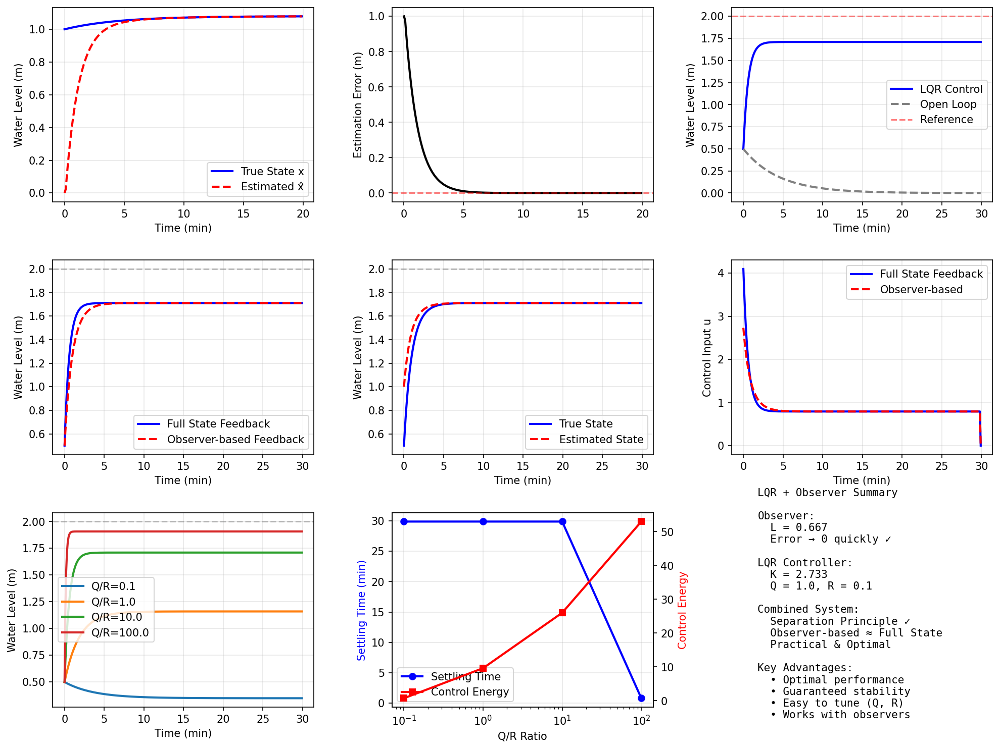

# 案例12：状态观测器与LQR最优控制

## 系统示意图

### 图1：LQR与观测器设计系统示意图

<table>
<tr>
<td width="50%"></td>
<td width="50%">

**系统架构说明：**

这张综合图展示了状态观测器与LQR最优控制的完整系统架构：

**核心组件：**
1. **状态观测器（Luenberger Observer）**：
   - 观测器方程：dx̂/dt = Ax̂ + Bu + L(y - ŷ)
   - 从输出y估计状态x̂
   - L为观测器增益矩阵
   - 估计误差渐近收敛到零
2. **LQR最优控制器**：
   - 性能指标：J = ∫(x'Qx + u'Ru)dt
   - 最优控制律：u = -Kx̂（使用估计状态）
   - K通过求解Riccati方程得到
   - Q权衡状态偏差，R权衡控制能量
3. **分离原理（Separation Principle）**：
   - 观测器和控制器可独立设计
   - 观测器极点：快速收敛
   - 控制器极点：期望闭环性能
   - 联合系统保持稳定性

**系统优势：**
- 最优性能保证
- 鲁棒性好
- 适用于状态不可测系统
- 工程实用性强

**应用场景：**
适用于需要高性能控制但状态不完全可测的系统。

</td>
</tr>
</table>

## 场景描述
在实际工程中，系统的所有状态往往无法直接测量。例如，水箱系统中我们可以测量水位，但无法直接测量流速。此外，即使所有状态可测，传感器噪声也会影响控制性能。本案例介绍两个重要的现代控制技术：**状态观测器（State Observer）**和**线性二次型调节器（LQR）**。
状态观测器可以从可测输出估计不可测状态，LQR则提供最优的状态反馈增益。两者结合形成实际工程中广泛应用的控制系统。

## 教学目标
1. **状态观测器设计**：Luenberger观测器的原理和设计方法
2. **LQR最优控制**：理解性能指标和求解Riccati方程
3. **分离原理**：观测器和控制器可独立设计
4. **完整系统实现**：观测器+LQR的联合应用
5. **性能权衡**：理解Q和R矩阵对系统性能的影响

## 核心概念

### 1. 状态观测器（Luenberger Observer）
**问题**：状态反馈需要所有状态x，但实际中只能测量输出y
**解决方案**：设计观测器估计状态
**观测器方程**：
```
d x̂/dt = Ax̂ + Bu + L(y - ŷ)
ŷ = Cx̂
```

其中：
- **x̂**: 状态估计值
- **L**: 观测器增益矩阵（设计参数）
- **y - ŷ**: 输出误差（创新项）
**误差动态**：
```
e = x - x̂（估计误差）
de/dt = (A - LC)e
```

**设计目标**：选择L使得误差快速收敛，即配置(A-LC)的特征值

### 2. LQR最优控制
**问题**：如何选择最优的状态反馈增益K？
**性能指标**：
```
J = ∫₀^∞ (x^T Q x + u^T R u) dt
```

其中：
- **Q**: 状态权重矩阵（半正定）
- **R**: 控制权重矩阵（正定）
- Q大：重视状态偏差小
- R大：重视控制能量小
**最优解**：
```
u = -Kx
K = R⁻¹ B^T P
```

其中P是代数Riccati方程（ARE）的解：
```
A^T P + PA - PBR⁻¹B^T P + Q = 0
```

### 3. 分离原理（Separation Principle）
**重要定理**：观测器和控制器可以独立设计
- 先设计状态反馈增益K（假设所有状态可测）
- 再设计观测器增益L（估计不可测状态）
- 将两者结合：**u = -Kx̂**（用估计值代替真实值）
**闭环系统**：
```
[dx/dt]   [A-BK    BK  ] [x]
[de/dt] = [ 0    A-LC  ] [e]
```

极点：{A-BK的特征值} ∪ {A-LC的特征值}

### 4. 观测器极点配置指南
**经验法则**：
- 观测器极点应比控制器极点快2-5倍
- 过快的观测器对测量噪声敏感
- 过慢的观测器跟踪性能差
**典型配置**：
- 控制器极点：-0.5
- 观测器极点：-2.0（约4倍）

## 任务列表

### 任务1：状态观测器设计
- 设计Luenberger观测器
- 配置观测器极点
- 验证估计误差收敛性

### 任务2：LQR控制器设计
- 选择权重矩阵Q和R
- 求解Riccati方程
- 分析最优反馈增益

### 任务3：观测器+LQR联合应用
- 实现基于观测器的输出反馈
- 对比全状态反馈
- 分析分离原理

### 任务4：参数权衡分析
- Q和R对性能的影响
- 观测器速度与噪声敏感性
- 鲁棒性测试

## 使用方法
```bash
cd books/water-system-control/code/examples/case_12_observer_lqr
python main.py
python experiments.py
```

## 预期结果
1. **观测器性能**：
   - 估计误差快速收敛至零
   - 观测器极点比控制器极点快
   - 对初始误差不敏感
2. **LQR性能**：
   - 自动权衡控制性能和能量消耗
   - 保证稳定性和鲁棒性
   - 最优反馈增益
3. **联合系统性能**：
   - 基于观测器的控制接近全状态反馈
   - 分离原理有效
   - 实际可实现

## 工程意义

### 1. 状态观测器应用
- **不可测状态估计**：从可测量推断不可测量
- **传感器融合**：结合多个传感器信息
- **故障检测**：通过残差检测异常
- **软测量**：避免昂贵的物理传感器

### 2. LQR应用
- **飞行控制**：飞机姿态稳定
- **车辆控制**：自动驾驶路径跟踪
- **机器人控制**：机械臂轨迹跟踪
- **过程控制**：化工、电力系统优化

### 3. 实际考虑
- **计算效率**：Riccati方程离线求解
- **鲁棒性**：LQR有固有的稳定裕度
- **可调性**：Q和R矩阵易于调整
- **扩展性**：可处理多输入多输出系统

## 关键公式

### Riccati方程求解（连续时间）
```
A^T P + PA - PBR⁻¹B^T P + Q = 0
K = R⁻¹B^T P
```

### 观测器误差动态
```
de/dt = (A - LC)e
```

### 闭环系统（观测器+LQR）
```
u = -Kx̂
d x̂/dt = (A - BK - LC)x̂ + Ly
```

## 扩展学习
experiments.py包含：
1. **不同Q/R权重对比**：性能-能量权衡曲线
2. **观测器极点速度影响**：估计质量vs噪声敏感性
3. **双水箱LQR控制**：多变量系统应用
4. **鲁棒性分析**：参数不确定性下的性能

## 常见问题
**Q1: 为什么观测器极点要比控制器极点快？**
A: 确保估计误差快速收敛，使x̂≈x，从而基于观测器的控制接近全状态反馈。
**Q2: 如何选择Q和R矩阵？**
A:
- Q对角元素对应各状态的重要性
- R对角元素对应控制代价
- 通常先归一化状态和输入，然后从单位矩阵开始调整
**Q3: LQR相比极点配置有什么优势？**
A:
- 自动权衡多个目标（性能vs代价）
- 保证稳定性和一定的鲁棒性
- 可处理多变量系统
- 有明确的物理意义
**Q4: 分离原理的限制是什么？**
A:
- 仅适用于线性系统
- 假设模型准确
- 非线性系统需要扩展Kalman滤波等方法

## 下一步
- **案例13**：鲁棒控制（H∞控制）
- **案例14**：模型预测控制（MPC）
- **案例15**：自适应控制

---

**作者**: CHS-Books项目
**日期**: 2025-10-30
**版本**: 1.0
**关键词**: 状态观测器, Luenberger观测器, LQR, 最优控制, Riccati方程, 分离原理