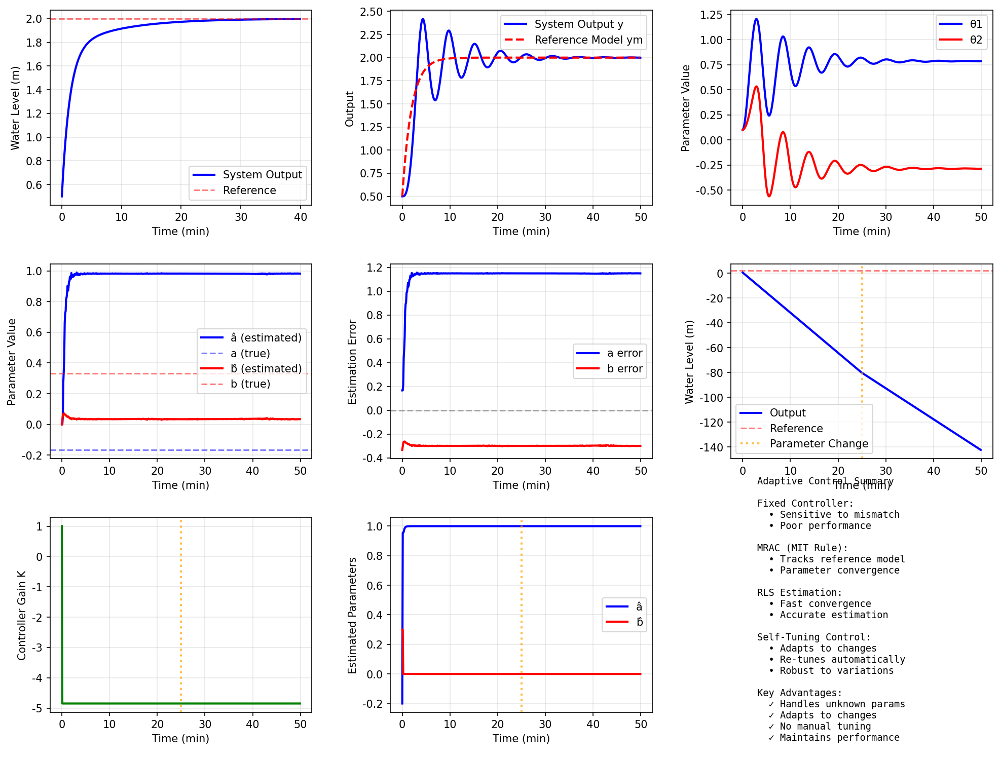

# 案例13：自适应控制 - 应对参数不确定性

## 系统示意图

### 图1：自适应控制系统示意图

<table>
<tr>
<td width="50%"></td>
<td width="50%">

**系统架构说明：**

这张图展示了自适应控制系统的基本架构和工作原理：

**核心特点：**
1. **参数自适应机制**：
   - 在线辨识系统参数
   - 根据参数变化调整控制器
   - 适应时变或不确定系统
   - 保证系统性能
2. **自适应律设计**：
   - 基于Lyapunov稳定性理论
   - 保证参数收敛
   - 保证跟踪误差收敛
   - 自适应增益设计
3. **控制系统结构**：
   - 直接自适应（调整控制参数）
   - 间接自适应（先辨识再控制）
   - MIT规则或其他自适应律

**系统优势：**
- 适应参数变化
- 无需精确模型
- 在线学习能力
- 鲁棒性强

**应用场景：**
适用于参数时变、不确定性大的系统。

</td>
</tr>
</table>

## 场景描述
在实际工程中，系统参数常常未知或随时间变化。例如，水箱的横截面积可能因为沉积物而改变，阀门阻力可能因磨损而增加。传统的固定参数控制器在这种情况下性能会下降。**自适应控制**能够在线估计系统参数并相应调整控制器，保持良好的控制性能。
本案例介绍**模型参考自适应控制（MRAC）**和**自校正控制（STC）**两种经典自适应方法。

## 教学目标
1. **理解自适应控制的必要性**：参数不确定性对控制性能的影响
2. **掌握MRAC原理**：MIT规则和Lyapunov稳定性设计
3. **学习参数估计**：递推最小二乘法（RLS）
4. **实现自校正控制器**：参数估计+控制器重设计
5. **性能对比**：自适应控制vs固定参数控制

## 核心概念

### 1. 自适应控制的基本思想
**问题**：系统参数θ未知或时变，固定控制器性能不佳
**解决方案**：
- **在线辨识**：实时估计参数θ̂(t)
- **控制器调整**：根据θ̂(t)调整控制器参数
**两种主要方法**：
1. **MRAC**：定义参考模型，调整控制器使系统跟踪参考模型
2. **STC**：估计参数，基于估计值重新设计控制器

### 2. 模型参考自适应控制（MRAC）
**结构**：
```
参考模型：Gm(s) = bm/(s + am)（期望特性）
实际系统：G(s) = b/(s + a)（参数未知）
控制律：u = θ1*r + θ2*y（自适应增益）
```

**MIT规则**（最简单的自适应律）：
```
e = y - ym（跟踪误差）
dθ1/dt = -γ1 * e * ∂e/∂θ1
dθ2/dt = -γ2 * e * ∂e/∂θ2
```

**Lyapunov设计**（保证稳定性）：
```
选择Lyapunov函数 V = e²/2 + 误差项
设计自适应律使 dV/dt ≤ 0
```

### 3. 递推最小二乘法（RLS）
**参数估计问题**：
```
y(t) = φ(t)^T θ + 噪声
```

其中：
- **φ(t)**：回归向量（包含过去的输入输出）
- **θ**：待估计参数
**RLS算法**：
```
θ̂(k) = θ̂(k-1) + K(k)[y(k) - φ(k)^T θ̂(k-1)]
K(k) = P(k-1)φ(k) / [λ + φ(k)^T P(k-1)φ(k)]
P(k) = [I - K(k)φ(k)^T]P(k-1) / λ
```

其中λ为遗忘因子（0 < λ ≤ 1）

### 4. 自校正控制（STC）
**原理**：
1. **辨识步骤**：用RLS估计系统参数
2. **设计步骤**：基于估计参数设计控制器
3. **控制步骤**：应用新控制器
4. **循环**：重复以上步骤
**实现方式**：
- **间接自校正**：估计系统参数 → 计算控制器参数
- **直接自校正**：直接估计控制器参数

### 5. 稳定性考虑
**MRAC稳定性条件**：
- 系统必须是最小相位的（零点在左半平面）
- 相对阶数已知
- 自适应增益合适选择
**实际问题**：
- **参数漂移**：无激励时参数可能发散
- **未建模动态**：高频未建模部分可能导致不稳定
- **解决方案**：σ修正、归一化、死区、投影等

## 任务列表

### 任务1：MRAC控制器设计（MIT规则）
- 定义参考模型
- 实现MIT自适应律
- 分析跟踪性能

### 任务2：MRAC稳定性分析
- 验证Lyapunov稳定性
- 分析自适应增益的影响
- 处理参数漂移

### 任务3：RLS参数估计
- 实现递推最小二乘算法
- 分析遗忘因子的作用
- 验证参数收敛性

### 任务4：自校正控制器
- 结合RLS和极点配置
- 实现完整的STC
- 对比固定参数控制器

## 使用方法
```bash
cd books/water-system-control/code/examples/case_13_adaptive_control
python main.py
python experiments.py
```

## 预期结果
1. **MRAC性能**：
   - 系统输出跟踪参考模型
   - 自适应参数收敛
   - 对参数变化鲁棒
2. **参数估计**：
   - RLS快速收敛
   - 估计误差趋于零
   - 遗忘因子影响分析
3. **自校正控制**：
   - 参数未知时仍能控制
   - 参数变化时自动调整
   - 性能优于固定控制器

## 工程意义

### 1. 实际应用场景
**水系统**：
- 水箱容积因沉积物变化
- 管道阻力因结垢增加
- 泵特性因磨损退化
**其他领域**：
- **航空**：飞机质量因燃料消耗变化
- **汽车**：车辆负载变化
- **机器人**：抓取不同质量物体
- **化工**：反应动力学参数随温度变化

### 2. 优势与局限
**优势**：
- 自动适应参数变化
- 无需精确模型
- 可处理缓慢时变系统
**局限**：
- 设计和分析复杂
- 计算量较大
- 对未建模动态敏感
- 需要持续激励信号

### 3. 实用建议
- **增益调参**：自适应增益不能太大（稳定性）或太小（速度慢）
- **初值选择**：参数估计初值应合理，避免过渡过程过大
- **鲁棒性增强**：使用σ修正、死区、投影等技术
- **监督机制**：检测异常参数估计值，必要时切换到备用控制器

## 关键公式

### MIT规则
```
e = y - ym
dθ/dt = -Γ * e * (∂e/∂θ)
```

### RLS算法
```
θ̂(k) = θ̂(k-1) + K(k)*[y(k) - φ(k)^T*θ̂(k-1)]
K(k) = P(k-1)*φ(k) / [λ + φ(k)^T*P(k-1)*φ(k)]
P(k) = [I - K(k)*φ(k)^T]*P(k-1) / λ
```

### 自校正控制
```
1. 估计：θ̂ ← RLS(y, u)
2. 设计：计算控制器参数基于θ̂
3. 控制：u = Controller(θ̂) * e
```

## 扩展学习
experiments.py包含：
1. **不同自适应增益对比**：收敛速度vs稳定性
2. **参数突变测试**：阶跃变化的适应能力
3. **噪声影响**：测量噪声对参数估计的影响
4. **遗忘因子优化**：固定vs时变遗忘因子

## 常见问题
**Q1: 自适应控制vs增益调度，如何选择？**
A:
- **自适应控制**：参数未知或不可测，自动在线调整
- **增益调度**：工作点可测（如飞行速度），查表切换控制器
- 增益调度更简单但需要预先设计多个控制器
**Q2: 为什么需要持续激励？**
A: 如果输入信号不够"丰富"，参数估计可能不收敛或收敛到错误值。例如，阶跃输入无法区分某些参数组合。实际中可加入小幅度探测信号。
**Q3: 如何防止参数估计发散？**
A:
- 使用参数投影（限制估计值范围）
- σ修正（修改自适应律）
- 死区（小误差时停止自适应）
- 归一化（除以信号能量）
**Q4: 自适应控制适合快速系统吗？**
A: 自适应需要时间收敛，对于快速系统（秒级）可能来不及调整。通常适合时间常数在分钟级以上的系统。对于快速系统，鲁棒控制可能更合适。

## 下一步
- **案例14**：模型预测控制（MPC）- 处理约束优化
- **案例15**：非线性控制 - 反馈线性化
- **案例16**：智能控制 - 模糊控制、神经网络

---

**作者**: CHS-Books项目
**日期**: 2025-10-30
**版本**: 1.0
**关键词**: 自适应控制, MRAC, 模型参考自适应, RLS, 递推最小二乘, 自校正控制, 参数估计