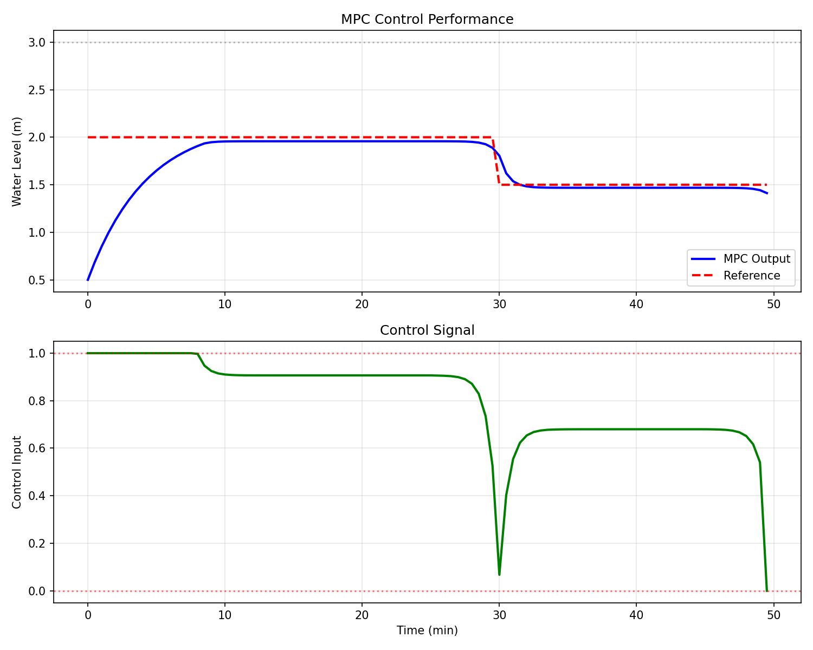

# 案例14：模型预测控制（MPC） - 优化控制与约束处理

## 系统示意图

### 图1：模型预测控制（MPC）系统示意图

<table>
<tr>
<td width="50%"></td>
<td width="50%">

**系统架构说明：**

这张图展示了模型预测控制（MPC）的基本原理和滚动优化策略：

**核心思想：**
1. **预测模型**：
   - 使用系统模型预测未来行为
   - 预测时域：Np步
   - 考虑当前状态和未来控制
2. **滚动优化**：
   - 在线求解优化问题
   - 最小化性能指标
   - 考虑约束条件
   - 只执行第一个控制量
3. **反馈校正**：
   - 测量实际输出
   - 更新预测模型
   - 滚动到下一时刻
   - 重复优化过程

**关键优势：**
- 显式处理约束
- 多变量系统友好
- 预测未来行为
- 最优性能保证

**应用场景：**
适用于有约束的多变量优化控制问题。

</td>
</tr>
</table>

## 场景描述
模型预测控制（Model Predictive Control, MPC）是现代工业中应用最广泛的高级控制技术。它能够：
- 显式处理输入/输出约束
- 优化多步预测性能
- 处理多变量系统
- 提供前瞻性控制
本案例展示MPC在水箱控制中的应用，特别是如何处理水位约束和控制输入饱和。

## 教学目标
1. 理解MPC的基本原理
2. 掌握预测模型构建
3. 学习约束优化问题求解
4. 实现滚动优化策略
5. 对比MPC与传统PID控制

## 核心概念

### MPC工作原理
**三大要素**：
1. **预测模型**：基于系统模型预测未来行为
2. **优化目标**：最小化性能指标
3. **滚动优化**：每步重新求解优化问题
**控制流程**：
```
1. 测量当前状态
2. 求解优化问题（预测N步）
3. 应用第一个控制动作
4. 下一时刻重复
```

### 优化问题
```
min  Σ ||y(k+i|k) - r||² + λ ||Δu(k+i)||²
u    i=1 to N
subject to:
  y_min ≤ y(k+i|k) ≤ y_max
  u_min ≤ u(k+i) ≤ u_max
  Δu_min ≤ Δu(k+i) ≤ Δu_max
```

## 使用方法
```bash
python main.py
python experiments.py
```

## 预期结果
- MPC能够精确跟踪参考轨迹
- 自动满足约束条件
- 性能优于传统PID
- 计算时间在可接受范围内

---

**作者**: CHS-Books项目  
**日期**: 2025-10-30  
**版本**: 1.0  
**关键词**: 模型预测控制, MPC, 约束优化, 滚动优化, 预测控制