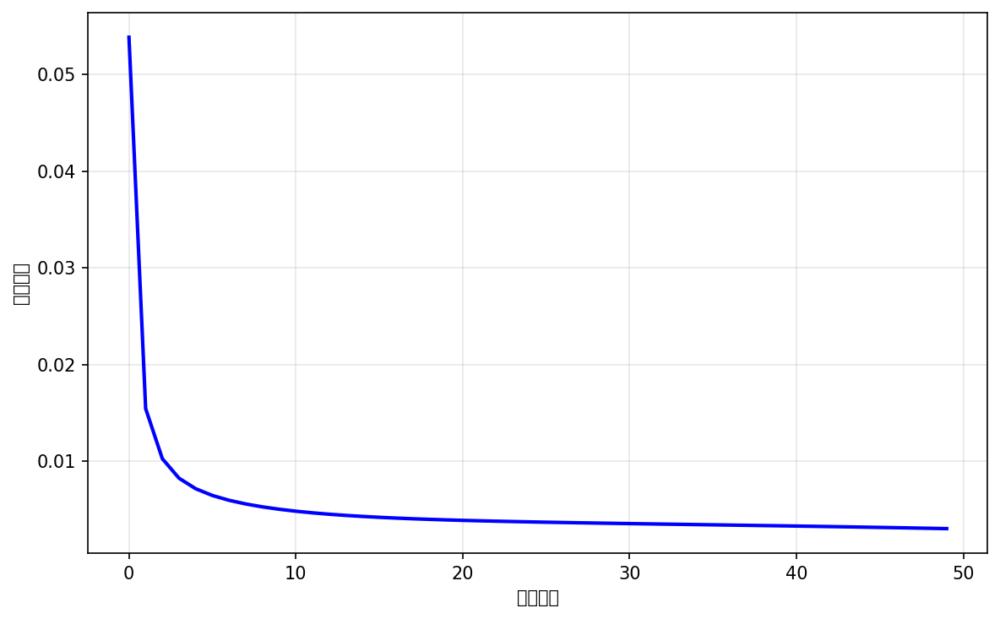
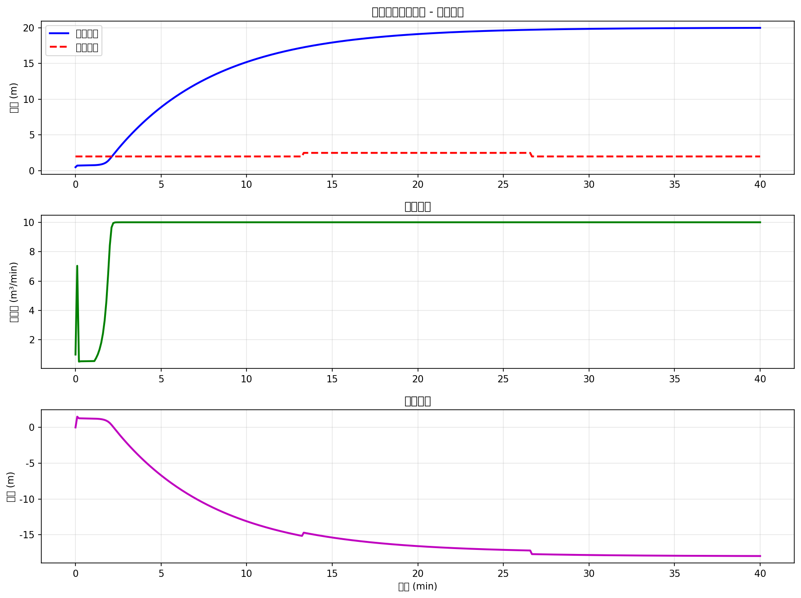
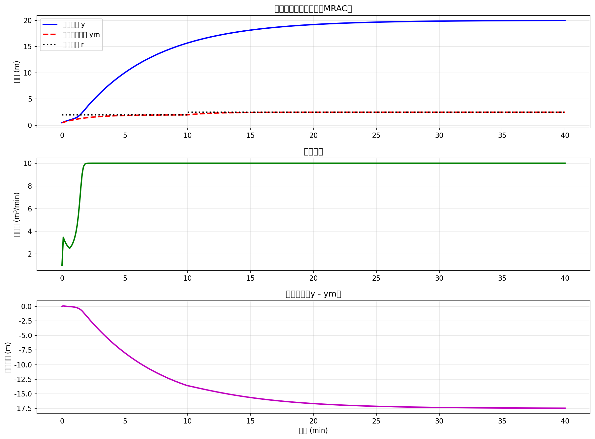

# 案例17：神经网络控制 - 深度学习与智能控制的结合

## 系统示意图

### 图1：神经网络控制系统示意图

<table>
<tr>
<td width="50%"></td>
<td width="50%">

**系统架构说明：**

这张图展示了神经网络控制的基本架构和学习过程：

**核心方法：**
1. **神经网络控制器**：
   - 多层前馈网络
   - 反向传播训练
   - 非线性映射能力
   - 在线学习
2. **控制策略**：
   - 直接神经网络控制
   - 神经网络PID
   - 神经网络逆模型
   - 模型参考自适应
3. **训练过程**：
   - 监督学习（离线训练）
   - 强化学习（在线调整）
   - 误差反向传播
   - 权值更新

**系统优势：**
- 强大的非线性逼近能力
- 自学习能力
- 适应性强
- 并行计算

**应用场景：**
适用于复杂非线性、难以建模的系统。

</td>
</tr>
</table>

## 场景描述
随着深度学习的快速发展，**神经网络控制（Neural Network Control）**成为智能控制领域的研究热点。神经网络具有强大的非线性逼近能力和学习能力，可以通过训练数据学习复杂的控制策略，无需精确的系统模型。
本案例介绍如何使用神经网络设计控制器，包括**神经网络PID**、**自适应神经网络控制**、**模型参考自适应控制（MRAC）**等方法，并应用于水箱液位控制系统。

## 教学目标
1. **理解神经网络基础**：前向传播、反向传播、梯度下降
2. **掌握神经网络控制器设计**：结构设计、训练方法
3. **学习在线学习方法**：实时参数调整、自适应控制
4. **实现神经网络自适应控制**：结合反馈进行在线训练
5. **性能对比**：神经网络控制 vs 传统控制方法

## 核心概念

### 1. 神经网络基础
**基本结构**：
```python
输入层 → 隐藏层 → 输出层
x → [W1, b1] → h → [W2, b2] → y
```

**前向传播**：
```python
h = σ(W1·x + b1)    # 隐藏层
y = W2·h + b2        # 输出层
```

**激活函数**：
- **Sigmoid**: σ(x) = 1/(1 + e^(-x))
- **Tanh**: tanh(x) = (e^x - e^(-x))/(e^x + e^(-x))
- **ReLU**: relu(x) = max(0, x)
**反向传播（BP算法）**：
- 计算输出误差：e = y_target - y_pred
- 反向传播误差到各层
- 更新权重：W = W + η·∂E/∂W

### 2. 神经网络控制器类型

#### 类型1：神经网络PID控制器
**结构**：
```python
输入：[e, Δe, ∫e] → 神经网络 → 输出：[Kp, Ki, Kd]
u = Kp·e + Ki·∫e + Kd·Δe
```

**优势**：
- 自动调整PID参数
- 适应系统变化
- 非线性增益调度

#### 类型2：直接神经网络控制器
**结构**：
```python
输入：[r, y, e, ...] → 神经网络 → 输出：u
```

**优势**：
- 直接学习控制策略
- 无需PID结构约束
- 更大的设计自由度

#### 类型3：模型参考自适应神经网络控制（MRAC）
**结构**：
```python
参考模型：ym = f_ref(r)
神经网络：u = NN(e, x)
目标：使 y → ym
```

**训练信号**：
- 跟踪误差：e = ym - y
- 在线更新权重

### 3. 训练方法

#### 离线训练（Pre-training）
1. **数据收集**：运行系统，收集输入输出数据
2. **监督学习**：使用历史数据训练网络
3. **部署应用**：将训练好的网络用于控制
**优点**：
- 训练充分，性能稳定
- 可以使用大规模数据
- 便于调试优化
**缺点**：
- 需要大量数据
- 无法适应系统变化
- 泛化能力有限

#### 在线学习（Online Learning）
1. **实时反馈**：根据当前误差更新权重
2. **增量学习**：小步长调整参数
3. **自适应调整**：持续适应系统变化
**优点**：
- 适应系统变化
- 无需大量先验数据
- 持续改进性能
**缺点**：
- 训练不充分可能不稳定
- 需要careful调参
- 计算开销大

### 4. 神经网络结构设计
**输入层设计**：
- **状态量**：y（当前液位）
- **误差量**：e = r - y
- **误差导数**：Δe
- **误差积分**：∫e
- **参考输入**：r
**隐藏层设计**：
- **层数**：1-2层通常足够
- **神经元数量**：5-20个（根据复杂度）
- **激活函数**：tanh或sigmoid
**输出层设计**：
- **直接控制**：输出u
- **参数调整**：输出Kp, Ki, Kd
- **增量控制**：输出Δu

### 5. 在线学习的关键问题

#### 稳定性保证
**问题**：在线学习可能导致控制不稳定
**解决方案**：
- 限制学习率（小步长）
- 权重限幅（防止发散）
- 添加正则化项
- 使用经验回放（Experience Replay）

#### 探索与利用（Exploration vs Exploitation）
**问题**：纯利用（exploitation）可能陷入局部最优
**解决方案**：
- 添加探索噪声
- ε-greedy策略
- 温度参数退火

#### 数据效率
**问题**：在线学习数据有限
**解决方案**：
- 迁移学习（使用预训练模型）
- 数据增强
- 元学习（Meta-learning）

### 6. 神经网络vs传统控制
| 对比维度 | 神经网络控制 | 传统控制 |
|---------|-------------|----------|
| 建模需求 | 无需精确模型 | 需要模型 |
| 设计方法 | 数据驱动 | 理论驱动 |
| 非线性处理 | 强 | 弱 |
| 稳定性分析 | 困难 | 成熟 |
| 计算开销 | 大 | 小 |
| 可解释性 | 弱 | 强 |
| 适应能力 | 强（在线学习） | 中等 |

## 任务列表

### 任务1：神经网络基础
- 实现多层感知器（MLP）
- 前向传播与反向传播
- 训练与预测

### 任务2：神经网络PID控制器
- 三输入三输出网络
- 在线调整PID参数
- 性能分析

### 任务3：直接神经网络控制器
- 端到端学习控制策略
- 误差反向传播训练
- 实时控制

### 任务4：模型参考自适应控制
- 参考模型设计
- 跟踪误差最小化
- 自适应权重更新

## 使用方法
```bash
cd books/water-system-control/code/examples/case_17_neural_network_control
python main.py
python experiments.py
```python

## 预期结果
1. **神经网络PID**：
   - 自动调整Kp, Ki, Kd
   - 适应不同工作点
   - 性能优于固定PID
2. **直接神经网络控制**：
   - 学习复杂控制策略
   - 非线性增益调度
   - 快速响应
3. **MRAC**：
   - 精确跟踪参考模型
   - 在线适应参数变化
   - 鲁棒性强

## 工程意义

### 1. 实际应用场景
**工业控制**：
- 复杂非线性过程控制
- 多变量耦合系统
- 时变系统
**机器人控制**：
- 轨迹跟踪
- 力控制
- 动态环境适应
**自动驾驶**：
- 路径规划与跟踪
- 速度控制
- 障碍物避让
**能源管理**：
- 智能电网调度
- 建筑能耗优化
- 电池管理系统

### 2. 优势与局限
**优势**：
- 强大的非线性逼近能力
- 无需精确数学模型
- 数据驱动、易于实现
- 在线学习、自适应能力强
- 可处理高维复杂系统
**局限**：
- 需要大量数据（离线训练）
- 稳定性难以保证
- 黑箱模型，可解释性差
- 计算开销大
- 调参困难（学习率、网络结构等）
- 可能过拟合

### 3. 实用建议
**网络结构设计**：
- 从简单开始（1隐藏层，5-10神经元）
- 根据性能逐步增加复杂度
- 避免过度设计
**训练策略**：
- 先离线预训练，再在线微调
- 使用小学习率（0.001-0.01）
- 添加权重衰减防止过拟合
**稳定性保证**：
- 限制输出范围（饱和函数）
- 添加传统控制器作为baseline
- 监控系统状态，异常时切换
**调试技巧**：
- 可视化权重和激活值
- 监控损失函数变化
- 对比传统控制器性能
- 逐步增加复杂度

## 关键公式

### 前向传播
**隐藏层**：
```
z1 = W1·x + b1
h = σ(z1)
```python

**输出层**：
```
z2 = W2·h + b2
y = z2  (或 y = σ(z2))
```python

### 反向传播
**输出层梯度**：
```
δ2 = (y - y_target) * σ'(z2)
∂E/∂W2 = δ2 · h^T
∂E/∂b2 = δ2
```python

**隐藏层梯度**：
```
δ1 = (W2^T · δ2) ⊙ σ'(z1)
∂E/∂W1 = δ1 · x^T
∂E/∂b1 = δ1
```python

**权重更新**：
```
W = W - η · ∂E/∂W
b = b - η · ∂E/∂b
```python

### 激活函数及其导数
**Sigmoid**：
```
σ(x) = 1/(1 + e^(-x))
σ'(x) = σ(x) * (1 - σ(x))
```python

**Tanh**：
```
tanh(x) = (e^x - e^(-x))/(e^x + e^(-x))
tanh'(x) = 1 - tanh²(x)
```python

**ReLU**：
```
relu(x) = max(0, x)
relu'(x) = 1 if x > 0 else 0
```python

### 神经网络PID
**参数输出**：
```
[Kp, Ki, Kd] = NN([e, Δe, ∫e])
```python

**控制律**：
```
u(t) = Kp·e(t) + Ki·∫e(τ)dτ + Kd·de/dt
```python

### 模型参考自适应控制
**参考模型**：
```
ym(t) = f_ref(r(t))
```python

**跟踪误差**：
```
e(t) = ym(t) - y(t)
```python

**权重更新（梯度下降）**：
```
ΔW = η · e · ∂y/∂W
```

## 扩展学习
experiments.py包含：
1. **不同网络结构对比**：神经元数量、隐藏层数
2. **学习率影响**：收敛速度与稳定性
3. **在线学习vs离线学习**：性能与适应性对比
4. **鲁棒性测试**：参数突变、噪声干扰

## 常见问题
**Q1: 神经网络控制器的输入应该包含哪些信号？**
A: 常用输入组合：
- **最小配置**：e（误差）
- **标准配置**：e, Δe（误差及其导数）
- **完整配置**：e, Δe, ∫e, r, y（误差、参考、输出）
- **建议**：从简单开始，根据性能逐步增加
**Q2: 隐藏层应该设计多少神经元？**
A: 经验法则：
- **简单系统**：5-10个神经元
- **中等复杂度**：10-20个神经元
- **复杂系统**：20-50个神经元
- **原则**：从少到多，避免过拟合
**Q3: 学习率如何选择？**
A:
- **离线训练**：0.01-0.1（可以较大）
- **在线学习**：0.001-0.01（必须小）
- **自适应**：使用Adam、RMSprop等
- **建议**：从小开始，观察收敛情况
**Q4: 如何保证控制稳定性？**
A:
- 限制输出范围（u_min ~ u_max）
- 使用小学习率（避免大幅调整）
- 权重初始化（小随机值）
- 添加传统控制器作为backup
- 监控性能，异常时降低学习率或冻结权重
**Q5: 神经网络控制器何时优于传统PID？**
A:
- **强非线性系统**：传统PID线性化性能差
- **时变系统**：参数频繁变化
- **复杂耦合系统**：多变量交互
- **有大量数据**：可以充分训练
**Q6: 在线学习会不会导致控制不稳定？**
A: 可能，但可以通过以下方法缓解：
- 使用极小学习率（0.0001-0.001）
- 权重限幅（防止参数发散）
- 误差死区（小误差不更新）
- 周期性冻结权重（探索后稳定）
- 与传统控制器混合（加权平均）
**Q7: 如何调试神经网络控制器？**
A:
1. 先训练一个离线模型，验证网络能学到合理策略
2. 可视化权重和激活值，检查是否异常
3. 对比传统PID，找出差距
4. 逐步增加网络复杂度
5. 监控损失函数，观察收敛情况
6. 添加日志，记录关键变量

## 下一步
- **案例18**：强化学习控制 - Q-learning与深度Q网络
- **案例19**：综合对比 - 所有控制方法的性能评估
- **案例20**：实际应用 - 在实际硬件上部署控制器

---

**作者**: CHS-Books项目
**日期**: 2025-10-30
**版本**: 1.0
**关键词**: 神经网络控制, 深度学习, 自适应控制, 在线学习, 反向传播, MRAC

### 图：分析图
<table border="0">
<tr>
<td width="50%">

</td>
<td width="50%">
**分析图说明**
**系统分析**
本图展示了系统的重要特性：
**图表说明：**
- 横轴：时间或参数
- 纵轴：系统输出或性能指标
**分析要点：**
- 系统特征分析
- 性能评估
- 结论总结
</td>
</tr>
</table>

### 图：分析图
<table border="0">
<tr>
<td width="50%">

</td>
<td width="50%">
**分析图说明**
**系统分析**
本图展示了系统的重要特性：
**图表说明：**
- 横轴：时间或参数
- 纵轴：系统输出或性能指标
**分析要点：**
- 系统特征分析
- 性能评估
- 结论总结
</td>
</tr>
</table>

### 图：分析图
<table border="0">
<tr>
<td width="50%">

</td>
<td width="50%">
**分析图说明**
**系统分析**
本图展示了系统的重要特性：
**图表说明：**
- 横轴：时间或参数
- 纵轴：系统输出或性能指标
**分析要点：**
- 系统特征分析
- 性能评估
- 结论总结
</td>
</tr>
</table>
