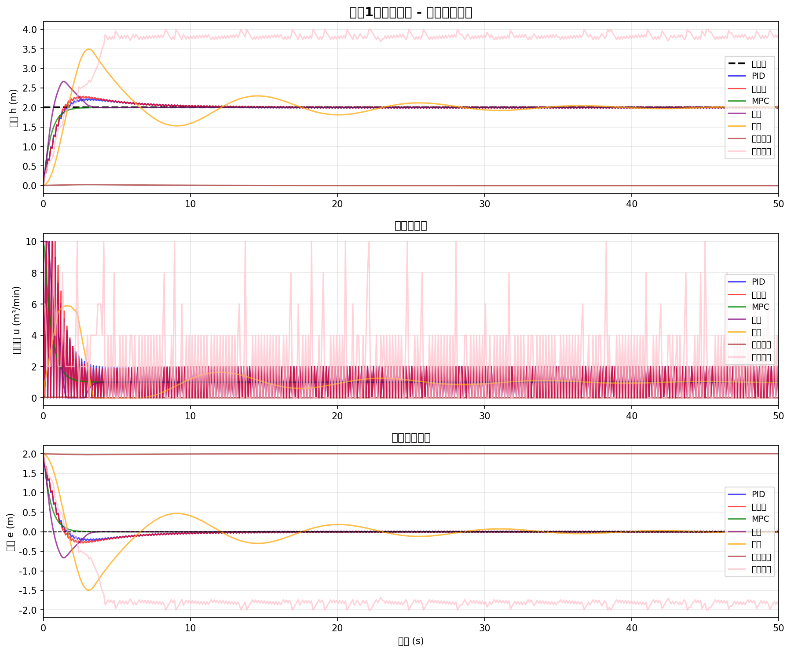
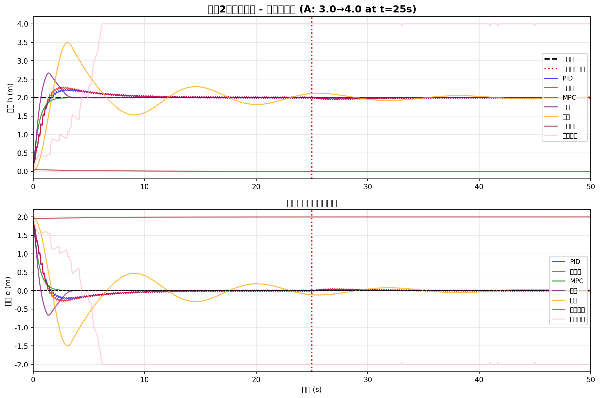
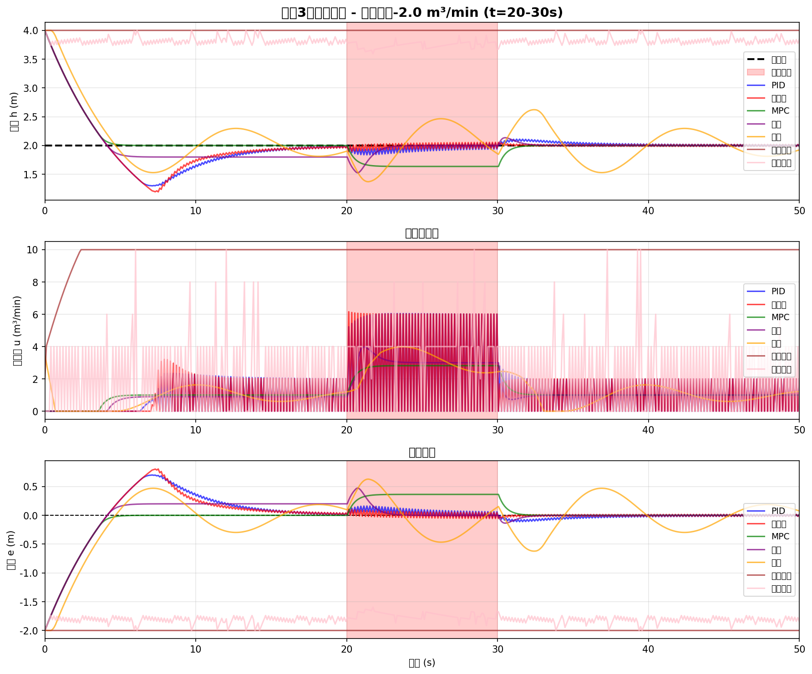
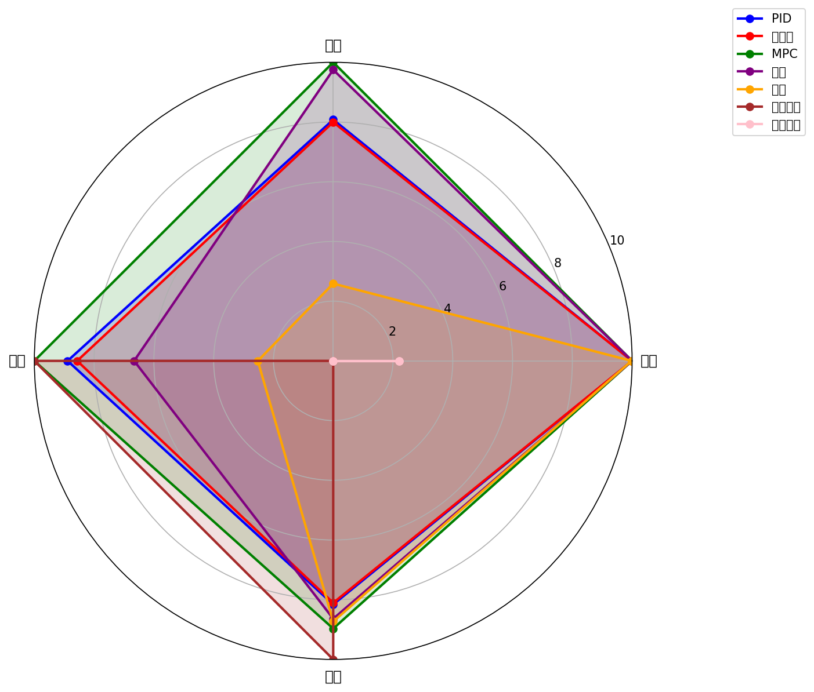

# 案例19：综合对比 - 所有控制方法的性能评估

## 系统示意图

### 图1：控制方法综合对比示意图

<table>
<tr>
<td width="50%"></td>
<td width="50%">

**系统架构说明：**

这张综合对比图展示了各种控制方法的性能对比和适用场景：

**对比维度：**
1. **控制性能**：
   - 上升时间
   - 超调量
   - 稳态误差
   - 鲁棒性
2. **实现复杂度**：
   - 算法复杂度
   - 计算量
   - 参数数量
   - 调试难度
3. **适用场景**：
   - 系统类型
   - 不确定性
   - 实时性要求
   - 工程应用

**方法对比：**
- **经典控制**：简单、快速、适合SISO
- **现代控制**：系统化、适合MIMO
- **智能控制**：自适应、适合复杂系统

**选择建议：**
根据系统特点、性能要求、实现条件综合选择。

</td>
</tr>
</table>

## 场景描述
经过前面18个案例的学习，我们已经掌握了从经典控制到现代智能控制的多种方法。但在实际应用中，**如何选择最合适的控制方法**是一个关键问题。
本案例将**综合对比**所有控制方法在水箱液位控制中的性能，通过多种测试场景和量化指标，帮助您：
- 理解各种控制方法的优缺点
- 掌握控制方法的适用场景
- 学会根据具体需求选择最优方案
- 获得控制系统设计的实用经验

## 教学目标
1. **全面对比**：PID、自适应、MPC、滑模、模糊、神经网络、强化学习
2. **多场景测试**：标称工况、参数变化、外部干扰、多设定值
3. **性能指标**：超调量、调节时间、稳态误差、控制能量、鲁棒性
4. **可视化分析**：时域响应、误差分析、控制量对比、雷达图
5. **方法选择**：根据性能需求、计算资源、先验知识选择最优方案

## 对比方法总结

### 1. PID控制（案例1-9）
**原理**：
```
u(t) = Kp·e(t) + Ki·∫e(τ)dτ + Kd·de(t)/dt
```

**特点**：
- ✅ 简单易实现，计算量小
- ✅ 工程应用广泛，成熟可靠
- ✅ 不需要精确模型
- ❌ 参数整定需要经验
- ❌ 对非线性和时变系统效果有限
- ❌ 鲁棒性依赖参数选择
**适用场景**：
- 线性或弱非线性系统
- 参数相对稳定
- 对性能要求不极端
- 计算资源有限

### 2. 自适应控制（案例13）
**原理**：
```
参数估计：θ̂(t) = θ̂(t-1) + γ·e(t)·φ(t)
控制律：u(t) = f(θ̂(t), y(t), r(t))
```

**特点**：
- ✅ 自动调整参数，适应变化
- ✅ 不需要离线整定
- ✅ 对慢时变系统有效
- ❌ 参数估计需要持续激励
- ❌ 对快速变化响应慢
- ❌ 稳定性分析复杂
**适用场景**：
- 参数缓慢变化的系统
- 初始参数不精确
- 长期运行工况变化
- 需要自学习能力

### 3. 模型预测控制（MPC）（案例14）
**原理**：
```
min  Σ[||y(k+i) - r(k+i)||² + λ·||u(k+i)||²]
u    i=0
s.t. y_min ≤ y(k+i) ≤ y_max
     u_min ≤ u(k+i) ≤ u_max
```

**特点**：
- ✅ 显式处理约束
- ✅ 多步预测，考虑未来
- ✅ 优化性能指标
- ✅ 适合MIMO系统
- ❌ 计算量大
- ❌ 需要准确模型
- ❌ 实时性要求高
**适用场景**：
- 有约束的系统
- 多输入多输出
- 计算资源充足
- 对最优性要求高

### 4. 滑模控制（案例15）
**原理**：
```
滑模面：s = e + λ∫e
控制律：u = u_eq + k·sign(s)  或  u = u_eq + k·sat(s/φ)
```

**特点**：
- ✅ 强鲁棒性
- ✅ 对参数不确定性不敏感
- ✅ 抗干扰能力强
- ❌ 抖振问题
- ❌ 需要状态可测
- ❌ 切换增益选择敏感
**适用场景**：
- 高不确定性系统
- 强干扰环境
- 对鲁棒性要求高
- 可接受抖振

### 5. 模糊控制（案例16）
**原理**：
```
模糊化：x → μ(x)
推理：IF e is NB AND de is ZE THEN du is NM
去模糊：μ(u) → u
```

**特点**：
- ✅ 不需要精确模型
- ✅ 融合专家经验
- ✅ 处理非线性能力强
- ✅ 直观易理解
- ❌ 规则库需要设计
- ❌ 缺乏系统设计方法
- ❌ 难以保证稳定性
**适用场景**：
- 难以建模的系统
- 有专家经验可用
- 非线性特性明显
- 对理论保证要求不高

### 6. 神经网络控制（案例17）
**原理**：
```
前向：y = NN(x; θ)
反向：θ ← θ - α·∇_θ L(y, r)
```

**特点**：
- ✅ 强大的非线性逼近能力
- ✅ 自动学习特征
- ✅ 可在线学习
- ✅ 适应复杂系统
- ❌ 需要大量数据
- ❌ 训练时间长
- ❌ 黑盒特性，可解释性差
- ❌ 稳定性难保证
**适用场景**：
- 高度非线性系统
- 有历史数据可用
- 难以建立数学模型
- 对性能要求高

### 7. 强化学习控制（案例18）
**原理**：
```
Q-learning：Q(s,a) ← Q(s,a) + α[r + γ·max Q(s',a') - Q(s,a)]
策略：a = argmax Q(s, a')  (with ε-greedy)
```

**特点**：
- ✅ 无需模型（model-free）
- ✅ 自动探索最优策略
- ✅ 适应环境变化
- ✅ 处理延迟奖励
- ❌ 需要大量样本
- ❌ 训练时间长
- ❌ 稳定性和收敛性难保证
- ❌ 奖励函数设计关键
**适用场景**：
- 无精确模型
- 可仿真试错
- 长期优化任务
- 有足够训练时间

## 测试场景设计

### 场景1：标称工况
**描述**：系统参数为标称值，无干扰，单次阶跃响应
**目的**：测试各方法的基本性能
**性能指标**：
- 上升时间（Rise Time）
- 超调量（Overshoot）
- 调节时间（Settling Time）
- 稳态误差（Steady-State Error）

### 场景2：参数变化
**描述**：系统参数在运行中变化（如A、R变化±30%）
**目的**：测试鲁棒性和自适应能力
**性能指标**：
- 参数变化后的调节时间
- 稳态误差变化
- 控制性能退化程度

### 场景3：外部干扰
**描述**：施加阶跃干扰、脉冲干扰、随机噪声
**目的**：测试抗干扰能力
**性能指标**：
- 干扰抑制比（Disturbance Rejection Ratio）
- 恢复时间
- 最大偏差

### 场景4：多设定值跟踪
**描述**：设定值多次变化，考察跟踪性能
**目的**：测试跟踪能力和重复性
**性能指标**：
- 平均调节时间
- 平均超调量
- 跟踪误差积分

### 场景5：约束满足
**描述**：存在控制量约束和状态约束
**目的**：测试约束处理能力
**性能指标**：
- 约束违反次数
- 约束违反幅度
- 约束下的性能

### 场景6：控制能量
**描述**：评估控制信号的总能量
**目的**：测试能效和实用性
**性能指标**：
- 控制能量：∫u²dt
- 控制变化率：∫(du/dt)²dt
- 执行器磨损指数

## 性能指标定义

### 1. 时域性能指标
**上升时间（Rise Time）**：
```
t_r = 从0%到90%设定值的时间
```

**超调量（Overshoot）**：
```
σ% = (y_max - y_ss) / y_ss × 100%
```

**调节时间（Settling Time）**：
```
t_s = 进入并保持在±2%误差带的时间
```

**稳态误差（Steady-State Error）**：
```
e_ss = lim (r - y(t))
       t→∞
```

### 2. 积分性能指标
**IAE（Integral of Absolute Error）**：
```
IAE = ∫|e(t)|dt
```

**ISE（Integral of Squared Error）**：
```
ISE = ∫e²(t)dt
```

**ITAE（Integral of Time-weighted Absolute Error）**：
```
ITAE = ∫t·|e(t)|dt
```

### 3. 控制能量指标
**控制能量**：
```
E_u = ∫u²(t)dt
```

**控制变化率**：
```
E_Δu = ∫(du/dt)²dt
```

### 4. 鲁棒性指标
**参数灵敏度**：
```
S_θ = |Δy/y| / |Δθ/θ|
```

**干扰抑制比**：
```
DRR = |Δd| / |Δy|
```

## 综合评分体系

### 评分维度（0-10分）
1. **控制精度**：稳态误差、超调量
2. **响应速度**：上升时间、调节时间
3. **鲁棒性**：参数变化、干扰抑制
4. **实现复杂度**：算法复杂度、计算量
5. **参数整定**：整定难度、对参数敏感性
6. **先验知识**：是否需要模型、经验依赖
7. **约束处理**：显式约束、饱和处理
8. **可扩展性**：MIMO、复杂系统

### 加权总分
```
总分 = Σ w_i × score_i
      i
```

权重根据具体应用调整。

## 方法选择指南

### 决策树
```
开始
 ↓
是否需要显式处理约束？
 ├─ 是 → MPC
 └─ 否 ↓
    系统是否高度非线性？
     ├─ 是 ↓
     │   是否有专家经验？
     │    ├─ 是 → 模糊控制
     │    └─ 否 ↓
     │        是否有历史数据？
     │         ├─ 是 → 神经网络
     │         └─ 否 → 强化学习（需仿真）
     └─ 否 ↓
         参数是否时变？
          ├─ 是 → 自适应控制
          └─ 否 ↓
              干扰是否很强？
               ├─ 是 → 滑模控制
               └─ 否 → PID控制
```

### 应用场景推荐
| 场景 | 推荐方法 | 备选方案 |
|------|---------|---------|
| 工业过程控制（线性） | PID | MPC（有约束时） |
| 机器人关节控制 | 滑模控制 | 自适应控制 |
| 化工过程（多变量） | MPC | 分散PID |
| 温度控制（非线性） | 模糊控制 | 神经网络 |
| 自动驾驶 | MPC + RL | 神经网络 |
| 飞行器控制 | 自适应控制 | 滑模控制 |
| 无模型系统 | 强化学习 | 神经网络 |

### 性能-复杂度权衡
```
高性能
  │
  │  MPC (高计算)
  │  神经网络 (需数据)
  │  强化学习 (需训练)
  │
  │  自适应控制
  │  滑模控制
  │  模糊控制
  │
  │  PID (经典)
  │
低性能───────────────高复杂度
      低复杂度
```

## 使用方法
```bash
cd books/water-system-control/code/examples/case_19_comprehensive_comparison
python main.py
python experiments.py
```

## 预期结果

### 标称工况性能排序（预期）
1. **MPC**：最优性能，但计算量大
2. **神经网络/强化学习**：经过充分训练后性能优异
3. **滑模控制**：快速响应，轻微抖振
4. **自适应控制**：初期性能一般，后期改善
5. **模糊控制**：性能良好，调节平滑
6. **PID**：性能稳定，中规中矩

### 鲁棒性排序（预期）
1. **滑模控制**：最强鲁棒性
2. **自适应控制**：参数自调整
3. **模糊控制**：对非线性鲁棒
4. **MPC**：依赖模型精度
5. **神经网络**：对训练域外数据敏感
6. **强化学习**：奖励函数设计影响大
7. **PID**：参数固定，鲁棒性有限

### 实现复杂度排序
1. **PID**：最简单（3个参数）
2. **模糊控制**：规则设计
3. **滑模控制**：参数不多但需调试
4. **自适应控制**：增加参数估计器
5. **神经网络**：网络训练
6. **MPC**：优化求解
7. **强化学习**：长时间训练

## 工程意义

### 1. 实际应用指导
本案例提供了**系统化的方法选择框架**：
- 不存在"最好"的控制方法，只有"最合适"的
- 需要根据系统特性、性能需求、资源约束综合决策
- 多方法融合（如PID+前馈、MPC+RL）可以取长补短

### 2. 设计流程建议
```
需求分析 → 方法选择 → 参数设计 → 仿真测试 → 性能评估 → 实际部署
    ↑                                                          ↓
    └─────────────────── 迭代优化 ←───────────────────────────┘
```

**步骤详解**：
1. **需求分析**：明确性能指标、约束条件、资源限制
2. **方法选择**：根据决策树初步选择2-3种候选方法
3. **参数设计**：使用整定工具、优化算法确定参数
4. **仿真测试**：多场景测试，量化性能指标
5. **性能评估**：对比评分，选择最优方案
6. **实际部署**：硬件实现，实时测试，安全监控

### 3. 混合控制策略
**案例1：MPC + PID**
- MPC作为上层优化控制器（较慢）
- PID作为底层跟踪控制器（快速）
- 结合最优性和实时性
**案例2：RL + 滑模**
- RL学习名义控制策略
- 滑模提供鲁棒性保证
- 结合智能性和安全性
**案例3：模糊 + 自适应**
- 模糊规则提供基础控制
- 自适应调整隶属函数参数
- 结合经验和学习

### 4. 容错设计
**多控制器切换**：
```
IF 传感器故障 THEN
    切换到开环控制
ELSE IF 执行器饱和 THEN
    切换到抗饱和PID
ELSE IF 参数大幅变化 THEN
    切换到自适应控制
ELSE
    使用MPC
END IF
```

## 关键公式汇总

### 性能指标计算
**IAE（积分绝对误差）**：
```
IAE = ∫_0^T |e(t)| dt ≈ Σ |e[k]|·Δt
                        k=0
```

**ISE（积分平方误差）**：
```
ISE = ∫_0^T e²(t) dt ≈ Σ e²[k]·Δt
                       k=0
```

**ITAE（时间加权积分绝对误差）**：
```
ITAE = ∫_0^T t·|e(t)| dt ≈ Σ k·Δt·|e[k]|·Δt
                           k=0
```

**控制能量**：
```
E_u = ∫_0^T u²(t) dt ≈ Σ u²[k]·Δt
                       k=0
```

### 归一化评分
**单项评分归一化**：
```
score_i = 10 × (1 - (value_i - value_min) / (value_max - value_min))
```

对于"越小越好"的指标（如IAE、超调量）：
```
score = 10 × (1 - (value - best) / (worst - best))
```

对于"越大越好"的指标（如DRR）：
```
score = 10 × (value - worst) / (best - worst)
```

## 扩展学习
experiments.py包含：
1. **极端工况测试**：大参数变化、强干扰、快速变化设定值
2. **计算效率对比**：各方法的计算时间、内存占用
3. **长时间运行**：稳定性、性能退化
4. **Monte Carlo测试**：随机参数、统计性能

## 常见问题
**Q1: 为什么不同方法的性能差异不明显？**
A: 可能原因：
1. 水箱系统相对简单，差异体现不明显
2. 参数整定充分，各方法都接近最优
3. 需要更复杂或极端的测试场景
4. 实际系统中非理想因素会放大差异
**Q2: 如何公平对比不同方法？**
A: 关键点：
1. 统一测试场景和评价指标
2. 每种方法都进行充分整定
3. 考虑实际约束（计算时间、硬件资源）
4. 多次实验取平均（对于随机算法）
5. 设计能体现各方法特点的场景
**Q3: 生产环境如何选择控制方法？**
A: 考虑因素：
1. **安全性**：首要考虑，选择成熟可靠的方法
2. **性能需求**：明确必须满足的指标
3. **可维护性**：工程师能否理解和调试
4. **成本**：硬件、开发、维护成本
5. **法规标准**：某些行业有强制要求
**Q4: 多种方法如何融合？**
A: 融合策略：
1. **分层融合**：上层优化+底层跟踪
2. **并行融合**：多控制器投票或加权
3. **串级融合**：外环+内环
4. **切换融合**：根据工况切换控制器
5. **学习融合**：用RL/NN学习切换策略
**Q5: 控制方法的发展趋势？**
A: 未来方向：
1. **智能化**：AI与控制深度融合
2. **分布式**：多智能体协同控制
3. **数据驱动**：减少对模型依赖
4. **安全保证**：形式化验证、安全强化学习
5. **云边协同**：云端优化+边缘实时控制

## 下一步
- **案例20**：实际应用 - 硬件实现与工程部署

---

**作者**: CHS-Books项目
**日期**: 2025-10-30
**版本**: 1.0
**关键词**: 控制方法对比, 性能评估, 方法选择, 综合分析, 工程应用

### 图：分析图
<table border="0">
<tr>
<td width="50%">

</td>
<td width="50%">
**分析图说明**
**系统分析**
本图展示了系统的重要特性：
**图表说明：**
- 横轴：时间或参数
- 纵轴：系统输出或性能指标
**分析要点：**
- 系统特征分析
- 性能评估
- 结论总结
</td>
</tr>
</table>

### 图：分析图
<table border="0">
<tr>
<td width="50%">

</td>
<td width="50%">
**分析图说明**
**系统分析**
本图展示了系统的重要特性：
**图表说明：**
- 横轴：时间或参数
- 纵轴：系统输出或性能指标
**分析要点：**
- 系统特征分析
- 性能评估
- 结论总结
</td>
</tr>
</table>

### 图：分析图
<table border="0">
<tr>
<td width="50%">

</td>
<td width="50%">
**分析图说明**
**系统分析**
本图展示了系统的重要特性：
**图表说明：**
- 横轴：时间或参数
- 纵轴：系统输出或性能指标
**分析要点：**
- 系统特征分析
- 性能评估
- 结论总结
</td>
</tr>
</table>

### 图：分析图
<table border="0">
<tr>
<td width="50%">

</td>
<td width="50%">
**分析图说明**
**系统分析**
本图展示了系统的重要特性：
**图表说明：**
- 横轴：时间或参数
- 纵轴：系统输出或性能指标
**分析要点：**
- 系统特征分析
- 性能评估
- 结论总结
</td>
</tr>
</table>
