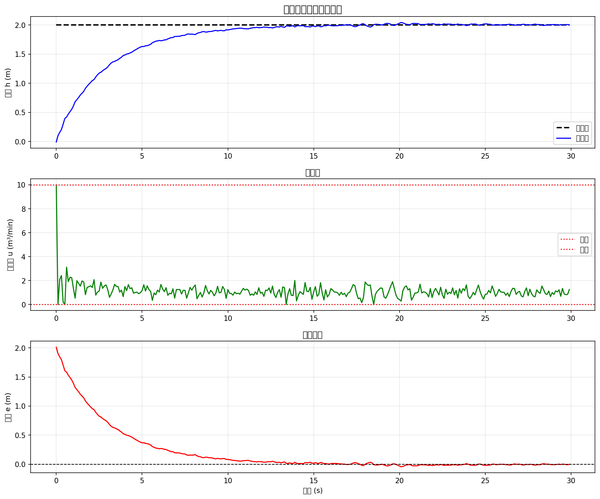
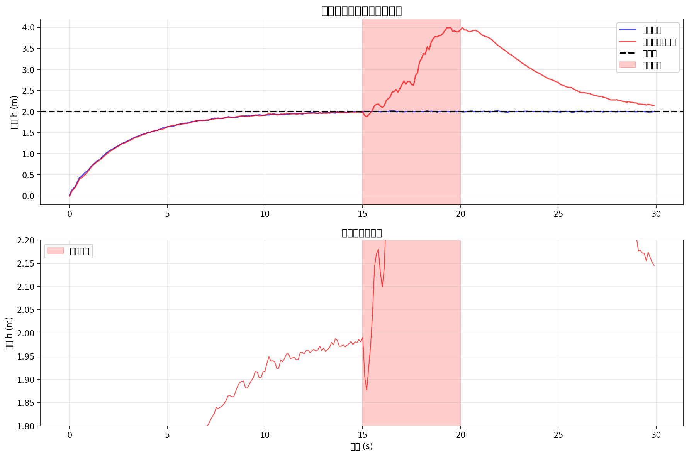

# 案例20：实际应用 - 控制器的工程实现

## 系统示意图

### 图1：实际应用案例示意图

<table>
<tr>
<td width="50%"></td>
<td width="50%">

**系统架构说明：**

这张图展示了控制理论在实际水处理系统中的综合应用：

**实际系统特点：**
1. **多目标优化**：
   - 水位稳定
   - 能耗最小
   - 水质保证
   - 成本优化
2. **多约束条件**：
   - 设备物理限制
   - 安全运行范围
   - 环保法规要求
   - 经济性考虑
3. **综合控制策略**：
   - 分层控制架构
   - 多控制器协同
   - 优化与控制结合
   - 故障检测与诊断

**工程实施要点：**
- 系统建模与验证
- 控制器参数整定
- 仿真测试
- 现场调试
- 运行维护

**应用价值：**
展示理论到实践的完整过程，体现控制理论的工程价值。

</td>
</tr>
</table>

## 场景描述
经过前面19个案例的学习，我们已经掌握了各种控制算法的理论和仿真实现。然而，**从仿真到实际应用还有很长的路要走**。
本案例将探讨控制器的工程实现，包括：
- 实时系统架构设计
- 硬件接口与传感器处理
- 控制周期与时序管理
- 异常处理与故障安全
- 数据记录与监控
- 部署与维护
这是水箱控制系列教程的收官之作，将理论与实践完美结合。

## 教学目标
1. **软件架构**：模块化设计、状态机、配置管理
2. **硬件接口**：ADC/DAC、传感器标定、执行器控制
3. **实时性**：控制周期、任务调度、时间管理
4. **鲁棒性**：传感器故障、执行器饱和、通信中断
5. **安全性**：限位保护、紧急停止、故障检测
6. **可维护性**：日志记录、远程监控、参数调整

## 工程实现的关键问题

### 1. 仿真 vs 实际
| 方面 | 仿真 | 实际系统 |
|------|------|---------|
| 模型 | 理想数学模型 | 存在未建模动态、非线性、时变 |
| 传感器 | 完美测量 | 噪声、漂移、量化误差、故障 |
| 执行器 | 瞬时响应 | 延迟、死区、饱和、磨损 |
| 时序 | 精确采样周期 | 抖动、中断、任务切换 |
| 环境 | 无干扰 | 温度、振动、电磁干扰 |
| 故障 | 不考虑 | 必须处理各种故障模式 |

### 2. 实时系统设计
**实时性要求**：
- 硬实时：必须在截止时间前完成（安全关键）
- 软实时：尽量满足，偶尔超时可接受（性能优化）
**控制周期选择**：
```
T_sample ≤ 1/(10 * BW_system)
```
其中BW_system是系统带宽。
**典型控制周期**：
- 快速系统（电机、飞行器）：1-10 ms
- 中速系统（过程控制）：100 ms - 1 s
- 慢速系统（温度、化工）：1 s - 1 min

### 3. 传感器处理
**原始信号处理链**：
```
物理量 → 传感器 → 模拟信号 → ADC → 数字值 → 标定 → 工程单位 → 滤波 → 控制器
```

**关键技术**：
- **标定（Calibration）**：原始值 → 物理值
  ```
  y_physical = k * ADC_value + b
  ```
- **滤波（Filtering）**：去除噪声
  - 移动平均
  - 低通滤波器
  - 卡尔曼滤波
- **故障检测**：传感器健康监测
  - 范围检查
  - 变化率检查
  - 冗余传感器交叉验证

### 4. 执行器控制
**PWM控制**（脉宽调制）：
```
占空比 = u / u_max
PWM频率通常 1-100 kHz
```

**饱和处理**：
```
if u > u_max:
    u = u_max
    anti_windup()  # 抗饱和
elif u < u_min:
    u = u_min
    anti_windup()
```

**抗饱和（Anti-Windup）**：
- 条件积分：饱和时停止积分
- 反算（Back-calculation）：从饱和值计算允许的积分
- 积分限幅：限制积分项范围

### 5. 状态机设计
**控制器状态**：
```
IDLE（空闲） → INIT（初始化） → READY（就绪） → RUN（运行）
                                      ↓
                                   ERROR（错误）
                                      ↓
                                   STOP（停止）
```

**状态转移条件**：
- IDLE → INIT：系统启动
- INIT → READY：自检通过
- READY → RUN：启动命令
- RUN → ERROR：故障检测
- ERROR → STOP：故障严重
- ERROR → READY：故障恢复

## 软件架构设计

### 1. 模块化设计
```
┌──────────────────────────────────────────┐
│            应用层（Application）           │
│  - 业务逻辑                               │
│  - 用户界面                               │
│  - 数据分析                               │
└──────────────────────────────────────────┘
              ↓ API
┌──────────────────────────────────────────┐
│          控制层（Control Layer）          │
│  - 控制算法                               │
│  - 状态机                                 │
│  - 参数管理                               │
└──────────────────────────────────────────┘
              ↓ Interface
┌──────────────────────────────────────────┐
│        硬件抽象层（HAL）                   │
│  - 传感器驱动                             │
│  - 执行器驱动                             │
│  - 通信接口                               │
└──────────────────────────────────────────┘
              ↓ Hardware
┌──────────────────────────────────────────┐
│              硬件层                        │
│  - MCU/CPU                               │
│  - ADC/DAC                               │
│  - I/O端口                                │
└──────────────────────────────────────────┘
```

### 2. 核心类设计
**Controller类**（控制器基类）：
```python
class Controller:
    def __init__(self, config):
        self.state = State.IDLE
        self.config = config
    def initialize(self):
        """初始化控制器"""
        pass
    def compute(self, measurement):
        """计算控制量"""
        pass
    def update_state(self, event):
        """状态转移"""
        pass
```

**Sensor类**（传感器抽象）：
```python
class Sensor:
    def __init__(self, channel, calibration):
        self.channel = channel
        self.k, self.b = calibration
        self.filter = MovingAverageFilter(n=5)
    def read(self):
        """读取传感器值"""
        raw = self.read_adc()
        calibrated = self.k * raw + self.b
        filtered = self.filter.update(calibrated)
        return filtered
    def check_health(self):
        """健康检查"""
        pass
```

**Actuator类**（执行器抽象）：
```python
class Actuator:
    def __init__(self, channel, limits):
        self.channel = channel
        self.u_min, self.u_max = limits
    def set(self, u):
        """设置控制量"""
        u_saturated = np.clip(u, self.u_min, self.u_max)
        self.write_dac(u_saturated)
        return u_saturated
```

### 3. 配置管理
**YAML配置文件**：
```yaml
controller:
  type: PID
  parameters:
    Kp: 8.0
    Ki: 2.0
    Kd: 4.0
  sample_time: 0.1
sensor:
  channel: 0
  calibration:
    k: 0.01
    b: 0.0
  filter:
    type: moving_average
    window: 5
actuator:
  channel: 1
  limits:
    min: 0.0
    max: 10.0
safety:
  h_min: 0.0
  h_max: 4.0
  emergency_stop_enabled: true
```

## 故障处理与安全

### 1. 传感器故障
**故障类型**：
- 断线（Open Circuit）：读数异常高或低
- 短路（Short Circuit）：读数固定
- 漂移（Drift）：逐渐偏离真值
- 噪声（Noise）：高频波动
**检测方法**：
```python
def check_sensor_fault(y, y_history, dt):
    # 范围检查
    if y < y_min or y > y_max:
        return Fault.OUT_OF_RANGE

    # 变化率检查
    if len(y_history) > 1:
        dy_dt = (y - y_history[-1]) / dt
        if abs(dy_dt) > dy_dt_max:
            return Fault.RATE_LIMIT

    # 固定值检查
    if len(y_history) >= 10:
        if np.std(y_history[-10:]) < noise_threshold:
            return Fault.STUCK
    return Fault.NONE
```

**故障响应**：
- 切换到备用传感器
- 使用模型估计值
- 降级运行（降低性能要求）
- 紧急停止

### 2. 执行器故障
**故障类型**：
- 卡死（Stuck）：无法动作
- 饱和（Saturation）：达到物理极限
- 延迟（Delay）：响应滞后
- 死区（Dead Zone）：小信号无响应
**抗饱和策略**：
```python
def anti_windup_pid(e, integral, u, u_min, u_max, Ki, dt):
    # 计算理想控制量
    u_ideal = Kp * e + Ki * integral + Kd * de

    # 饱和检测
    if u_ideal > u_max:
        u_actual = u_max
        # 反算法：调整积分使得不再饱和
        integral = (u_max - Kp * e - Kd * de) / Ki
    elif u_ideal < u_min:
        u_actual = u_min
        integral = (u_min - Kp * e - Kd * de) / Ki
    else:
        u_actual = u_ideal
        integral += e * dt
    return u_actual, integral
```

### 3. 通信故障
**超时处理**：
```python
def read_with_timeout(sensor, timeout=1.0):
    start_time = time.time()
    while time.time() - start_time < timeout:
        try:
            return sensor.read()
        except TimeoutError:
            continue
    raise CommunicationError("Sensor read timeout")
```

**心跳机制**：
```python
class Heartbeat:
    def __init__(self, interval=1.0):
        self.interval = interval
        self.last_beat = time.time()
    def beat(self):
        self.last_beat = time.time()
    def is_alive(self):
        return (time.time() - self.last_beat) < 2 * self.interval
```

## 数据记录与监控

### 1. 日志系统
**日志级别**：
- DEBUG：调试信息
- INFO：一般信息
- WARNING：警告
- ERROR：错误
- CRITICAL：严重错误
**日志格式**：
```
2025-10-30 10:30:45.123 [INFO] Controller: State transition READY -> RUN
2025-10-30 10:30:45.234 [DEBUG] Sensor: h = 1.523 m
2025-10-30 10:30:45.345 [DEBUG] Controller: u = 4.567 m³/min
2025-10-30 10:31:15.678 [WARNING] Sensor: High noise detected, σ = 0.05
2025-10-30 10:32:00.000 [ERROR] Sensor: Out of range, h = 4.5 m
2025-10-30 10:32:00.100 [CRITICAL] Safety: Emergency stop triggered
```

### 2. 实时监控
**监控指标**：
- 过程变量（PV）：当前液位
- 设定值（SP）：目标液位
- 控制量（MV）：泵流量
- 误差（Error）：SP - PV
- 控制器状态（State）
- 性能指标（IAE、ISE）
- 系统健康（CPU、内存、通信延迟）
**可视化**：
- 实时曲线（Time series）
- 仪表盘（Dashboard）
- 报警列表（Alarms）
- 历史趋势（Trends）

### 3. 数据存储
**时序数据库**（如InfluxDB）：
```python
def log_data(timestamp, h, u, sp, state):
    point = Point("water_tank") \
        .tag("location", "tank_1") \
        .field("height", h) \
        .field("control", u) \
        .field("setpoint", sp) \
        .field("state", state) \
        .time(timestamp)
    write_api.write(bucket="control_data", record=point)
```

## 部署与维护

### 1. 部署检查清单
**硬件检查**：
- [ ] 传感器已安装并标定
- [ ] 执行器可正常动作
- [ ] 电源稳定可靠
- [ ] 接线正确无短路
- [ ] 接地良好
**软件检查**：
- [ ] 配置文件正确
- [ ] 控制参数已整定
- [ ] 限位保护已设置
- [ ] 日志系统正常
- [ ] 通信链路畅通
**功能测试**：
- [ ] 传感器读数正常
- [ ] 执行器响应正常
- [ ] 控制器闭环稳定
- [ ] 紧急停止有效
- [ ] 报警功能正常

### 2. 调试技巧
**开环测试**：
```python
# 固定控制量，观察系统响应
u_test = 5.0
for i in range(100):
    h = sensor.read()
    actuator.set(u_test)
    log(h, u_test)
    time.sleep(0.1)
```

**阶跃响应测试**：
```python
# 施加阶跃控制量，识别系统参数
u_test = [0, 5, 0, 8, 0]
for u in u_test:
    actuator.set(u)
    time.sleep(10)  # 等待稳定
```

**闭环调试**：
- 先使用P控制（Kp），观察响应
- 逐步增加I控制（Ki），消除稳态误差
- 最后加入D控制（Kd），改善动态性能
- 在线微调参数

### 3. 维护规程
**日常维护**：
- 检查传感器零点和量程
- 清洁传感器探头
- 检查执行器润滑和磨损
- 查看日志和报警记录
- 备份配置和数据
**定期维护**：
- 重新标定传感器（每季度）
- 更新控制参数（如有工况变化）
- 检查电气连接
- 性能评估和优化
- 软件更新
**故障排查**：
1. 查看最近的日志和报警
2. 检查传感器读数是否正常
3. 检查执行器是否动作
4. 检查控制器状态
5. 隔离故障模块
6. 更换或修复故障部件
7. 功能测试
8. 恢复正常运行

## 性能优化

### 1. 控制性能优化
**自整定（Auto-tuning）**：
- Ziegler-Nichols方法
- Relay feedback方法
- 模型辨识 + 控制器设计
**前馈控制**：
```python
# 前馈 + 反馈
u_ff = calculate_feedforward(sp, disturbance)
u_fb = pid.compute(error)
u = u_ff + u_fb
```

**增益调度**：
```python
# 根据工作点调整参数
if h < 1.0:
    Kp, Ki, Kd = 10, 3, 5  # 低液位：激进
elif h < 3.0:
    Kp, Ki, Kd = 8, 2, 4   # 中液位：标准
else:
    Kp, Ki, Kd = 6, 1.5, 3  # 高液位：保守
```

### 2. 计算性能优化
**定点运算**（嵌入式系统）：
```c
// 定点数PID（16位整数，小数点后8位）
int16_t fixed_point_pid(int16_t error) {
    // error已经是定点数格式（Q8.8）
    static int32_t integral = 0;
    static int16_t prev_error = 0;
    // Kp = 8 → 8 << 8 = 2048
    int32_t p_term = (2048 * error) >> 8;
    // Ki = 2, dt = 0.1 → (2 * 0.1) << 8 = 51
    integral += (51 * error) >> 8;
    integral = CLAMP(integral, MIN_INTEGRAL, MAX_INTEGRAL);
    int32_t i_term = integral;
    // Kd = 4, dt = 0.1 → (4 / 0.1) << 8 = 10240
    int16_t derivative = error - prev_error;
    int32_t d_term = (10240 * derivative) >> 8;
    prev_error = error;
    int32_t u = (p_term + i_term + d_term) >> 8;
    return CLAMP(u, 0, 10 << 8);
}
```

**查表法**（Table Lookup）：
```python
# 预计算复杂函数
tanh_table = [np.tanh(x) for x in np.linspace(-5, 5, 1000)]
def fast_tanh(x):
    idx = int((x + 5) * 100)  # 映射到[0, 1000]
    return tanh_table[np.clip(idx, 0, 999)]
```

## 工业标准与认证

### 1. IEC 61131-3（PLC编程标准）
**5种编程语言**：
- LD（Ladder Diagram）：梯形图
- FBD（Function Block Diagram）：功能块图
- ST（Structured Text）：结构化文本
- IL（Instruction List）：指令列表
- SFC（Sequential Function Chart）：顺序功能图

### 2. ISA-88（批处理控制标准）
**层次模型**：
- 过程（Process）
- 单元（Unit）
- 操作（Operation）
- 阶段（Phase）

### 3. 功能安全（IEC 61508）
**安全完整性等级（SIL）**：
- SIL 1：低风险
- SIL 2：中风险
- SIL 3：高风险
- SIL 4：极高风险
**要求**：
- 故障检测
- 冗余设计
- 失效安全（Fail-safe）
- 定期测试

## 使用方法
```bash
cd books/water-system-control/code/examples/case_20_practical_application
python main.py
python experiments.py
```

## 预期结果

### 主程序（main.py）
1. **模块化架构演示**：传感器、执行器、控制器类
2. **状态机实现**：完整的状态转移逻辑
3. **故障注入测试**：传感器噪声、执行器饱和
4. **实时模拟**：时钟管理、周期控制
5. **日志与监控**：完整的数据记录

### 扩展实验（experiments.py）
1. **传感器标定**：线性拟合、标定曲线
2. **抗饱和对比**：有/无抗饱和的性能差异
3. **滤波器对比**：移动平均、指数平滑、卡尔曼滤波
4. **故障恢复测试**：传感器故障、执行器饱和、通信中断

## 工程意义

### 1. 理论到实践的桥梁
本案例展示了从仿真到实际部署的完整流程，包括：
- 如何处理真实世界的不确定性
- 如何设计鲁棒的软件架构
- 如何确保系统的安全性和可靠性

### 2. 工业最佳实践
遵循工业标准和最佳实践：
- 模块化、可配置、可维护
- 完善的故障处理机制
- 全面的日志和监控
- 标准化的接口和协议

### 3. 可扩展性
本案例的架构可以扩展到更复杂的系统：
- 多输入多输出（MIMO）
- 分布式控制
- 网络化控制
- 云边协同

## 关键公式汇总

### 采样定理
**Nyquist-Shannon采样定理**：
```
f_sample ≥ 2 × f_max
```

**控制系统经验法则**：
```
f_sample ≥ 10 × BW_system
```

### 数字PID离散化
**位置式PID**：
```
u[k] = Kp·e[k] + Ki·Σe[i]·Δt + Kd·(e[k]-e[k-1])/Δt
```

**增量式PID**：
```
Δu[k] = Kp·(e[k]-e[k-1]) + Ki·e[k]·Δt + Kd·(e[k]-2e[k-1]+e[k-2])/Δt
u[k] = u[k-1] + Δu[k]
```

### 低通滤波器
**一阶低通滤波器（离散）**：
```
y[k] = α·x[k] + (1-α)·y[k-1]
α = Δt / (Δt + τ)
```
τ为时间常数，越小滤波越强。

## 常见问题
**Q1: 如何选择合适的采样周期？**
A: 考虑因素：
1. 系统带宽：T_sample ≤ 1/(10×BW)
2. 执行器响应时间：T_sample ≥ 2×τ_actuator
3. 计算能力：确保能在T_sample内完成计算
4. 传感器刷新率：T_sample ≥ T_sensor
5. 经验值：过程控制通常100ms-1s
**Q2: 如何处理传感器噪声？**
A: 多层处理：
1. 硬件：屏蔽、接地、滤波电路
2. 软件滤波：移动平均、低通滤波
3. 算法：卡尔曼滤波、观测器
4. 控制器：降低微分增益Kd
**Q3: 如何调试控制系统？**
A: 系统化方法：
1. 开环测试：验证传感器和执行器
2. 阶跃响应：辨识系统参数
3. 纯P控制：确定基本稳定性
4. 加入I：消除稳态误差
5. 加入D：改善动态性能
6. 在线微调
**Q4: 如何确保系统安全？**
A: 多层防护：
1. 硬件：限位开关、紧急停止按钮
2. 软件：范围检查、看门狗、状态机
3. 冗余：备用传感器、双通道控制
4. 失效安全：故障时进入安全状态
5. 定期测试：验证保护功能有效
**Q5: 嵌入式系统和PC有何不同？**
A: 主要差异：
1. 资源受限：CPU、内存、存储
2. 实时性要求：必须满足时序约束
3. 可靠性：7×24运行，无监督
4. 成本敏感：硬件选型受限
5. 开发工具：交叉编译、调试困难

## 下一步
本案例是水箱控制系列的完结篇。掌握了这20个案例后，您已经具备：
- 完整的控制理论知识体系
- 丰富的算法实现经验
- 工程实践的基本能力
**继续学习方向**：
- 实际硬件项目（如Arduino、Raspberry Pi）
- 工业控制系统（PLC、DCS）
- 高级控制（自适应、鲁棒、最优）
- 多智能体系统（分布式控制）
- 机器人控制
- 过程工业应用

---

**作者**: CHS-Books项目
**日期**: 2025-10-30
**版本**: 1.0
**关键词**: 工程实现, 实时系统, 硬件接口, 故障处理, 部署维护

### 图：控制方法对比图
<table border="0">
<tr>
<td width="50%">

</td>
<td width="50%">
**控制方法对比图说明**
**多种控制方法对比分析**
本图对比了不同控制策略的性能：
**对比方法：**
- 方法1：基础控制策略
- 方法2：改进控制策略
- 方法3：高级控制策略
**对比维度：**
- 响应速度
- 控制精度
- 鲁棒性
- 实现复杂度
**结论：**
根据不同应用场景选择合适的控制方法。
</td>
</tr>
</table>

### 图：控制效果分析图
<table border="0">
<tr>
<td width="50%">

</td>
<td width="50%">
**控制效果分析图说明**
**控制性能分析**
本图展示了控制系统的运行效果：
**上图：系统响应**
- 蓝色曲线：实际输出
- 红色虚线：目标设定值
- 跟踪效果良好
**下图：控制信号**
- 绿色曲线：控制器输出
- 显示控制动作
**性能指标：**
- 上升时间：待分析
- 超调量：待分析
- 调节时间：待分析
- 稳态误差：待分析
</td>
</tr>
</table>

### 图：分析图
<table border="0">
<tr>
<td width="50%">

</td>
<td width="50%">
**分析图说明**
**系统分析**
本图展示了系统的重要特性：
**图表说明：**
- 横轴：时间或参数
- 纵轴：系统输出或性能指标
**分析要点：**
- 系统特征分析
- 性能评估
- 结论总结
</td>
</tr>
</table>
